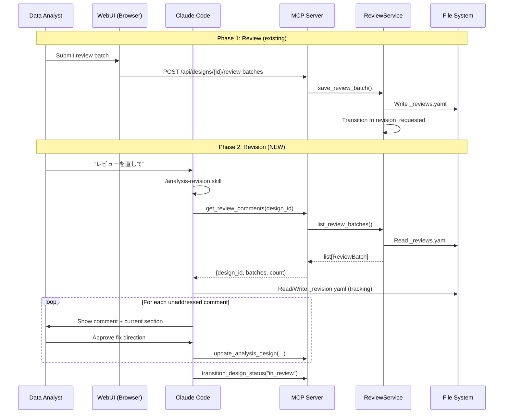

# Design: analysis-revision

## Overview

Issue #44 で報告されたレビュー→修正サイクルの断絶を解消する。MCP tool `get_review_comments` の追加（read/write 対称化）、修正ワークフローを担う新スキル `analysis-revision` の作成、コメント対応状態の追跡ファイルの3つで構成される。

変更範囲は限定的: server.py に MCP tool 1個追加、SKILL.md 1ファイル新規作成、テスト追加。model 層・storage 層・core 層への変更はない。

## Steering Document Alignment

### Technical Standards (tech.md)

- **レイヤー遵守**: `server.py → core/reviews.py → storage/ → models/` の依存方向を維持。新 MCP tool は既存 `ReviewService.list_review_batches()` の薄いラッパー
- **Service Locator パターン**: 既存の `_registry.get_review_service()` を使用
- **StrEnum / Pydantic**: 既存モデル (`ReviewBatch`, `BatchComment`) をそのまま使用。新モデル追加なし
- **Atomic YAML writes**: tracking file の書き込みは `tempfile + os.replace()` パターンを踏襲
- **TDD**: テストファーストで実装。既存の `test_server.py`, `test_reviews.py` のパターンに従う

### Project Structure (structure.md)

- MCP tool: `src/insight_blueprint/server.py` に追加（既存の `save_review_batch` の近くに配置）
- Skill: `src/insight_blueprint/_skills/analysis-revision/SKILL.md` に新規作成
- Test: `tests/test_server.py` に MCP tool テスト追加
- tracking file: `.insight/designs/{id}_revision.yaml`（skill-managed data、ランタイムデータ）

## Code Reuse Analysis

### Existing Components to Leverage

- **`ReviewService.list_review_batches(design_id)`** (core/reviews.py:258-278): レビューバッチ読み取りの本体。エラーハンドリング（ファイル不在、破損 YAML、旧形式）を全て内包。MCP tool はこれをそのまま呼ぶ
- **`_validate_design_id(design_id)`** (server.py:22-26): design_id のバリデーション。`[a-zA-Z0-9_-]+` パターンチェック。新 tool でも同じガードを使う
- **`get_review_service()`** (_registry.py:38-42): Service Locator からの ReviewService 取得
- **`ReviewBatch.model_dump(mode="json")`**: Pydantic のシリアライズ。REST API と同じ出力形式を MCP でも使う

### Integration Points

- **server.py**: `save_review_batch` (L405-435) の直後に `get_review_comments` を配置。読み書きが隣接して可読性が高い
- **REST API (web.py)**: `GET /api/designs/{id}/review-batches` と同等の機能。変更なし
- **analysis-reflection skill**: レビュー→修正→再提出のチェーンで連携。analysis-revision が修正、analysis-reflection が結論判定を担う

## Architecture



## Components and Interfaces

### Component 1: MCP Tool `get_review_comments`

- **Purpose**: design_id に対するレビューバッチ一覧を MCP 経由で取得する
- **Interfaces**:
  ```python
  @mcp.tool()
  async def get_review_comments(design_id: str) -> dict:
      """Get review comments for a design.

      Returns all review batches sorted by created_at descending (newest first).
      Returns empty list if no reviews exist or file is corrupted.
      """
  ```
- **Dependencies**: `_registry.get_review_service()`, `_validate_design_id()`
- **Reuses**: `ReviewService.list_review_batches()` をそのまま呼ぶ。新しいロジックなし

**実装パターン** (既存の `save_review_batch` に準拠):

```python
@mcp.tool()
async def get_review_comments(design_id: str) -> dict:
    """Get review comments for a design.

    Returns all review batches sorted by created_at descending (newest first).
    Returns empty list if no reviews exist or file is corrupted.
    """
    if err := _validate_design_id(design_id):
        return err
    svc = get_review_service()
    try:
        batches = svc.list_review_batches(design_id)
    except Exception:
        return {"error": "Failed to retrieve review comments"}
    return {
        "design_id": design_id,
        "batches": [b.model_dump(mode="json") for b in batches],
        "count": len(batches),
    }
```

### Component 2: Skill `analysis-revision`

- **Purpose**: revision_requested 状態の design に対し、レビューコメントを読み取り、修正ワークフローをガイドする
- **Interfaces**: SKILL.md（プロンプトベース。Python コード追加なし）
- **Dependencies**: MCP tools (`get_analysis_design`, `get_review_comments`, `update_analysis_design`, `transition_design_status`), File system (tracking file の Read/Write)
- **Reuses**: 既存スキル (`analysis-reflection`) のフォーマットと構造パターン

**ワークフロー**:

```
Phase 1: 状況把握
  ├─ get_analysis_design(design_id)
  ├─ status != revision_requested → エラー終了
  └─ get_review_comments(design_id) → 最新バッチ取得

Phase 2: Tracking 初期化
  ├─ Read .insight/designs/{id}_revision.yaml
  ├─ 最新バッチを選択: status_after == revision_requested のバッチのうち最新のもの
  │   （newest overall ではなく、revision_requested に限定して選択）
  ├─ 存在しない or batch_id 不一致 → 選択したバッチから新規作成
  └─ batch_id 一致 → 既存を再利用（セッション再開）

Phase 3: コメント対応ループ
  ├─ 未対応コメント(status=open)を順に提示
  ├─ target_section がある → design の該当セクション内容も表示
  ├─ ユーザーと対話 → 修正方針を決定
  ├─ update_analysis_design で修正を反映
  └─ tracking file の status を addressed に更新

Phase 4: 完了判定
  ├─ 全 items が addressed or wontfix → 完了
  ├─ transition_design_status("in_review") を提案
  └─ 次のスキルチェーン案内
```

### Component 3: Tracking File

- **Purpose**: コメント単位の対応状態をセッションをまたいで永続化する
- **Interfaces**: YAML ファイル（Claude が Read/Write tool で直接操作）
- **Dependencies**: なし（skill-managed data）
- **Reuses**: `now_jst()` の時刻フォーマット規約

## Data Models

### Tracking File Schema (`.insight/designs/{id}_revision.yaml`)

```yaml
batch_id: "RB-abcd1234"          # 対象レビューバッチの ID
created_at: "2026-03-17T10:00:00+09:00"  # tracking 作成日時
items:
  - index: 0                      # バッチ内のコメントインデックス
    fingerprint: "a1b2c3d4"       # comment + target_section の安定ハッシュ (identity key)
    comment_summary: "仮説文が曖昧"  # 元コメントの要約（人間可読性用）
    target_section: "hypothesis_statement"  # null の場合もある
    status: "addressed"           # open | addressed | wontfix
    addressed_at: "2026-03-17T10:30:00+09:00"  # null if open
  - index: 1
    fingerprint: "e5f6g7h8"
    comment_summary: "メトリクスの tier が不適切"
    target_section: "metrics"
    status: "open"
    addressed_at: null
```

**fingerprint の生成規則**: `hashlib.sha256(f"{comment}|{target_section or ''}".encode()).hexdigest()[:8]`。index はバッチ内の順序に依存するため、コメントの並び替えで drift する可能性がある。fingerprint はコメント内容に基づく安定した identity key として機能し、セッション再開時の突合に使う。（Codex レビュー指摘 #2 への対応）

**バッチ選択ルール**: `get_review_comments` が返す全バッチのうち、`status_after == "revision_requested"` のものだけをフィルタし、その中で `created_at` が最新のものを対象バッチとする。`status_after == "analyzing"` 等のバッチは revision ワークフローの対象外。（Codex レビュー指摘 #1 への対応）

**既存モデルへの変更: なし**。`ReviewBatch`, `BatchComment` は immutable のまま。tracking は完全に独立したファイル。

### MCP Tool Response Schema

```json
{
  "design_id": "FP-H01",
  "batches": [
    {
      "id": "RB-abcd1234",
      "design_id": "FP-H01",
      "status_after": "revision_requested",
      "reviewer": "analyst",
      "comments": [
        {
          "comment": "仮説文が曖昧",
          "target_section": "hypothesis_statement",
          "target_content": "売上が上がる"
        }
      ],
      "created_at": "2026-03-17T09:00:00+09:00"
    }
  ],
  "count": 1
}
```

## Error Handling

### Error Scenarios

1. **design_id が不正（空文字列、特殊文字）**
   - **Handling**: `_validate_design_id` が `{error: ...}` を返す
   - **User Impact**: Claude がエラーメッセージを表示

2. **design_id に対するレビューが存在しない**
   - **Handling**: `ReviewService.list_review_batches()` が空リストを返す → `{batches: [], count: 0}`
   - **User Impact**: スキルが「レビューコメントがない」と通知

3. **`_reviews.yaml` が破損**
   - **Handling**: `ReviewService.list_review_batches()` 内の try/except が空リストを返す（既存の堅牢性）
   - **User Impact**: 空リストとして扱われる

4. **design が revision_requested でない状態でスキル発動**
   - **Handling**: スキルがステータスチェックし、エラーメッセージを表示して終了
   - **User Impact**: 「このデザインは revision_requested 状態ではない」と通知

5. **tracking file が破損**
   - **Handling**: スキルが最新バッチから tracking file を再作成（フォールバック）
   - **User Impact**: 対応状態がリセットされるが、レビューコメント自体は失われない

6. **セッション中断後の再開で、既に design が in_review に遷移済み**
   - **Handling**: スキルがステータスチェックし、「既に in_review に戻っている」と通知
   - **User Impact**: 修正サイクルは完了済みと判断

## Testing Strategy

### Unit Testing

**MCP Tool テスト** (`tests/test_server.py`) — 9テスト:
- Unit-01: `test_get_review_comments_returns_batches`: レビューバッチが正しく返る
- Unit-02: `test_get_review_comments_empty_when_no_reviews`: レビューなし → 空リスト
- Unit-03: `test_get_review_comments_invalid_design_id`: 不正な design_id → error dict
- Unit-04: `test_get_review_comments_corrupted_yaml`: 破損 YAML → 空リスト（エラーにならない）
- Unit-05: `test_get_review_comments_sorted_descending`: 複数バッチが降順で返る
- Unit-06: `test_get_review_comments_includes_target_fields`: target_section/target_content を含む
- Unit-07: `test_get_review_comments_nonexistent_design_id`: valid 形式だが存在しない ID → 空リスト（Codex review）
- Unit-08: `test_get_review_comments_service_exception`: service 例外 → error dict（Codex review）
- Integ-01: `test_review_write_then_read_roundtrip`: write → read ラウンドトリップ

### End-to-End Testing

- E2E テストは本 spec のスコープ外。スキルは SKILL.md（プロンプト）であり、自動テストの対象外
- MCP tool の E2E は Unit/Integration で十分にカバーされる

## File Changes Summary

| ファイル | 変更種別 | 内容 |
|---------|---------|------|
| `src/insight_blueprint/server.py` | 修正 | `get_review_comments` MCP tool 追加（~20行、try/except 含む） |
| `src/insight_blueprint/_skills/analysis-revision/SKILL.md` | 新規 | revision ワークフロースキル |
| `tests/test_server.py` | 修正 | MCP tool テスト 9件追加（~70行） |
