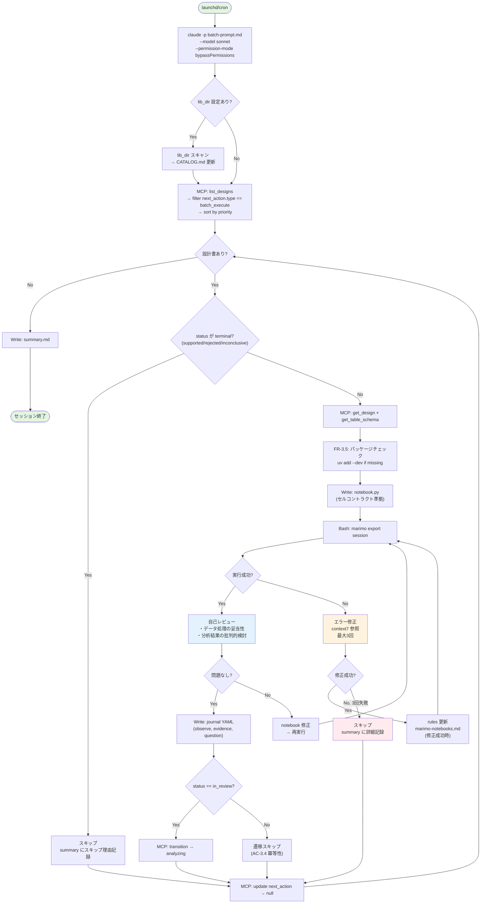

# Design Document: batch-analysis

## Reference

> **investigation.md**: 本設計の判断は全て実機検証に基づく。修正時は [investigation.md](investigation.md) の Verified Facts および Design Decisions に矛盾しないことを確認すること。

## Overview

batch-analysis は Claude Code の Skill として実装する。Python コードの変更はない。成果物は:

1. `skills/batch-analysis/SKILL.md` — スキル定義、セルコントラクト仕様、設定項目
2. `skills/batch-analysis/batch-prompt.md` — headless 実行用のオーケストレーションプロンプト
3. `.insight/runs/` — 実行結果のディレクトリ規約

エージェントの振る舞いは batch-prompt.md のプロンプトで制御する。MCP ツール・Pydantic モデル・REST API・WebUI への変更はない（Extension Policy 準拠）。

## Steering Document Alignment

### Technical Standards (tech.md)

- **Extension Policy**: Skill レイヤーのみ。MCP/WebUI は Fix
- **YAML as Source of Truth**: journal は `.insight/designs/{id}_journal.yaml` に YAML で記録（既存 convention に従う）
- **StrEnum / Pydantic モデル**: 変更なし。`next_action` は既存の `dict | None` フィールドを convention で活用
- **TDD**: batch-prompt.md の検証は E2E テスト（headless 実行 + 結果確認）で行う

### Project Structure (structure.md)

- **Skills 配置**: `skills/batch-analysis/` に SKILL.md + batch-prompt.md
- **実行結果**: `.insight/runs/YYYYMMDD_HHmmss/` に保存（skill-managed data、insight-yaml.md の例外に登録）
- **Rules 更新**: `.claude/rules/marimo-notebooks.md` に知見を追記（既存ファイル）

## Code Reuse Analysis

### Existing Components to Leverage

| コンポーネント | 用途 | 参照 |
|--------------|------|------|
| **MCP tools** (`list_analysis_designs`, `get_analysis_design`, `get_table_schema`, `update_analysis_design`, `transition_design_status`) | 設計書の読み取り、ステータス遷移、next_action リセット | server.py |
| **analysis-journal YAML format** | journal イベントの記録形式。metadata + events 構造 | skills/analysis-journal/SKILL.md |
| **LineageSession + tracked_pipe** | notebook 内でのデータ変換追跡 | lineage/tracker.py |
| **export_lineage_as_mermaid** | Mermaid lineage 図の生成 | lineage/exporter.py |
| **marimo export session** | notebook の headless 実行 + JSON 出力 | marimo CLI |
| **context7 MCP** | marimo 公式ドキュメントの参照（エラー修正時） | .mcp.json |
| **.claude/rules/marimo-notebooks.md** | marimo 固有のルール（_prefix, plt.gcf() 等）。エラー修正時に知見を追記 | 既存ファイル |

### Integration Points

- **既存 MCP ツール**: 全て既存ツールの呼び出しのみ。新規ツール追加なし
- **journal YAML**: 既存フォーマットに追記。スキーマ変更なし
- **next_action convention**: `{"type": "batch_execute", "priority": N}` を新規 convention として追加。`{"type": "human_review"}` は FV-1 用に予約

## Architecture

### 全体フロー



### 設計書1件の処理パイプライン（詳細）

```
1. 設計書読み込み（MCP: get_design + get_table_schema）
2. パッケージチェック（methodology.package → uv add --dev if missing）
3. notebook 生成（Write: セルコントラクトに従い8セル生成）
4. notebook 実行（Bash: uv run marimo export session --force-overwrite）
5. 実行結果確認
   ├─ 成功 → 6. 自己レビュー
   └─ 失敗 → エラー修正ループ（最大3回）
       ├─ context7 で marimo docs 参照
       ├─ notebook 修正 → 再実行
       └─ 3回失敗 → スキップ + rules 更新
6. 自己レビュー（30分/件の時間配分の核心）
   ├─ session JSON の各セル出力を読み取り
   ├─ データ処理の妥当性チェック（Cell 3 の前処理は適切か）
   ├─ 分析結果の批判的検討（Cell 4 の結果は妥当か、見落としはないか）
   ├─ 問題あり → notebook 修正 → 再実行（4. に戻る）
   └─ 問題なし → 7. journal 記録
7. journal 記録（Write: observe/evidence/question イベント）
8. ステータス遷移（MCP: transition → analyzing）
9. next_action リセット（MCP: update → null）
```

## Components and Interfaces

### Component 1: SKILL.md

- **Purpose**: batch-analysis スキルの定義。セルコントラクト仕様、設定項目、使い方を記述
- **配置**: `skills/batch-analysis/SKILL.md`
- **内容**:
  - スキルの概要と起動方法
  - セルコントラクト仕様（8セルの入出力定義、責務境界）
  - verdict dict スキーマ
  - 設定項目（notebook 出力ディレクトリ、ユーティリティライブラリディレクトリ）
  - next_action convention の定義
  - headless 起動コマンド例
- **Dependencies**: なし（ドキュメントのみ）

### Component 2: batch-prompt.md

- **Purpose**: headless 実行時に `claude -p` に渡すオーケストレーションプロンプト。エージェントの全振る舞いを制御する
- **配置**: `skills/batch-analysis/batch-prompt.md`
- **Interfaces**: Claude Code の `-p` フラグで読み込まれる
- **内容構成**:

```markdown
# batch-prompt.md の構造

## 1. Role & Context
- あなたは夜間バッチ分析エージェントである
- 分析設計書をキューから取得し、notebook 生成→実行→journal 記録を行う

## 2. Available Tools
- MCP tools の一覧と用途
- Read/Write/Bash/Glob/Grep の用途

## 3. Cell Contract
- 8セルの完全な定義（入出力、責務境界、marimo ルール）
- exploratory / confirmatory の振る舞い差
- mo.md() の安全パターン

## 4. Execution Pipeline
- キュー取得 → パッケージチェック → 生成 → 実行 → レビュー → journal → summary

## 5. Self-Review Protocol
- データ処理の妥当性チェック項目
- 分析結果の批判的検討項目
- 修正判断の基準

## 6. Error Handling
- 修正可能なエラーの分類と対応
- context7 参照の手順
- rules 更新のフォーマット

## 7. Journal Recording
- session JSON からの抽出ルール
- イベント種別の判定基準
- 既存 journal への追記ルール

## 8. Summary Generation
- summary.md のテンプレート
- Requires Attention の判定基準
- Next Steps の提示ルール

## 9. Configuration
- notebook 出力ディレクトリ（デフォルト + カスタム）
- ユーティリティライブラリディレクトリ
```

- **Dependencies**: SKILL.md（セルコントラクト定義を参照）

### Component 3: ディレクトリ規約

- **Purpose**: 実行結果の保存場所と命名規則
- **定義先**: SKILL.md に記載

```
.insight/runs/                              # バッチ実行結果ルート
  YYYYMMDD_HHmmss/                          # 日時別ディレクトリ（同日追加実行に対応）
    session.log                             # Claude Code セッションログ
    summary.md                              # 朝レビュー用サマリー
    {design_id}/                            # 設計書別ディレクトリ
      notebook.py                           # 生成された marimo notebook
      __marimo__/session/                   # marimo session JSON（notebook と同階層に自動生成）
        notebook.py.json                    # ← V2 で確認: notebook と同ディレクトリ配下

.insight/designs/
  {design_id}_journal.yaml                  # journal（既存場所に追記）
```

**ディレクトリ命名**: `YYYYMMDD_HHmmss`（例: `20260403_230000`）。同日中に複数回バッチを実行しても衝突しない。タイムスタンプは JST（`now_jst()` 相当）。

**Note**: `__marimo__/session/` は `marimo export session` が notebook ファイルの親ディレクトリに自動生成する（V2 検証済み）。

設定可能な項目:
- `notebook_dir`: notebook 出力ディレクトリ（デフォルト: `.insight/runs/YYYYMMDD_HHmmss/{design_id}/`）
- `lib_dir`: ユーティリティライブラリディレクトリ（デフォルト: なし）

## Data Models

本スキルでは新規 Pydantic モデルを追加しない。既存モデルの convention 活用のみ。

### next_action convention（新規）

```yaml
# バッチ実行キューに投入
next_action:
  type: "batch_execute"
  priority: 1              # optional, integer, 小さい順に処理

# FV-1 用（将来）: 人間レビュー待ち
next_action:
  type: "human_review"
```

### verdict dict スキーマ（DD-7）

```python
verdict = {
    "conclusion": str,             # 一行の結論
    "evidence_summary": list[str], # エビデンス箇条書き
    "open_questions": list[str],   # 未解決の問い
}
```

### journal イベント（既存フォーマット準拠）

```yaml
events:
  - id: "{design_id}-E{nn:02d}"
    type: "observe"                # or "evidence", "question"
    content: "..."
    evidence_refs: []
    parent_event_id: null
    metadata:
      direction: "supports"        # evidence のみ: supports / contradicts
    created_at: "..."
```

## Cell Contract Detail

### 8セルの完全定義（DD-6 拡張）

| Cell | 名前 | 入力 | 出力 | 責務 |
|------|------|------|------|------|
| 0 | imports | — | `(pd, plt, np, LineageSession, export_lineage_as_mermaid, tracked_pipe)` | ライブラリ import + rcParams 設定 |
| 1 | meta | `(mo,)` | — | 設計書情報の表示（design_id, title, hypothesis, intent） |
| 2 | data_load | `(pd, LineageSession)` | `(raw_df, session, mo)` | CSV/DB 読み込み + LineageSession 初期化 + `import marimo as mo` |
| 3 | data_prep | `(raw_df, session, tracked_pipe, mo)` | `(df_clean,)` | methodology 非依存の前処理。全操作 tracked_pipe 経由 |
| 4 | analysis | `(df_clean, pd, mo)` | `(results,)` | methodology 依存の分析。intent で振る舞い変更 |
| 5 | viz | `(df_clean, results, plt)` | — | 可視化。`_` prefix 必須。`plt.gcf()` が最後 |
| 6 | verdict | `(results, mo)` | `(verdict,)` | 結論 + evidence + open questions |
| 7 | lineage | `(session, export_lineage_as_mermaid, mo)` | — | Mermaid lineage 図の表示 |

### Cell 4 の intent 別振る舞い

**exploratory**:
- パターン探索: 相関、分布、サブグループ比較
- 事前の合否基準なし
- `results`: 発見したパターンを dict に格納

**confirmatory**:
- metrics の AC に照らして合否判定
- `results`: 各 metric の value + threshold + pass/fail

### marimo 固有ルール（V3 + V5d で検証済み）

1. cell-local 変数は `_` prefix 必須
2. `plt.gcf()` が viz セルの最後の式
3. `mo.mermaid()` で Mermaid 描画（`mo.md()` + コードブロックは不可）
4. `mo.md()` で multiline f-string 展開を避ける（事前に string 組み立て）
5. `import marimo as mo` は Cell 2 で行い、他セルは引数で受け取る
6. return は tuple 構文: `return (df_clean,)` — `return df_clean` は不可

## Self-Review Protocol

30分/件の時間配分の核心。生成→実行の後、エージェントが自ら分析結果を批判的に検討する。

### チェック項目

| フェーズ | チェック内容 | 対応 |
|---------|-------------|------|
| データ処理 (Cell 3) | 欠損処理は適切か。フィルタでバイアスが入っていないか。必要な列が残っているか | notebook 修正 → 再実行 |
| 分析手法 (Cell 4) | methodology が hypothesis に対して適切か。前提条件を満たしているか | notebook 修正 → 再実行 |
| 結果解釈 (Cell 6) | evidence と conclusion が整合しているか。効果量は実質的に意味があるか | verdict 修正 → 再実行 |
| open questions | 見落としている交絡因子や代替説明はないか | question 追加 |

### 修正判断の基準

- データ処理の不備: **必ず修正**（lineage の信頼性に直結）
- 分析結果の疑問: **question イベントとして記録し、人間にエスカレート**（エージェントが勝手に結論を変えない）
- open questions の漏れ: **追加**（漏れは修正すべき）

## Session JSON Parsing Specification (FR-4.1, FR-4.4)

### セル同定

session JSON の `cells` 配列はセルコントラクトの順序（Cell 0〜7）に対応する。各セルの `outputs[0].data` から mime type 別にデータを取得する。

```python
# session JSON の読み取り擬似コード
with open(session_json_path) as f:
    session = json.load(f)

for i, cell in enumerate(session["cells"]):
    for output in cell.get("outputs", []):
        data = output.get("data", {})
        # text/markdown: HTML ラップされている（V2 検証済み）
        # 例: <span class="markdown prose ...">実際のコンテンツ</span>
        if "text/markdown" in data:
            html_content = data["text/markdown"]
            # HTML タグを除去してプレーンテキストを抽出
        # application/vnd.marimo+mimebundle: 画像等（スキップ）
        # text/plain: 空の場合が多い（スキップ）
```

### journal イベント抽出ルール

| 対象セル | 抽出する情報 | journal イベント種別 | metadata |
|---------|-------------|-------------------|----------|
| Cell 2 (data_load) | 行数、列数、期間 | `observe` | — |
| Cell 3 (data_prep) | 前処理前後の行数、対象商品/条件 | `observe` | — |
| Cell 4 (analysis) | 主要指標の値（相関係数、ATT、p-value 等） | `evidence` | `direction` を判定 |
| Cell 6 (verdict) | conclusion, evidence_summary, open_questions | `evidence` + `question` | `direction` を判定（下記ロジック参照） |

### supports / contradicts の判定ロジック (FR-4.4)

verdict dict から判定する:

- **confirmatory intent**: verdict.conclusion に AC の pass/fail が含まれる
  - 全 primary AC が pass → `direction: supports`
  - いずれかの primary AC が fail → `direction: contradicts`
- **exploratory intent**: 明確な pass/fail がないため、エージェントが hypothesis_statement と evidence_summary を比較して判定
  - 相関の方向が仮説と一致 → `direction: supports`
  - 相関の方向が仮説と反対、または無相関 → `direction: contradicts`
- **判定が曖昧な場合**: `direction` を設定せず、`question` イベントとして「direction の判定が困難」を記録

## Time Budget Management (30分/件)

### 制御方式

バッチプロンプト内で設計書ごとの処理開始時刻を記録し、経過時間を監視する。

```
処理開始 → 開始時刻を記録

各フェーズ完了時:
  経過時間 = 現在時刻 - 開始時刻
  IF 経過時間 > 25分:
    自己レビューを簡略化（チェック項目を「データ処理の致命的不備」のみに絞る）
  IF 経過時間 > 30分:
    現在のフェーズを完了させて次の設計書に移行
    summary に「時間超過のため自己レビュー簡略化」を記録
```

### Graceful degradation

| 経過時間 | 動作 |
|---------|------|
| 0〜20分 | 通常処理（生成 + 実行 + フルレビュー） |
| 20〜25分 | レビュー継続、ただしエラー修正の残り試行回数を1回に制限 |
| 25〜30分 | レビューを「致命的不備チェックのみ」に簡略化 |
| 30分超過 | 現フェーズを完了 → journal 記録 → 次の設計書へ移行 |

### バッチ全体の時間見積もり

- 5件 × 30分/件 = 最大2.5時間
- 通常は1件10〜15分（V3: 生成5分 + 実行0.5分 + レビュー5〜10分）で、30分はエラー修正込みの上限

## Configuration Resolution (FR-2.5, FR-2.6)

### 設定項目と解決順序

| 設定 | 解決順序（優先度高→低） | デフォルト値 |
|------|----------------------|-------------|
| `notebook_dir` | 1. batch-prompt.md 内の明示指定 → 2. `.insight/config.yaml` の `batch.notebook_dir` → 3. デフォルト | `.insight/runs/YYYYMMDD_HHmmss/{design_id}/` |
| `lib_dir` | 1. batch-prompt.md 内の明示指定 → 2. `.insight/config.yaml` の `batch.lib_dir` → 3. なし（無効） | なし |

### notebook_dir の処理

1. ディレクトリが存在しない場合は `mkdir -p` で作成
2. `YYYYMMDD_HHmmss` は実行日の JST 日付で展開
3. `{design_id}` は処理中の設計書 ID で展開

### lib_dir の処理

#### 事前カタログ化（バッチ開始時、notebook 生成前に実行）

1. `lib_dir` が設定されている場合、バッチ開始時に `lib_dir` 内の全 `.py` ファイルをスキャンする
2. 各ファイルの関数シグネチャ・docstring を抽出し、`lib_dir/CATALOG.md` に保存・更新する
3. 各 notebook 生成時、agent は `CATALOG.md` を読んでユーティリティ関数の存在を把握した上でコードを生成する

```markdown
# lib_dir/CATALOG.md（自動生成）
## data_utils.py
- `clean_revenue(df: pd.DataFrame) -> pd.DataFrame`: 売上データの標準前処理（欠損除去、正値フィルタ）
- `one_hot_time_slot(df: pd.DataFrame) -> pd.DataFrame`: time_slot を one-hot エンコード

## viz_utils.py
- `plot_correlation_matrix(df: pd.DataFrame, columns: list[str]) -> None`: 相関行列ヒートマップ
```

#### notebook 生成中のユーティリティ追加

1. notebook 生成中に「この処理は他の notebook でも使いそうだ」と判断した場合、`lib_dir` に新しいユーティリティ関数を作成する
2. 作成後、`lib_dir/CATALOG.md` に追記する
3. 以降の notebook 生成では更新された CATALOG.md を参照する

#### notebook への注入

1. `lib_dir` が設定されている場合、生成 notebook の Cell 0 (imports) に `sys.path.insert(0, lib_dir)` を追加
2. CATALOG.md に記載された関数は notebook から `import` 可能
3. `lib_dir` が存在しない場合はエラー（ディレクトリの自動作成はしない）

```python
# Cell 0 への注入例（lib_dir が設定されている場合）
@app.cell
def _():
    import sys
    sys.path.insert(0, "/path/to/lib_dir")  # batch-prompt が実行時に展開
    from data_utils import clean_revenue     # CATALOG.md から把握した関数
    import pandas as pd
    # ... 通常の imports ...
```

## Error Handling

### Error Scenarios

| シナリオ | 検知方法 | 対応 | summary への記録 |
|---------|---------|------|-----------------|
| **パッケージ未インストール** | `marimo export session` の exit code ≠ 0 + ModuleNotFoundError | `uv add --dev {package}` → 再実行 | 修正成功なら記録なし |
| **marimo 記法エラー** | exit code ≠ 0 + multiple-defs, syntax error 等 | context7 で marimo docs 参照 → notebook 修正 → 再実行 → rules 更新 | 修正成功なら rules 更新のみ |
| **データソース不在** | FileNotFoundError / ConnectionError | journal に `question` として記録 → スキップ | "Requires Attention" に記載 |
| **分析ロジックエラー** | Cell 4 の実行時エラー（ValueError, LinAlgError 等） | notebook 修正（手法の前提確認） → 再実行 | 3回失敗でスキップ |
| **MCP サーバー接続失敗** | MCP tool call のタイムアウト/エラー | session.log に記録 → バッチ全体を停止 | summary に "MCP connection failed" |

### エラー修正ループ（#8 対応: 適用条件と検証基準）

```
修正試行 1: エラー内容を読み取り、直接的な修正を試みる
  - 対象: ImportError, SyntaxError, NameError（明確な原因が特定できるエラー）
  - 検証: marimo export session の exit code == 0 かつ全セルに output あり

修正試行 2: context7 で marimo docs を参照し、公式推奨の方法で修正
  - 対象: marimo 固有エラー（multiple-defs, cell dependency error）
  - context7 クエリ: mcp__context7__resolve-library-id("/marimo-team/marimo") → query-docs
  - 検証: 修正前後の diff が問題箇所に限定されているか確認（無関係な変更を含まない）

修正試行 3: 別のアプローチ（手法の簡略化、パラメータ変更等）
  - 対象: RuntimeError, ValueError（分析ロジック起因）
  - 検証: 修正が元の hypothesis/methodology の意図から逸脱していないか確認

→ 3回失敗: スキップ + summary に「エラー内容 + 3回の修正試行内容 + 推奨対処」を記録
```

**context7 を使わないエラー**: ModuleNotFoundError（`uv add --dev` で対応）、FileNotFoundError（データソース不在、journal に記録してスキップ）、MCP 接続エラー（バッチ全体停止）

### rules 更新フォーマット

marimo 固有のエラーを修正した場合、`.claude/rules/marimo-notebooks.md` に以下の形式で追記:

```markdown
## {問題の簡潔な説明}

{問題の発生条件}

```python
# Bad: {エラーが発生するコード}
...

# Good: {修正後のコード}
...
```
```

## Testing Strategy

### Unit Testing

本スキルは Skill（プロンプト + ドキュメント）であり、Python コード変更がないため、従来の unit test は不要。

### Integration Testing

| テスト | 検証内容 | 方法 |
|--------|---------|------|
| セルコントラクト準拠 | 生成 notebook が8セル構造を持ち、marimo で実行可能か | `claude -p` で生成 → `marimo export session` で実行 → session JSON 確認 |
| journal 記録 | observe/evidence/question が正しく記録されるか | 実行後の journal YAML を解析 |
| エラー修正ループ | 意図的にエラーを含む設計書で修正が機能するか | methodology.package に存在しないパッケージを指定 |
| summary 生成 | 全設計書の結果が正しく集約されるか | 複数設計書でバッチ実行 → summary.md 確認 |

### End-to-End Testing

| テスト | 入力 | 期待結果 |
|--------|------|---------|
| 正常系: exploratory | DEMO-H01（気温と売上の相関） | notebook 生成 + 全セル実行 + journal に observe/evidence/question + summary に結果一覧 |
| 正常系: confirmatory | CAUSAL-H01（PSM） | notebook 生成 + AC 判定 + journal に evidence(supports/contradicts) + summary に verdict |
| エラー系: パッケージ不足 | methodology.package: "nonexistent_lib" | uv add --dev 試行 → 失敗 → スキップ → summary に "Requires Attention" |
| エラー系: terminal status | supported の設計書をキューに入れる | スキップ → summary にスキップ理由 |
| 複数件バッチ | 3件（exploratory + confirmatory + エラー）混在 | 2件成功 + 1件スキップ + summary に全3件の結果 |

### 検証済み実績（investigation.md より）

- V3: セルコントラクト付き notebook 生成 → marimo 実行成功（sonnet, DEMO-H01）
- V5b: haiku でも同等品質で生成可能
- V6a: 因果推論（PSM）が8セルに収まり全セル実行成功
