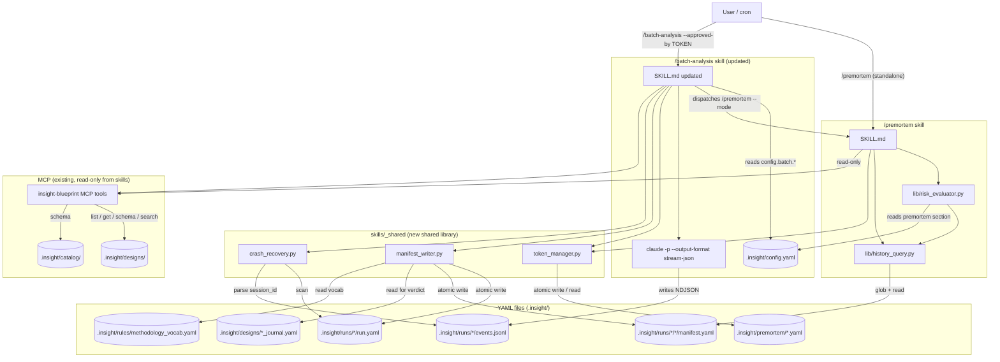
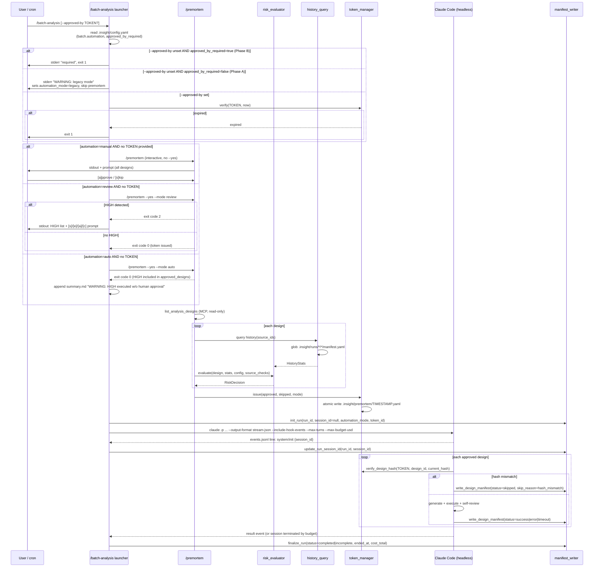
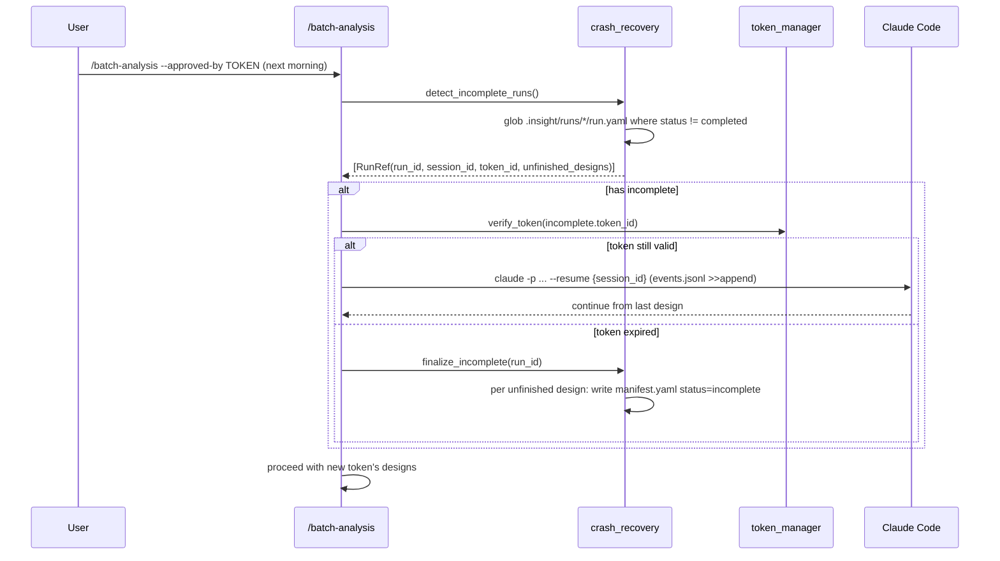

# Design Document

## Overview

`batch-harness-engineering` は、既存の `/batch-analysis` v1.0 の launcher / checkpoint / recovery 層を Claude Code 公式機能と薄い自前 YAML ファイル群に置き換えるハーネス刷新である。中心は 3 コンポーネント: (a) `/premortem` skill (新規、独立) による事前 risk 判定と承認トークン発行、(b) per-design `manifest.yaml` の atomic 書き出しを軸にした run-local YAML 構造、(c) `--output-format stream-json` / `--resume {session_id}` を前提とした crash-safe な launcher。既存 `/batch-analysis` は add-only で拡張し、既存 MCP ツール (`list_analysis_designs` 等) 以外に新規 MCP は導入しない。

## Steering Document Alignment

### Technical Standards (tech.md)

- **YAML as Source of Truth** — `run.yaml`, per-design `manifest.yaml`, approval token, `methodology_vocab.yaml` は全て `ruamel.yaml` でラウンドトリップ、SQLite は触らない。history 検索はグロブ + YAML load で完結（FR-4.5 の AC）
- **Atomic writes** — `tempfile.NamedTemporaryFile` + `os.replace()` パターンを `storage/yaml_store.py` の既存ヘルパーに合わせる（もし直接参照できない場合は skill bundle 内で同じパターンを再実装）
- **StrEnum for all enums** — `RiskLevel`, `ManifestStatus`, `AutomationMode`, `RunStatus` は全て `StrEnum`。YAML との相性を維持
- **uv / ruff / ty / pytest** — 既存 pyproject 構成に従う。新規依存は不要（標準ライブラリ + 既存の ruamel.yaml / pydantic で賄える）
- **TDD** — Test Design フェーズでカバレッジマトリクスを定義し、Red → Green → Refactor で実装する（tech.md Development Principles）
- **YAGNI** — SQLite index / spec-workflow dashboard 拡張 / 信頼度ベース自動判定は本 spec のスコープ外（Out of Scope で明示）

### Project Structure (structure.md)

- 新規コードは **skill bundle 側** に置く（本 spec は MCP 側の Python コード追加を最小化する方針）:
  - `skills/premortem/` — 新規 skill bundle（SKILL.md + references/ + lib/）
  - `skills/premortem/lib/` — `/premortem` 専用の内部ロジック（`risk_evaluator.py`, `history_query.py`）。他 skill からは import 禁止
  - `skills/_shared/` — **複数 skill が共有するライブラリ**（本 spec で新設）。`token_manager.py`（トークン発行・検証・hash 計算）, `manifest_writer.py`（`run.yaml` / per-design `manifest.yaml` の atomic write）, `crash_recovery.py`（中断検出）を配置。両 skill はそれぞれ `_shared` を import する（skill 間の直接依存ではなく共有ライブラリへの依存）
  - `skills/batch-analysis/` の既存ファイル更新（`SKILL.md` の launch command / `references/batch-prompt.md` の manifest 生成指示）
  - **structure.md との関係** — structure.md は `src/insight_blueprint/` の MCP 側構造を規定している。`skills/` 配下の構造は現時点で structure.md に明記されておらず、本 spec の `skills/_shared/` 導入は **skill-bundle 例外として新設する確定事項**（議論ではない）。構造ドキュメント更新は spec 完了後のフォロータスクとする
- 命名規則は structure.md 準拠: Python は `snake_case.py`, クラスは `PascalCase`, 定数は `UPPER_SNAKE_CASE`, enum は `StrEnum`
- `.insight/` 配下の新規ファイルのガバナンス:
  - `.insight/premortem/` (トークン置き場、新規) — `.gitignore` 対象（機密ではないが履歴に残す価値が低い）
  - `.insight/runs/{YYYYMMDD_HHmmss}/{design_id}/manifest.yaml` (新規 schema) — `.gitignore` 対象（既存 runs 配下と同じ扱い）
  - `.insight/rules/methodology_vocab.yaml` (新規 vocab) — **Git 管理対象**（rules は共有ポリシー、チームで一貫した tag vocabulary を維持するため）

## Code Reuse Analysis

### Existing Components to Leverage

- **`mcp__insight-blueprint__list_analysis_designs`** — `/premortem` がキュー取得 (`next_action.type == "batch_execute"`) に使う。新規 MCP は追加しない
- **`mcp__insight-blueprint__get_analysis_design`** — design 内容取得。`/premortem` が design_hash 計算の入力に使う
- **`mcp__insight-blueprint__get_table_schema`** — BQ location 検証 (FR-2.3 の HARD_BLOCK 条件 c) に使う
- **`mcp__insight-blueprint__search_catalog`** — source 登録チェック (FR-2.3 条件 a) に使う
- **`skills/batch-analysis/SKILL.md`** の package allowlist — FR-2.3 条件 b のソース。初期実装では SKILL.md の markdown table を parse する（既存の文書を Source of Truth として扱う）。**フォロータスク（I-3）:** `.insight/rules/package_allowlist.yaml` へ機械可読 YAML として分離し、SKILL.md からは参照のみにする。本 spec の Tasks フェーズでこの分離タスクを追加する
- **`skills/batch-analysis/references/batch-prompt.md`** の既存 Self-Review / Time Budget / Error Handling — 変更しない。stream-json 切替と manifest 書き出しのみ add-only で追加
- **既存 `_journal.yaml` schema** — 変更しない。`verdict` 非正規化は manifest 側で読みに行くだけ

### Integration Points

- **`/batch-analysis` launcher (SKILL.md L215-226)** — launch command を `--output-format stream-json --include-hook-events --fallback-model sonnet` に切替、出力先を `events.jsonl` に変更、`--approved-by` フラグを追加（Phase A: warning, Phase B: required）
- **`references/batch-prompt.md`** — Step 3 の各段階で per-design `manifest.yaml` への atomic 書き出しを挿入。methodology_tags の選択を Step 3e (notebook 生成) 時点で行うよう指示追加
- **`.insight/config.yaml`** — `premortem:` セクションと `batch.automation`, `batch.approved_by_required`, `batch.max_turns` キーを追加（既存キーは変えない）

## Architecture

### Modular Design Principles

- **Single File Responsibility** — `risk_evaluator.py` / `token_manager.py` / `manifest_writer.py` / `history_query.py` を分割。各 100-300 行を目安
- **Component Isolation** — skill 間の契約は「YAML ファイルの形式」のみ。関数呼び出し境界は持たない (skill 独立性の維持)
- **Service Layer Separation** — `risk_evaluator` は pure function（入力: design + history + config、出力: RiskDecision dataclass）。`token_manager` は I/O（YAML write）と検証（hash / TTL）を分離。`manifest_writer` は atomic write のみに責務限定
- **Utility Modularity** — `history_query.py` はグロブ + YAML read + 統計計算のみ（median/rate）。config load は別ユーティリティ



### Sequence: `/batch-analysis` → `/premortem` (mode dispatch) → execution



### Sequence: Crash recovery



## Components and Interfaces

### Component 1: `/premortem` skill (SKILL.md + lib/)

- **Purpose:** design のキュー (or 単体) に対し risk 判定を行い、mode 引数に従って承認トークンを発行する
- **Interfaces:**
  - CLI: `/premortem [--queued | --design <id> | --all] [--yes] [--mode manual|review|auto]`
    - `--mode` 引数は `/batch-analysis` launcher から受け取る（自身では config を読まない）
    - `--mode` 省略時は `manual` を仮定（単体起動ケース）
  - 出力: stdout 1 画面 + `.insight/premortem/{TIMESTAMP}.yaml`
  - Exit codes:
    - `0` — トークン発行成功、batch 継続可
    - `2` — HIGH 検出で mode=review によりブロック（batch 側が停止判断）
    - `1` — 想定外エラー (config 不正 / I/O 失敗)
- **mode × risk 分岐 (HIGH の扱い):**
  - `manual` — 対話プロンプト必須、HIGH/MEDIUM/LOW 全て人間承認
  - `review` — HIGH あれば token 発行せず exit 2（`/batch-analysis` が停止。対話救済は batch 側が呼び出す）、HIGH 無ければ LOW/MEDIUM を自動 approved にして exit 0
  - `auto` — HIGH も含め全て `approved_designs` に入れ exit 0（summary.md への warning は batch 側で行う）
- **Dependencies:**
  - MCP read-only tools (`list_analysis_designs`, `get_analysis_design`, `get_table_schema`, `search_catalog`)
  - `.insight/config.yaml` の `premortem:` セクションのみ（`batch.automation` は読まない、引数で渡される）
  - `.insight/rules/methodology_vocab.yaml`（参照のみ、書き込みなし）
  - `lib/risk_evaluator.py`, `lib/history_query.py`
  - `skills/_shared/token_manager.py`（C-2: shared lib として切り出し、両 skill が import する）
- **Reuses:** 既存 MCP tools のみ。新規 MCP 追加なし
- **書き込み契約 (observable contract, AC-1.5):** `/premortem` 実行中は以下への書き込みが 0 回であること
  - `notebook.py` / marimo session JSON
  - `.insight/designs/*.yaml` / `.insight/designs/*_journal.yaml`
  - `.insight/runs/*/*/manifest.yaml` / `.insight/runs/*/run.yaml`
  - `.insight/catalog/**`

### Component 2: `risk_evaluator.py`

- **Purpose:** RiskDecision を純粋関数として計算する
- **Interfaces:**
  ```python
  def evaluate(
      design: DesignSnapshot,
      history: HistoryStats,
      config: PremortemConfig,
      source_checks: SourceChecks,  # catalog 登録・package allowlist・BQ location 結果
  ) -> RiskDecision
  ```
  - `RiskDecision` = `{level: RiskLevel, reasons: list[str], est_min: float | None, flags: list[str]}`
  - 決定ツリーは Requirements FR-2.1–2.6 に 1:1 対応
- **Dependencies:** None（純粋関数、I/O なし）
- **Reuses:** None（新規）

### Component 3: `history_query.py`

- **Purpose:** 過去 run の manifest.yaml を検索・集計し統計量を返す
- **Interfaces:**
  ```python
  def query(source_ids: list[str], min_samples: int) -> HistoryStats
  ```
  - `HistoryStats` = `{n: int, median_elapsed_min: float | None, median_rows: float | None, success_rate: float | None}`
  - 実装: `glob .insight/runs/*/*/manifest.yaml` → `source_ids` 完全一致でフィルタ → `status == success` を母集団に (success_rate 分母は全件、分子は success)
- **Dependencies:** `ruamel.yaml`, `pathlib.Path`
- **Reuses:** None

### Component 4: `skills/_shared/token_manager.py` (shared)

- **Purpose:** 承認トークンの発行 / 検証 / 失効 / design_hash 計算。`/premortem` と `/batch-analysis` の両方から import される共有ライブラリ
- **Interfaces:**
  ```python
  def issue(approved: list[DesignEntry], skipped: list[DesignEntry],
            approved_by: Literal["human", "auto"], automation_mode: str,
            ttl_hours: int) -> str
      # returns token_id, side effect: atomic write of .insight/premortem/{token_id}.yaml

  def verify(token_id: str, now: datetime) -> TokenVerifyResult
      # returns {ok: bool, reason: "expired" | "not_found" | None, token: Token | None}

  def verify_design_hash(token: Token, design_id: str, current_hash: str) -> bool

  def compute_design_hash(design: dict) -> str
      # sha256(canonical_json(DesignHashInput)) — see Data Models "Design Hash Canonicalization"
  ```
- **Dependencies:** `hashlib`, `json`, `ruamel.yaml`, `pathlib`, `skills/_shared/_atomic.py` (atomic write helper, newly extracted)
- **Reuses:** Atomic write pattern from `src/insight_blueprint/storage/yaml_store.py` — 直接 import は layer boundary のため避け、同等の pattern を `skills/_shared/_atomic.py` に**コピーして維持**する（copied pattern, not a cross-boundary import）

### Component 5: `skills/_shared/manifest_writer.py` (shared)

- **Purpose:** `run.yaml` と per-design `manifest.yaml` の atomic 書き出し。`/batch-analysis` が主に使うが、`crash_recovery` からも呼ばれる
- **Interfaces:**
  ```python
  def init_run(run_id: str, session_id: str | None, automation_mode: str,
               token_id: str | None) -> None
      # writes .insight/runs/{run_id}/run.yaml with started_at, status=running

  def update_run_session_id(run_id: str, session_id: str) -> None
      # updates run.yaml after events.jsonl system/init event parsed

  def finalize_run(run_id: str, status: RunStatus, cost_total_usd: float,
                  ended_at: datetime) -> None

  def write_design_manifest(run_id: str, design_id: str, manifest: DesignManifest) -> None
      # atomic whole-file write; raises MethodologyTagError if tags not in vocab (C-3)

  def load_vocab() -> set[str]
      # reads .insight/rules/methodology_vocab.yaml, returns allowed tag set
  ```
- **Dependencies:** `ruamel.yaml`, `tempfile`, `os`, `pathlib`, `skills/_shared/_atomic.py`
- **Reuses:** `skills/_shared/_atomic.py`

### Component 6: `skills/_shared/crash_recovery.py` (shared)

- **Purpose:** 中断 run の検出と resume 判定。`/batch-analysis` 起動時に呼ばれる
- **Interfaces:**
  ```python
  def detect_incomplete() -> list[RunRef]
      # scans .insight/runs/*/run.yaml where status != "completed"; returns sorted by started_at desc

  def unfinished_designs(run_ref: RunRef) -> list[str]
      # returns design_ids missing manifest.yaml or with status=incomplete

  def finalize_incomplete(run_ref: RunRef, design_ids: list[str],
                         reason: str) -> None
      # writes manifest.yaml status=incomplete for each, updates run.yaml status=incomplete
  ```
- **Dependencies:** `skills/_shared/manifest_writer.py`, `skills/_shared/token_manager.py`（共有ライブラリ内での依存は許容。skill 間直接依存ではない）
- **Reuses:** `manifest_writer.write_design_manifest`

### Component 7: `/batch-analysis` launcher (SKILL.md updates only)

- **Purpose:** 公式 stream-json と `--approved-by` フラグを使う起動ロジック
- **Interfaces:** Bash コマンドブロック (SKILL.md に記載)
- **変更点:**
  1. L215-226 の launch command を stream-json 版に差し替え
  2. `--approved-by TOKEN` の Phase A/B 処理を Bash wrapper として追加
  3. resume フローを追加（crash_recovery を事前実行）
  4. `events.jsonl` からの session_id 抽出を Bash snippet で実装（jq ベース、公式研究 doc の例に準拠）
- **Dependencies:** `jq`（既存想定）、上記 Python モジュール
- **Reuses:** 既存 L229-233 の `--permission-mode bypassPermissions --max-budget-usd 10` を保持

### Component 8: `batch-prompt.md` 追記 (Step 3 への挿入)

- **Purpose:** Claude Code 本体が per-design manifest を書く責務を持たされる。batch agent が従うべき指示を追記
- **Interfaces:** Markdown 追記
- **追記内容:**
  - Step 3e (notebook 生成) の直後: methodology_tags を vocab から 1-3 個選択し `manifest.yaml.methodology_tags` に設定する指示
  - Step 3h (journal 記録) の直後: verdict 非正規化コピー → `manifest.yaml.verdict` に書く
  - Step 3k (summary 更新) の直前: `manifest.yaml` 全体を atomic に書く（tempfile + mv 相当の Bash）
  - skip / error 経路: manifest を欠落させず `status: skipped / error / timeout` で書く
- **Reuses:** 既存 Step 3a-3k 構造

## Data Models

### RiskLevel (StrEnum)

```python
class RiskLevel(StrEnum):
    HARD_BLOCK = "hard_block"   # 実行不能系、対話でも続行不可
    HIGH = "high"               # 閾値超過 or success_rate 低下
    MEDIUM = "medium"           # history 不足 or extrapolated > medium_min
    LOW = "low"                 # 履歴良好
    SKIP = "skip"               # terminal status (supported/rejected/inconclusive)
```

### RunStatus (StrEnum)

```python
class RunStatus(StrEnum):
    RUNNING = "running"         # run 開始時
    COMPLETED = "completed"     # 全 design 処理完了
    INCOMPLETE = "incomplete"   # crash 検出 or TTL 失効 or 明示停止
```

### ManifestStatus (StrEnum)  — per-design

```python
class ManifestStatus(StrEnum):
    SUCCESS = "success"
    ERROR = "error"
    TIMEOUT = "timeout"
    SKIPPED = "skipped"
    INCOMPLETE = "incomplete"
```

### AutomationMode (StrEnum)

```python
class AutomationMode(StrEnum):
    MANUAL = "manual"
    REVIEW = "review"   # default
    AUTO = "auto"
    LEGACY = "legacy"   # Phase A で --approved-by 未指定時の run.yaml に記録される値（config の選択肢ではない）
```

### ApprovalToken (YAML)

```yaml
token_id: "20260418_183015"
created_at: "2026-04-18T18:30:15+09:00"
expires_at: "2026-04-19T18:30:15+09:00"
approved_by: human            # human | auto
automation_mode: review       # このトークンを発行した時の mode
risk_summary:
  LOW: 2
  MEDIUM: 1
  HIGH: 0
  HARD_BLOCK: 0
approved_designs:
  - design_id: DES-042
    design_hash: "sha256:abc..."
    risk_at_approval: LOW
    est_min: 18.0
  - design_id: DES-044
    design_hash: "sha256:def..."
    risk_at_approval: HIGH       # auto mode で HIGH を承認済みに入れたケース
    est_min: 180.0
skipped_designs:
  - design_id: DES-047
    risk_at_approval: HARD_BLOCK
    reason: "source orders_big not registered in catalog"
```

### Run Manifest (`.insight/runs/{run_id}/run.yaml`)

```yaml
run_id: "20260418_230000"
session_id: "abc-123-def"       # events.jsonl の system/init から抽出後に追記
started_at: "2026-04-18T23:00:00+09:00"
ended_at: "2026-04-19T01:45:12+09:00"   # 終了時追記
automation_mode: review         # manual | review | auto | legacy
premortem_token: "20260418_183015"   # null if legacy
status: running                 # running → completed | incomplete
cost_total_usd: 2.34            # 終了時追記
```

### Design Manifest (`.insight/runs/{run_id}/{design_id}/manifest.yaml`)

```yaml
design_id: DES-042
run_id: "20260418_230000"
started_at: "2026-04-18T23:02:15+09:00"
ended_at: "2026-04-18T23:20:27+09:00"

design_snapshot:
  hash: "sha256:abc123..."
  source_ids: [sales_raw]
  intent: exploratory           # exploratory | confirmatory
  methodology: "sales と time_slot の相関分析"

methodology_tags: [correlation_analysis, time_series]

input_profile:
  estimated_rows: 1500000
  column_count: 23
  data_volume_strategy: sample  # direct | sample | agg_first

execution:
  elapsed_min: 18.2
  cost_usd: 0.34
  api_retries: 2
  tool_calls:
    mcp: 12
    bash: 5
    file: 8
  status: success               # success | error | timeout | skipped | incomplete
  error_category: null          # null | import | type | logic | data_missing | budget_exceeded
  skip_reason: null             # null | hard_block | unapproved | hash_mismatch | token_expired_or_crashed

verdict:                        # journal 非正規化コピー（status=success 時のみ populate）
  direction: supports           # supports | contradicts | question
  confidence: high              # high | medium | ambiguous
  events_recorded: 5
```

### methodology_vocab (`.insight/rules/methodology_vocab.yaml`)

```yaml
# Predefined methodology tags (fixed set, 10 types for v1)
methodology_tags:
  - correlation_analysis
  - regression
  - time_series
  - classification
  - clustering
  - hypothesis_test
  - descriptive
  - segmentation
  - causal_inference
  - ab_test
```

### Design Hash Canonicalization (FR-3.4 / AC-3.3 実装仕様)

`token_manager.compute_design_hash` の決定的実装仕様。Token 発行時と batch 実行時で同一の結果を保証する。

**含むフィールド (DesignHashInput):**

```python
@dataclass(frozen=True)
class DesignHashInput:
    hypothesis: str
    intent: Literal["exploratory", "confirmatory"]
    methodology: str
    source_ids: list[str]           # sorted alphabetically before hashing
    metrics: list[dict]             # each dict also sorted by key
    acceptance_criteria: list[dict]
```

**除外フィールド（ハッシュに含めない）:**

- `updated_at` / `created_at` — 時刻は意味を持たない
- `status` — ライフサイクル遷移は hash に影響しない
- `next_action` — 実行フラグは design の本質ではない
- `review_history` — レビュー記録は design の意味論と独立
- `id` — hash の入力ではなく出力のキーとして使うため不要

**Canonicalization 手順:**

1. 対象フィールドのみを抽出し、`dict[str, Any]` を構築
2. `source_ids` は `sorted()` で昇順ソート
3. `metrics` / `acceptance_criteria` の各 dict は `sort_keys=True` で key ソート
4. トップレベル dict も `sort_keys=True`
5. `json.dumps(..., sort_keys=True, ensure_ascii=False, separators=(",", ":"))` でシリアライズ
6. `hashlib.sha256(...).hexdigest()` を取り、`"sha256:" + hex` の形式で返す

**冪等性テスト:** 同一 DesignHashInput に対し異なる key 順序・異なる空白で入れても同じ hash になることを Unit テストで保証する（Test Design フェーズで定義）。

### PremortemConfig (`.insight/config.yaml` の `premortem:` セクション)

```yaml
premortem:
  time_high_min: 120
  time_medium_min: 45
  history_min_samples: 3
  history_extrapolation_buffer: 1.3
  success_rate_high_threshold: 0.6
  static_rows_high: 10000000
  token_ttl_hours: 24
batch:
  automation: review            # manual | review | auto
  approved_by_required: false   # Phase A: false (warning), Phase B: true (exit 1)
  max_turns: 200
  max_budget_usd: 10
```

## AC ↔ Component Coverage Matrix

| AC | Component(s) |
|---|---|
| AC-1.1 `/premortem --queued` がキュー取得 + 判定 | /premortem SKILL + history_query + risk_evaluator |
| AC-1.2 CLI 1 画面表示 + 選択肢 | /premortem SKILL (stdout rendering) |
| AC-1.3 `--yes` 非対話 + mode 準拠 | /premortem SKILL (dispatch by AutomationMode) |
| AC-1.4 Launch メッセージ | /premortem SKILL (stdout finalizer) |
| AC-1.5 書き込み禁止契約 | /premortem skill design (no write APIs imported) |
| AC-2.1 terminal status → SKIP | risk_evaluator.evaluate (pre-check branch) |
| AC-2.2 HARD_BLOCK 条件 | risk_evaluator + source_checks (catalog / allowlist / BQ) |
| AC-2.3 extrapolated > time_high_min → HIGH | risk_evaluator |
| AC-2.3b success_rate < 0.6 → HIGH | risk_evaluator |
| AC-2.3c extrapolated > time_medium_min → MEDIUM | risk_evaluator |
| AC-2.4/2.5 history 不足時 static fallback | risk_evaluator |
| AC-2.6 config defaults | PremortemConfig loader |
| AC-3.1 トークン発行 | token_manager.issue |
| AC-3.2 TTL 検証 | token_manager.verify |
| AC-3.3 hash mismatch skip | token_manager.verify_design_hash + manifest_writer |
| AC-3.4 auto mode 全 approved | /premortem SKILL + token_manager |
| AC-3.5 dir atomic create | token_manager (mkdir -p + atomic write) |
| AC-4.1 run.yaml 作成 | manifest_writer.init_run |
| AC-4.2 per-design atomic | manifest_writer.write_design_manifest |
| AC-4.3 verdict 一致 | batch-prompt.md Step 3h 追記 + manifest_writer |
| AC-4.4 methodology_tags vocab 制約 | batch-prompt.md Step 3e 追記 + manifest_writer validation |
| AC-4.5 SQLite 接続 0 回 | history_query (glob + YAML のみ) |
| AC-5.1 stream-json 起動 | batch-analysis SKILL.md launcher 更新 |
| AC-5.2 session_id 抽出 | batch-analysis launcher (jq snippet) + manifest_writer.update_run_session_id |
| AC-5.3 Phase B 未指定拒否 | batch-analysis launcher (approved_by_required true) |
| AC-5.3b Phase A 未指定 warning | batch-analysis launcher (approved_by_required false) |
| AC-5.4 events.jsonl | batch-analysis launcher |
| AC-5.5 budget/turns 上限 | batch-analysis launcher flags |
| AC-6.1 中断検出 | crash_recovery.detect_incomplete |
| AC-6.2 resume with --resume | batch-analysis launcher + crash_recovery |
| AC-6.3 token expired → incomplete 確定 | crash_recovery.finalize_incomplete |
| AC-6.4 run.yaml finalize | manifest_writer.finalize_run |
| AC-6.5 最新 1 件のみ resume | crash_recovery (select latest) |
| AC-7.1 manual 対話必須 | /batch-analysis launcher (config 読取・`/premortem` を対話モードで呼ぶ) + /premortem CLI (対話プロンプト実装) |
| AC-7.2 review + HIGH 停止 | /batch-analysis launcher (mode=review を `/premortem --yes --mode review` で渡す、exit code 非ゼロで停止) + /premortem (HIGH 検出時 exit code non-zero) |
| AC-7.3 review + no HIGH 自動 | /batch-analysis launcher (`/premortem --yes --mode review` → success code → batch 継続) |
| AC-7.4 auto + HIGH warning | /batch-analysis launcher (`/premortem --yes --mode auto` で HIGH 含む token 受取 → batch 本体実行 → summary.md に WARNING 書き出し) |
| AC-7.5 default review | /batch-analysis launcher の config loader |

## Error Handling

### Error Scenarios

1. **HARD_BLOCK (source 未登録 / allowlist 外 / BQ location 検証失敗)**
   - **Handling:** risk_evaluator が `RiskLevel.HARD_BLOCK` を返し、`/premortem` CLI が `[s]kip [e]dit [a]bort` のみ提示（continue なし）。token の `skipped_designs[]` に理由付きで記録
   - **User Impact:** stdout に `HARD_BLOCK: source orders_big not registered` のように具体的理由を表示

2. **Token TTL 超過（起動時）**
   - **Handling:** `token_manager.verify` が `ok=false, reason="expired"` を返し、`/batch-analysis` が stderr に `token expired (created {created_at}, now {now})` を出して exit 1
   - **User Impact:** `/premortem` を再実行するよう明示的にエラーメッセージで誘導

3. **design_hash mismatch（design 処理開始時）**
   - **Handling:** batch agent が `token.approved_designs[].design_hash` と現在の hash を比較。不一致なら manifest を `status=skipped / skip_reason=hash_mismatch` で即書き出し、次 design へ
   - **User Impact:** summary.md に skipped list として出力、翌朝レビューで気付く

4. **Crash (PC シャットダウン / プロセス強制終了)**
   - **Handling:** 次回起動時 `crash_recovery.detect_incomplete` が `run.yaml.status != completed` を検出 → token TTL 内なら `--resume {session_id}` で続き、TTL 超過なら未完了 design を `status=incomplete` で確定
   - **User Impact:** 新 batch と並行して再開、summary に `resumed from {run_id}` を明記

5. **events.jsonl の最終行破損**
   - **Handling:** session_id 抽出の jq スニペットで最終行が壊れていたら 1 行手前を採用（fallback）。ログに `WARNING: last event line corrupted, fell back to prior session_id`
   - **User Impact:** 最大 1 stream event の損失、resume は継続可能

6. **Phase A で `--approved-by` 未指定**
   - **Handling:** `approved_by_required: false` なら warning 付きで続行、`run.yaml` に `automation_mode: legacy / premortem_token: null`。`true` なら即 exit 1
   - **User Impact:** 既存ユーザーが突然 exit 1 を食らわない（段階移行）

7. **Budget / turns 上限到達（処理中の design で）**
   - **Handling:** Claude Code が `--max-budget-usd` / `--max-turns` に達すると session を終了する。batch agent は当該 design の `manifest.yaml` を `status=timeout / error_category=budget_exceeded`（budget 超過の場合）または `error_category=turn_limit`（turns 超過の場合）で書き出す時間が残っていれば書き、session が即死する場合は書けずに中断
   - **残り design への遷移:** 同一 session 内で次 design に進むことは不可能（session 終了）。残り design は `crash_recovery` が次回 `/batch-analysis` 起動時に検出し、token が TTL 内なら `--resume {session_id}` で続き、TTL 超過なら `status=incomplete / skip_reason=token_expired_or_crashed` で確定
   - Requirements Reliability 表の「次 design に進む」は **次回起動時の resume を経由した継続** を意味し、同一 session 内の遷移を指さない
   - **User Impact:** 当該 run の summary.md 生成が遅延、次回起動時に resume され通常完了する

8. **methodology_tags vocab 外の値（AC-4.4 違反）**
   - **Handling:** `manifest_writer.write_design_manifest` が `load_vocab()` との差分を検証し、vocab 外の tag があれば `MethodologyTagError` を raise して書き込みを中止する（空配列を書き出すことは **しない**、FR-4.6 遵守）。batch-prompt.md は raise を受けて同一 design の notebook 生成 Step 3e から **一度だけ** リトライし、vocab から選び直す
   - **リトライ失敗時:** 2 回連続で vocab 外を選んだ場合、batch agent は当該 design を `status=error / error_category=logic` + `error_detail: "methodology_tag_selection_failed"` で manifest 書き出し（tag フィールドは vocab 内のデフォルト `descriptive` で代替入力）、journal に `question` event として記録し、次 design へ
   - **User Impact:** 翌朝の summary.md に `methodology_tag_selection_failed: DES-XXX` として表示、人間が vocab 更新か design 修正で対処

9. **BQ location 検証 API 失敗（HARD_BLOCK 判定の根拠取得失敗）**
   - **Handling:** `get_table_schema` MCP 呼び出しが network error / auth error で失敗した場合、`risk_evaluator` は当該 design を `HIGH + flag=location_check_failed` として扱う（HARD_BLOCK ではない。検証不能を HARD_BLOCK にすると偽陽性が増えるため）
   - **User Impact:** 翌朝、判定理由に `location_check_failed` が表示され、network 復旧後に再実行か手動判断

10. **Package allowlist 読み取り失敗**
   - **Handling:** 本 spec では `/batch-analysis` SKILL.md 内の markdown table から allowlist を抽出するが、将来的に `.insight/rules/package_allowlist.yaml` へ分離する（改善推奨 I-3）。分離前は SKILL.md parse 失敗時に risk_evaluator は `allowlist_check_failed` flag を立て、HIGH と判定
   - **User Impact:** SKILL.md 形式崩壊を検知でき、翌朝対応可能

## Testing Strategy

### Unit Testing

- **risk_evaluator.py** — 15+ テスト: terminal status → SKIP / HARD_BLOCK 3 条件 / history n=0,2,3,5 × extrapolated < / > thresholds / success_rate 境界値 / static_rows 境界値 / config default 適用
- **token_manager.py** — 10+ テスト: issue 書き出し内容検証 / TTL 未満・超過 / design_hash 計算の sorted JSON 性質 / hash mismatch 検知 / TTL 0 / 存在しない token の verify
- **history_query.py** — 5+ テスト: glob 結果 0 件 / source_ids 完全一致のみ / 複数 run の median 計算 / success_rate 計算 / YAML 壊れファイル混在時の無視
- **manifest_writer.py** — 8+ テスト: init_run / update_run_session_id / finalize_run / write_design_manifest atomic（tempfile → replace）/ 同時書き込み（filelock）/ vocab 外 tag 拒否 / incomplete 書き出し

### Integration Testing

- **/premortem e2e (subprocess)** — 実 YAML ファイル作った fixtures で `/premortem --mode <m>` を mode 3 種 × risk 5 種 の代表パスで実行、stdout 形式 / token YAML 内容 / exit code / 書き込み禁止契約 (AC-1.5) を検証
- **/batch-analysis --approved-by TOKEN** — 実 Claude Code 呼び出しは mock、token 検証分岐のみ / 期限切れ拒否 / Phase A warning / Phase B exit 1 / hash mismatch skip
- **crash_recovery** — fixtures で中断 run を用意、detect_incomplete + finalize_incomplete のフローを end-to-end 検証（実 resume は subprocess mock）
- **events.jsonl 最終行破損** — 壊れた末尾行を含む fixtures で session_id 抽出スニペットが 1 行前の session_id を採用し WARNING を出すこと、その後 resume が正常に進むことを検証（I-2）
- **mode × risk 全組合せ** — `automation: {manual, review, auto}` × `risk: {LOW, MEDIUM, HIGH, HARD_BLOCK}` の 12 組を table-driven で Integration 実行（HARD_BLOCK は全 mode で skip されることなど）

### End-to-End Testing

- **overnight-style scenario** — 3 designs (LOW / MEDIUM / HIGH) のキュー → `/premortem --queued --yes` → 擬似 Claude Code が manifest を書く → summary.md に正しく反映 → 翌日 crash を模擬 → `/batch-analysis --approved-by NEW_TOKEN` で resume できる
- **Phase A → B 移行** — config `approved_by_required: false` で動作 → `true` に変更 → 未指定起動が exit 1 になることを確認
- **automation mode 3 × risk level 5 の全組合せ** — Integration レベルで全 15 組合せを table-driven テスト (E2E は代表 3 ケースのみ)

### Test Data Strategy

- **Fixtures** — `tests/fixtures/batch-harness-engineering/` に `runs_history/`（多様な manifest.yaml サンプル）, `designs/`（intent / status / hash 対応）, `config_*.yaml` を配置
- **Mocks** — MCP tools は `conftest.py` で `unittest.mock` を使い deterministic なレスポンスを返す
- **Property-based tests (optional)** — `compute_design_hash` の order-insensitive 性は hypothesis で検証可（YAGNI: 最初は決定的テストのみ）
