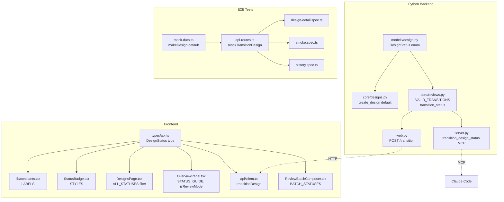

# Design Document: Design Status Refactor

## Overview

DesignStatus enum を6値（draft/active/pending_review → in_review/revision_requested/analyzing）に置換し、遷移ルール・API・MCP・フロントエンド・E2Eテストを全レイヤーで一貫して更新する。

設計判断は design-partner で確定済み。本ドキュメントはその決定を実装可能な粒度で記述する。

## Code Reuse Analysis

### Existing Components to Leverage

- **`DesignStatus(StrEnum)`** (`models/design.py`): enum 値を置換するのみ。クラス構造は維持
- **`VALID_REVIEW_TRANSITIONS`** (`core/reviews.py`): マップの内容を差し替え。データ構造（`dict[DesignStatus, set[DesignStatus]]`）は維持
- **`ReviewService`** (`core/reviews.py`): `submit_for_review` を `transition_status` に置換。他メソッド（`save_review_batch`, `save_review_comment` 等）は `_ensure_pending_review` → `_ensure_in_review` の名前変更のみ
- **`DesignService.create_design`** (`core/designs.py`): デフォルトステータスを参照する `AnalysisDesign` モデルの default 値変更で対応
- **Frontend `StatusBadge`**: 色マッピングの差し替えのみ。コンポーネント構造は維持
- **Frontend `ReviewBatchComposer`**: `BATCH_STATUSES` 配列の差し替えのみ

### Integration Points

- **REST API (`web.py`)**: `POST /api/designs/{id}/review` を `POST /api/designs/{id}/transition` に置換
- **MCP Server (`server.py`)**: `submit_for_review` ツールを `transition_design_status` ツールに置換
- **E2E fixtures**: `mock-data.ts` と `api-routes.ts` のデフォルト値・ルート定義を更新

## Architecture

変更は横断的だが、アーキテクチャの構造自体は変更しない。各レイヤーの enum 値とそれを参照するコードを機械的に更新する。



## Components and Interfaces

### C1: DesignStatus Enum (Python)

- **File:** `src/insight_blueprint/models/design.py`
- **Change:** enum 値を `{in_review, revision_requested, analyzing, supported, rejected, inconclusive}` に置換
- **Default:** `AnalysisDesign.status` の default を `DesignStatus.in_review` に変更
- **Requirements:** FR-1

### C2: Transition Rules & Service (Python)

- **File:** `src/insight_blueprint/core/reviews.py`
- **Changes:**
  1. `VALID_REVIEW_TRANSITIONS` → `VALID_TRANSITIONS` にリネーム。内容を新遷移ルールに差し替え:
     ```python
     VALID_TRANSITIONS: dict[DesignStatus, set[DesignStatus]] = {
         DesignStatus.in_review: {
             DesignStatus.revision_requested,
             DesignStatus.analyzing,
             DesignStatus.supported,
             DesignStatus.rejected,
             DesignStatus.inconclusive,
         },
         DesignStatus.revision_requested: {DesignStatus.in_review},
         DesignStatus.analyzing: {DesignStatus.in_review},
         # Terminal states: explicit empty sets to avoid KeyError
         DesignStatus.supported: set(),
         DesignStatus.rejected: set(),
         DesignStatus.inconclusive: set(),
     }
     ```
  2. `submit_for_review` → `transition_status(design_id, target_status)` に置換。VALID_TRANSITIONS マップに基づいて有効な遷移のみ許可する（終端ステータスからの遷移は空集合で明示的に拒否）
  3. `_validate_post_review_status` → `_validate_transition(current, target)` に汎用化
  4. `_ensure_pending_review` → `_ensure_in_review` にリネーム
- **Requirements:** FR-2, FR-5

### C3: REST API Endpoint (Python)

- **File:** `src/insight_blueprint/web.py`
- **Changes:**
  1. `POST /api/designs/{id}/review` を削除
  2. `POST /api/designs/{id}/transition` を追加。リクエストボディ: `{"status": "<target_status>"}`
  3. `TransitionRequest` Pydantic モデルを追加
- **Requirements:** FR-3

### C4: MCP Tool (Python)

- **File:** `src/insight_blueprint/server.py`
- **Changes:**
  1. `submit_for_review` ツールを削除
  2. `transition_design_status(design_id, status)` ツールを追加。内部で `ReviewService.transition_status` を呼び出し、ValueError は `{"error": "..."}` dict として返す（MCP ツールは例外を raise せず dict を返す既存パターンに従う）
  3. `update_analysis_design` の `pending_review` ガード（L114）を削除（遷移は `transition_design_status` で統一）
  4. `create_analysis_design` の docstring を `'draft'` → `'in_review'` に更新
- **Requirements:** FR-4（AC-3: 無効遷移時のエラーメッセージ返却は `{"error": "Cannot transition from X to Y"}` 形式）

### C5: Frontend DesignStatus Type

- **File:** `frontend/src/types/api.ts`
- **Change:** `DesignStatus` type union を `"in_review" | "revision_requested" | "analyzing" | "supported" | "rejected" | "inconclusive"` に置換
- **Requirements:** FR-6 AC-1

### C6: Frontend Constants & Labels

- **File:** `frontend/src/lib/constants.tsx`
- **Change:** `DESIGN_STATUS_LABELS` を新ステータスに対応するラベルマップに置換
- **Requirements:** FR-6 AC-2

### C7: Frontend StatusBadge

- **File:** `frontend/src/components/StatusBadge.tsx`
- **Change:** `STATUS_STYLES` を新カラースキームに置換: in_review=yellow, revision_requested=blue, analyzing=purple
- **Requirements:** FR-6 AC-3

### C8: Frontend DesignsPage Filter

- **File:** `frontend/src/pages/DesignsPage.tsx`
- **Change:** `ALL_STATUSES` 配列を新6値に置換
- **Requirements:** FR-6 AC-4

### C9: Frontend OverviewPanel

- **File:** `frontend/src/pages/design-detail/OverviewPanel.tsx`
- **Changes:**
  1. `STATUS_GUIDE` を新6ステータス対応に更新
  2. `isReviewMode` の条件を `status === "pending_review"` → `status === "in_review"` に変更
  3. "Submit for Review" ボタンを削除（design は in_review で生成されるため不要）
  4. 未使用 import（`submitReview`, `Button`, `useState` のうち該当するもの）を削除
- **Requirements:** FR-7

### C10: Frontend API Client

- **File:** `frontend/src/api/client.ts`
- **Changes:**
  1. `submitReview` 関数を削除
  2. `transitionDesign(designId, status)` 関数を追加: `POST /api/designs/{id}/transition` with `{"status": status}`
- **Requirements:** FR-8

### C11: Frontend ReviewBatchComposer

- **File:** `frontend/src/pages/design-detail/components/ReviewBatchComposer.tsx`
- **Change:** `BATCH_STATUSES` を `["supported", "rejected", "inconclusive", "revision_requested", "analyzing"]` に置換
- **Backend 対応:** `_validate_post_review_status` → `_validate_transition` の汎用化により、バックエンド側も `revision_requested` と `analyzing` を `status_after` として受け付けるようになる（VALID_TRANSITIONS マップで制御）
- **Requirements:** FR-9, FR-5 AC-2

### C12: E2E Mock Data

- **File:** `frontend/e2e/fixtures/mock-data.ts`
- **Change:** `makeDesign` のデフォルト status を `"in_review"` に変更
- **Requirements:** FR-10 AC-1

### C13: E2E API Routes

- **File:** `frontend/e2e/fixtures/api-routes.ts`
- **Changes:**
  1. `mockSubmitReview` → `mockTransitionDesign` にリネーム。エンドポイントを `/review` → `/transition` に変更
  2. レスポンスの status フィールドを更新
- **Requirements:** FR-10 AC-2

### C14: E2E Test Specs

- **Files:** `frontend/e2e/design-detail.spec.ts`, `frontend/e2e/smoke.spec.ts`, `frontend/e2e/history.spec.ts`
- **Changes:**
  1. 旧ステータス参照（`"draft"`, `"active"`, `"pending_review"`）を新ステータスに置換
  2. `mockSubmitReview` → `mockTransitionDesign` に更新
  3. Submit for Review テストをワークフローガイド表示テストに置換
  4. ステータスフィルタテスト（S6）を `"in_review"` に変更
- **Requirements:** FR-10 AC-3, AC-4

## Data Models

### DesignStatus (Python StrEnum)

```python
class DesignStatus(StrEnum):
    in_review = "in_review"
    revision_requested = "revision_requested"
    analyzing = "analyzing"
    supported = "supported"
    rejected = "rejected"
    inconclusive = "inconclusive"
```

### DesignStatus (TypeScript type)

```typescript
export type DesignStatus =
  | "in_review"
  | "revision_requested"
  | "analyzing"
  | "supported"
  | "rejected"
  | "inconclusive";
```

### TransitionRequest (Python Pydantic, 新規)

```python
class TransitionRequest(BaseModel):
    status: str
```

### State Transition Map

```
VALID_TRANSITIONS = {
    in_review:          {revision_requested, analyzing, supported, rejected, inconclusive}
    revision_requested: {in_review}
    analyzing:          {in_review}
    supported:          {}  (terminal)
    rejected:           {}  (terminal)
    inconclusive:       {}  (terminal)
}
```

## Error Handling

### Error Scenarios

1. **Invalid transition attempt**
   - **Handling:** `ReviewService.transition_status` が ValueError を raise → web.py の ValueError handler が 400 を返す
   - **User Impact:** フロントエンドの ErrorBanner に "Cannot transition from X to Y" メッセージが表示される

2. **Invalid status value in API request**
   - **Handling:** `DesignStatus(status)` が ValueError → 400 "Invalid status 'xxx'"
   - **User Impact:** フロントエンドの ErrorBanner にエラーメッセージが表示される

3. **Review batch on non-in_review design**
   - **Handling:** `_ensure_in_review` が ValueError → 400 "Design must be in 'in_review' status"
   - **User Impact:** フロントエンドの ReviewBatchComposer がエラーを表示

4. **Design not found**
   - **Handling:** 404 "Design 'xxx' not found"（既存動作、変更なし）
   - **User Impact:** 変更なし

5. **MCP ツールでの無効遷移 (FR-4 AC-3)**
   - **Handling:** `transition_design_status` が `ReviewService.transition_status` の ValueError をキャッチし `{"error": "Cannot transition from X to Y. Valid: ..."}` を返す
   - **User Impact:** Claude Code が遷移失敗を検知し、ユーザーに状況を伝える

## Python Test Update Strategy

Python テストファイル（`test_designs.py`, `test_reviews.py`, `test_web.py`, `test_web_integration.py`, `test_integration.py`, `test_server.py`）の更新方針:

1. **旧ステータスリテラルの置換**: `"draft"` → `"in_review"`, `"active"` → `"analyzing"` or `"in_review"`（文脈依存）, `"pending_review"` → `"in_review"`
2. **旧関数呼び出しの置換**: `submit_for_review` → `transition_status`, `POST /review` → `POST /transition`
3. **遷移テストの書き換え**: 旧フロー（draft→active→pending_review→terminal）のテストを新フロー（in_review→{revision_requested,analyzing,terminal}）に合わせて再構成
4. **ヘルパー関数の更新**: テスト内の `_create_active_design` → `_create_in_review_design` 等のリネーム
5. **パラメタライズの更新**: `@pytest.mark.parametrize` の status 値リストを新ステータスに置換
