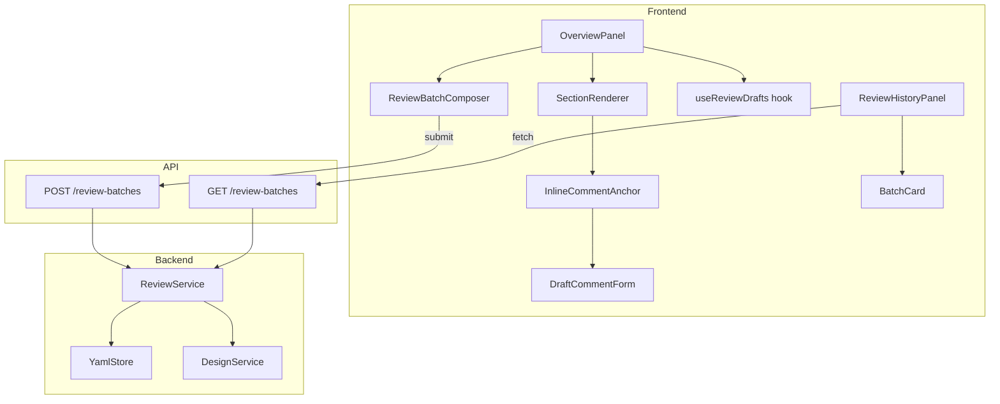

# Design: Inline Review Comments

## Overview

Design Detail の Overview タブにインラインコメント機能を統合し、Review タブを廃止する。セクション単位のアンカーとセクション内容のスナップショットを持つコメントを `ReviewBatch` としてバッチ投稿し、AI revision の入力精度を向上させる。

## Steering Document Alignment

### Technical Standards (tech.md)

- **Storage**: YAML primary + atomic write（`tempfile.mkstemp()` + `os.replace()`）。`ReviewBatch` も同パターンに従う
- **Models**: Pydantic models が single source of truth。`ReviewBatch` / `BatchComment` を `models/review.py` に追加
- **MCP**: `save_review_batch` ツールを `server.py` に追加。REST API と同一語彙
- **TDD**: Red-Green-Refactor サイクルでバックエンドのサービス層から実装開始

### Project Structure (structure.md)

- **Layer architecture**: Core Services (`core/reviews.py`) にビジネスロジック追加。`web.py` / `server.py` はトランスポート層のみ
- **Frontend directory**: SPEC-4b の SRP ディレクトリパターンに従い、`pages/design-detail/components/` にコンポーネント配置
- **File length**: OverviewPanel は400行以内。超過する機能は専用コンポーネントに分割

## Code Reuse Analysis

### Existing Components to Leverage

- **`ReviewService`** (`core/reviews.py`): `save_review_batch()` / `list_review_batches()` メソッドを追加
- **`read_yaml` / `write_yaml`** (`storage/yaml_store.py`): バッチの永続化に atomic write を再利用
- **`VALID_REVIEW_TRANSITIONS`** (`core/reviews.py`): ステータス遷移バリデーションをバッチ投稿にも適用
- **`StatusBadge`** (`components/StatusBadge.tsx`): History タブのバッチ表示で再利用
- **`JsonTree`** (`components/JsonTree.tsx`): OverviewPanel のセクション表示で引き続き使用
- **`request()`** (`api/client.ts`): 新 API クライアント関数のベース
- **`ErrorBanner`** (`components/ErrorBanner.tsx`): エラー表示で再利用

### Integration Points

- **`DesignDetail`** (`pages/design-detail/DesignDetail.tsx`): タブ構成変更 + `refreshDesign` コールバック接続
- **`DesignsPage`** (`pages/DesignsPage.tsx`): `onDesignUpdated` 経由のリスト更新（変更なし）

## Architecture

### 全体構成



### Modular Design Principles

- **Single File Responsibility**: `SectionRenderer`（表示）/ `InlineCommentAnchor`（アンカーUI）/ `DraftCommentForm`（入力）/ `ReviewBatchComposer`（投稿）を分離
- **Component Isolation**: 各セクションのコメント状態は `useReviewDrafts` hook でセクション単位に購読し、無関係なセクションの再レンダリングを防ぐ
- **Service Layer Separation**: `ReviewService` がバッチ保存を担う。`web.py` / `server.py` はデータ変換のみ
- **Section Registry Pattern**: コメント対象セクションをハードコードせず、registry 定義で管理する（セクション追加時の変更漏れ防止）

```typescript
// Section registry — single source of truth for commentable sections
const COMMENTABLE_SECTIONS = [
  { id: "hypothesis_statement", label: "Hypothesis Statement", type: "text" },
  { id: "hypothesis_background", label: "Hypothesis Background", type: "text" },
  { id: "metrics", label: "Metrics", type: "json" },
  { id: "explanatory", label: "Explanatory", type: "json" },
  { id: "chart", label: "Chart", type: "json" },
  { id: "next_action", label: "Next Action", type: "json" },
] as const;
```

## Components and Interfaces

### Backend: `ReviewBatch` / `BatchComment` モデル

- **Purpose**: バッチ単位のレビューコメントを表現する Pydantic モデル
- **Interfaces**:
  ```python
  # JSON 互換の再帰型（YAML シリアライズ安全）
  JsonValue = str | int | float | bool | None | list["JsonValue"] | dict[str, "JsonValue"]

  class BatchComment(BaseModel, extra="forbid"):
      comment: str
      target_section: str | None = None
      target_content: JsonValue = None  # セクション内容のスナップショット（レビュー時点）

      @model_validator(mode="after")
      def target_content_requires_section(self) -> Self:
          if self.target_section and self.target_content is None:
              raise ValueError("target_content is required when target_section is set")
          return self

  class ReviewBatch(BaseModel, extra="forbid"):
      id: str                          # "RB-{uuid4.hex[:8]}"
      design_id: str
      status_after: DesignStatus
      reviewer: str = "analyst"
      comments: list[BatchComment]     # 1件以上
      created_at: datetime = Field(default_factory=now_jst)
  ```
- **Dependencies**: `models.design.DesignStatus`, `models.common.now_jst`
- **Reuses**: 既存の `ReviewComment` と同じモジュールに配置
- **Validation rules**:
  - `target_section` が設定されている場合、`target_content` は必須
  - `extra="forbid"` で想定外フィールドの混入を防止

### Backend: `ReviewService` 拡張

- **Purpose**: バッチ保存・取得のビジネスロジック
- **Interfaces**:
  ```python
  def save_review_batch(
      self, design_id: str, status: str,
      comments: list[dict], reviewer: str = "analyst",
  ) -> ReviewBatch | None

  def list_review_batches(self, design_id: str) -> list[ReviewBatch]
  # 返却順: created_at 降順（新しい順）
  ```
- **Dependencies**: `DesignService`, `YamlStore`
- **Reuses**: `VALID_REVIEW_TRANSITIONS`, `_validate_id`, `read_yaml` / `write_yaml`
- **Atomicity**: `save_review_batch` の操作順序:
  1. YAML に ReviewBatch を書き込む（atomic write）
  2. 書き込み成功後、Design のステータスを遷移する
  3. ステータス遷移が失敗した場合、バッチは保存済みだがステータスは未遷移。ユーザーに再試行を促す（ローカルツールのため発生確率は極めて低い）

### Backend: REST API エンドポイント

- **Purpose**: ReviewBatch の投稿・取得エンドポイント
- **Interfaces**:
  ```python
  @app.post("/api/designs/{design_id}/review-batches")
  async def submit_review_batch(design_id, body: SubmitBatchRequest) -> dict
  # body: { status_after, reviewer?, comments: [{comment, target_section?, target_content?}] }
  # response: { batch_id, status_after, comment_count }

  @app.get("/api/designs/{design_id}/review-batches")
  async def list_review_batches(design_id) -> dict
  # response: { design_id, batches: ReviewBatch[], count }
  ```
- **Dependencies**: `ReviewService`
- **Reuses**: 既存の `_ID_PATTERN`, `ApiError`

### Frontend: `useReviewDrafts` hook

- **Purpose**: ドラフトコメントの状態管理。React state のみ（揮発性）。`beforeunload` 警告を含む
- **Interfaces**:
  ```typescript
  function useReviewDrafts(designId: string): {
    drafts: DraftComment[];
    addDraft: (section: string, comment: string, content: unknown) => void;
    removeDraft: (draftId: string) => void;
    clearAll: () => void;
    hasDrafts: boolean;
    draftsBySection: Map<string, DraftComment[]>;
  }
  ```
- **Dependencies**: React (`useState`, `useEffect`, `useCallback`)
- **Reuses**: なし（新規）

### Frontend: `SectionRenderer`

- **Purpose**: Design の1セクションを表示する。セクション種別（text / json）に応じてレンダリングを切り替え
- **Interfaces**:
  ```typescript
  interface SectionRendererProps {
    section: CommentableSection;  // registry のエントリ
    value: unknown;               // Design の該当フィールドの値
    isReviewMode: boolean;        // pending_review かどうか
    drafts: DraftComment[];       // このセクションのドラフト
    onAddDraft: (comment: string) => void;
    onRemoveDraft: (draftId: string) => void;
  }
  ```
- **Dependencies**: `JsonTree`, `InlineCommentAnchor`, `DraftCommentForm`
- **Reuses**: `JsonTree`, `Field` helper
- **Note**: `onAddDraft` 呼び出し時、`SectionRenderer` が `structuredClone(value)`（現在のセクション内容の deep copy）を `target_content` として hook に渡す。後続の Design 編集でスナップショットが変わらないことを保証する

### Frontend: `InlineCommentAnchor`

- **Purpose**: セクション横のコメントボタン。クリックで `DraftCommentForm` をトグル
- **Interfaces**: `{ onAdd: (comment: string) => void; isReviewMode: boolean }`
- **Dependencies**: shadcn/ui `Button`
- **Reuses**: なし

### Frontend: `DraftCommentForm`

- **Purpose**: インラインのテキスト入力フォーム。送信でドラフトに追加
- **Interfaces**: `{ onSubmit: (comment: string) => void; onCancel: () => void }`
- **Dependencies**: shadcn/ui `Textarea`, `Button`
- **Reuses**: なし

### Frontend: `ReviewBatchComposer`

- **Purpose**: 画面下部のフローティングバー。ドラフト件数 + ステータスセレクタ + Submit All
- **Interfaces**:
  ```typescript
  interface ReviewBatchComposerProps {
    designId: string;
    drafts: DraftComment[];
    onSubmitted: () => void;  // 送信成功後のコールバック
    onClearDrafts: () => void;
  }
  ```
- **Dependencies**: `submitReviewBatch` API client, shadcn/ui `Select`, `Button`
- **Reuses**: `COMMENT_STATUSES` 定数（旧 ReviewPanel から移動）
- **Note**: Submit ボタンは送信中 `disabled` にする（UI レベルの二重投稿防止）

### Frontend: `ReviewHistoryPanel`

- **Purpose**: 旧 ReviewPanel のリネーム。過去の ReviewBatch を read-only 表示。各コメントに `target_content`（レビュー時点のセクション内容）を引用表示する
- **Interfaces**: `{ designId: string }`
- **Dependencies**: `listReviewBatches` API client, `StatusBadge`, `JsonTree`
- **Reuses**: `StatusBadge`, `formatDateTime`

## Data Models

### ReviewBatch (backend, new)

```python
JsonValue = str | int | float | bool | None | list["JsonValue"] | dict[str, "JsonValue"]

class BatchComment(BaseModel, extra="forbid"):
    comment: str                        # コメントテキスト（max 2000 chars）
    target_section: str | None = None   # "hypothesis_statement" | "metrics" | ...
    target_content: JsonValue = None    # レビュー時点のセクション内容スナップショット
    # Validation: target_section が set なら target_content 必須

class ReviewBatch(BaseModel, extra="forbid"):
    id: str                            # "RB-{uuid4.hex[:8]}"
    design_id: str
    status_after: DesignStatus         # バッチ全体で1つのステータス遷移
    reviewer: str = "analyst"
    comments: list[BatchComment]       # 1件以上
    created_at: datetime
```

### YAML Storage Schema

```yaml
# {design_id}_reviews.yaml
batches:
  - id: "RB-a1b2c3d4"
    design_id: "DES-xyz"
    status_after: "active"
    reviewer: "analyst"
    comments:
      - comment: "仮説の指標が曖昧"
        target_section: "hypothesis_statement"
        target_content: "〇〇の施策はCVRを改善する"
      - comment: "KPI測定期間が未定義"
        target_section: "metrics"
        target_content:
          kpi_name: "CVR"
          current_value: "2.5%"
          target_value: null
    created_at: "2026-03-01T10:00:00+09:00"
```

`batches` キーがないファイル、またはファイル自体が存在しない場合は空リストとして扱う。旧形式（`comments` キーのみ）のデータは無視し、warning ログを出力する。

### Section Definition Sync

バックエンドの `ALLOWED_TARGET_SECTIONS`（`core/reviews.py`）とフロントエンドの `COMMENTABLE_SECTIONS` は同一のセクション ID リストを保持する必要がある。バックエンドが正（バリデーション責務）、フロントエンドが従（UI 表示責務）。セクション追加時は両方を更新する。

### Frontend Types (new)

```typescript
interface BatchComment {
  comment: string;
  target_section: string | null;
  target_content: JsonValue;  // text sections: string, json sections: object
}

// JSON-compatible recursive type
type JsonValue = string | number | boolean | null | JsonValue[] | { [key: string]: JsonValue };

interface ReviewBatch {
  id: string;
  design_id: string;
  status_after: DesignStatus;
  reviewer: string;
  comments: BatchComment[];
  created_at: string;
}

interface DraftComment {
  id: string;             // crypto.randomUUID()
  target_section: string;
  target_content: JsonValue;  // structuredClone でキャプチャしたスナップショット
  comment: string;
}

interface SubmitBatchRequest {
  status_after: DesignStatus;
  reviewer?: string;
  comments: { comment: string; target_section?: string; target_content?: JsonValue }[];
}
```

## Error Handling

### Error Scenarios

1. **バッチ投稿時に Design が `pending_review` でない**
   - **Handling**: API が 400 エラーを返す。`ReviewService.save_review_batch()` で事前チェック
   - **User Impact**: Submit Bar にエラーメッセージ表示。ドラフトは保持される

2. **YAML atomic write 失敗**
   - **Handling**: `write_yaml()` の例外をキャッチ。ステータス遷移は行わない（NFR-8 準拠）
   - **User Impact**: エラーメッセージ表示。再試行可能

3. **`target_section` に不正な値**
   - **Handling**: `ALLOWED_TARGET_SECTIONS` リストに対してバリデーション。不一致は 422 エラー（レスポンスに不正フィールド名を含む）
   - **User Impact**: フロントエンドが registry からのみ `target_section` を生成するため、正常利用では発生しない

4. **ドラフト未送信でページ離脱**
   - **Handling**: `beforeunload` イベントで確認ダイアログ表示
   - **User Impact**: 意図しない離脱を警告。ドラフトは揮発性のため離脱すると消失する

5. **存在しない `design_id`**
   - **Handling**: `DesignService` が design を見つけられず `None` 返却 → API が 404 を返す
   - **User Impact**: エラーメッセージ表示

6. **コメントバリデーション違反（空コメント、2000文字超過、空配列）**
   - **Handling**: Pydantic バリデーションで 422 を返す。レスポンスに違反フィールド情報を含む
   - **User Impact**: Submit Bar にバリデーションエラー表示。ドラフトは保持される

7. **YAML ファイル破損（GET 時のパースエラー）**
   - **Handling**: `read_yaml()` がパース失敗 → warning ログ出力 + 空リスト返却
   - **User Impact**: 過去のバッチが表示されないが、新規投稿は可能

## Testing Strategy

### Unit Testing

- **`ReviewService.save_review_batch()`**: 正常系（バッチ保存 + ステータス遷移）、異常系（非 `pending_review`、不正ステータス、空コメント）
- **`ReviewService.list_review_batches()`**: バッチ取得、空リスト、降順ソート
- **`target_section` validation**: 有効値の通過、不正値の拒否
- **`target_content` preservation**: テキスト型・JSON 型の両方が保存・復元されること
- **YAML write failure**: 書き込み失敗時にステータスが遷移しないこと

### Integration Testing

- **REST API** (`TestClient`):
  - `POST /review-batches` → バッチ保存 → `GET /review-batches` で取得確認
  - ステータス遷移の連動確認（`pending_review` → `status_after`）
  - `target_content` の round-trip 確認
- **MCP tool**: `save_review_batch` ツールの正常系・異常系

### End-to-End Testing

- フルレビューフロー: Design 作成 → `active` → `pending_review` → ドラフト追加 → バッチ投稿 → ステータス遷移確認
- History タブ: 複数バッチの時系列表示 + `target_content` の引用表示確認
