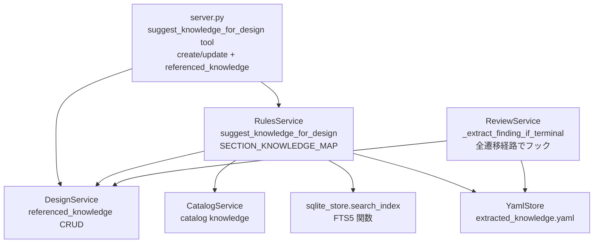

# Design Document: Knowledge Suggestion

## Overview

分析設計の各セクション作成時に、蓄積された Knowledge を自動サジェストし、参照のトレーサビリティを確保する機能。既存の `RulesService` を拡張し、`DesignService` と連携して finding の自動抽出とセクション別サジェストを実現する。

## Steering Document Alignment

### Technical Standards (tech.md)

- **TDD**: 全コンポーネントを Red-Green-Refactor で実装。テストが仕様、実装は手段
- **YAGNI**: `finding` カテゴリ1つの追加のみ。マッチング戦略の過剰な抽象化を避け、カテゴリごとにプライベートメソッドで実装
- **StrEnum**: `KnowledgeCategory` に `finding` を StrEnum メンバーとして追加
- **Pydantic**: `AnalysisDesign` モデルに `referenced_knowledge` フィールドを Pydantic Field で追加
- **Atomic YAML writes**: finding 保存も既存の `write_yaml` (tempfile + `os.replace()`) を使用
- **Service Locator**: `_registry.py` 経由で `RulesService` にアクセス

### Project Structure (structure.md)

- **依存方向の遵守**: `server.py → core/rules.py → storage/ → models/`。逆方向の依存は発生しない
- **Single File Responsibility**: suggest ロジックは `core/rules.py` に集約。`server.py` にビジネスロジックを置かない
- **命名規則**: `snake_case` メソッド名、`UPPER_SNAKE_CASE` 定数、テストは `test_{module}_{condition}_{expected}`
- **ファイルサイズ**: `core/rules.py` の拡張後も 400 行以内に収まる見込み

## Code Reuse Analysis

### Existing Components to Leverage

- **`RulesService._collect_all_knowledge_entries()`**: 全 knowledge 収集の基盤。suggest でそのまま再利用
- **`RulesService._read_extracted_knowledge()`**: `extracted_knowledge.yaml` の読み書き。finding 保存に再利用
- **`ReviewService.save_extracted_knowledge()`**: 既存の knowledge 保存ロジック（重複チェック付き）。finding 保存のパターンを踏襲
- **`DesignService.get_design()` / `update_design()`**: design の取得・更新。`referenced_knowledge` の読み書きに使用
- **`storage/sqlite_store.search_index()`**: FTS5 関数。methodology カテゴリのマッチングに使用（注: クラスではなくモジュールレベル関数）
- **`ALLOWED_TARGET_SECTIONS`**: `core/reviews.py` の既存定数。`referenced_knowledge` を追加

### Integration Points

- **terminal 遷移の全経路**: finding 自動抽出のフック地点。`transition_status()` / `save_review_comment()` / `save_review_batch()` の3メソッドが対象
- **`server.py` の MCP ツール群**: `create_analysis_design` / `update_analysis_design` に `referenced_knowledge` パラメータを追加
- **`extracted_knowledge.yaml`**: 既存の knowledge 保存先。finding もここに格納
- **`frontend/src/.../sections.ts`**: `COMMENTABLE_SECTIONS` に `referenced_knowledge` を追加（契約テスト維持のため最小限のフロントエンド変更が必要）

## Architecture

### コンポーネント間の依存関係



### データフロー

```
[Terminal 遷移] → ReviewService._extract_finding_if_terminal(design_id, target_status)
                    ↓ target_status が terminal (supported/rejected/inconclusive) の場合のみ
                    → design = DesignService.get_design(design_id)  ← 更新後の design を取得
                    → _build_finding(design) で DomainKnowledgeEntry を生成
                    → save_extracted_knowledge() で永続化 (fire-and-forget)

  適用経路 (3箇所すべてでフック):
    - transition_status() → update_design() → _extract_finding_if_terminal()
    - save_review_comment() → update_design() → _extract_finding_if_terminal()
    - save_review_batch() → update_design() → _extract_finding_if_terminal()

[サジェスト要求] → server.py: suggest_knowledge_for_design(section, ...)
                    → RulesService.suggest_knowledge_for_design()
                    → SECTION_KNOWLEDGE_MAP でカテゴリフィルタ
                    → カテゴリ別マッチング戦略実行
                    → relevance 付きで結果返却

[トレーサビリティ] → server.py: create/update_analysis_design(referenced_knowledge=...)
                    → DesignService.create/update_design()
                    → YAML に referenced_knowledge を保存
```

## Components and Interfaces

### Component 1: KnowledgeCategory 拡張 (models/catalog.py)

- **Purpose**: `finding` カテゴリの追加
- **Interfaces**: `KnowledgeCategory.finding` enum メンバー
- **Dependencies**: なし
- **Reuses**: 既存の `StrEnum` パターン

### Component 2: AnalysisDesign 拡張 (models/design.py)

- **Purpose**: `referenced_knowledge` フィールドの追加
- **Interfaces**: `AnalysisDesign.referenced_knowledge: dict[str, list[str]]`
- **Dependencies**: `models/common.py`
- **Reuses**: 既存の Pydantic `Field(default_factory=dict)` パターン

### Component 3: Finding 自動抽出 (core/reviews.py)

- **Purpose**: terminal 遷移時に finding を自動抽出・保存
- **Interfaces**:
  - `ReviewService._extract_finding_if_terminal(design_id: str, target_status: DesignStatus) -> None` — プライベートメソッド。target_status が terminal の場合のみ抽出を実行
  - `ReviewService._build_finding(design: AnalysisDesign) -> DomainKnowledgeEntry` — プライベートメソッド。finding エントリを生成
- **適用経路**: terminal 遷移する全メソッドからフック（3箇所）:
  - `transition_status()` — `update_design()` の後に呼び出し
  - `save_review_comment()` — `update_design()` の後に呼び出し
  - `save_review_batch()` — `update_design()` の後に呼び出し
- **順序保証**: `update_design(status=target)` で DB 更新完了後に `_extract_finding_if_terminal()` を呼ぶ。finding のタイトル `[{STATUS}]` は引数の `target_status` を使用し、DB 再読み込みに依存しない
- **Dependencies**: `DesignService`, `YamlStore`
- **Reuses**: `save_extracted_knowledge()` の保存パターン（重複チェック + atomic write）

### Component 4: Knowledge サジェスト (core/rules.py)

- **Purpose**: セクション別の knowledge サジェスト
- **Interfaces**:
  - `RulesService.suggest_knowledge_for_design(section, theme_id, source_ids, hypothesis_text, parent_id) -> dict`
  - `SECTION_KNOWLEDGE_MAP: dict[str, list[KnowledgeCategory]]` — モジュール定数
- **Dependencies**: `CatalogService`, `DesignService`, `storage/sqlite_store` (モジュールレベル関数)
- **Reuses**: `_collect_all_knowledge_entries()`, `_read_extracted_knowledge()`
- **RulesService コンストラクタ変更**: `DesignService` と `db_path: Path` (FTS5 用) を新たに受け取る。`_registry.py` と `cli.py` の配線を更新

### Component 5: MCP ツール (server.py)

- **Purpose**: `suggest_knowledge_for_design` ツールの追加、既存ツールに `referenced_knowledge` パラメータ追加
- **Interfaces**:
  - `suggest_knowledge_for_design(section, theme_id, source_ids, hypothesis_text, parent_id) -> dict`
  - `create_analysis_design(..., referenced_knowledge) -> dict`
  - `update_analysis_design(..., referenced_knowledge) -> dict`
- **Dependencies**: `_registry.py`
- **Reuses**: 既存の MCP ツール定義パターン
- **エラーメッセージ更新**: `get_domain_knowledge` のカテゴリ一覧に `finding` を追加

### Component 6: レビュー対象セクション拡張 (core/reviews.py + frontend)

- **Purpose**: `ALLOWED_TARGET_SECTIONS` に `referenced_knowledge` を追加
- **Backend**: `core/reviews.py` の `ALLOWED_TARGET_SECTIONS` set に追加
- **Frontend**: `frontend/src/pages/design-detail/components/sections.ts` の `COMMENTABLE_SECTIONS` 配列に `{ id: "referenced_knowledge", label: "Referenced Knowledge", type: "json" }` を追加
- **理由**: Backend/Frontend 間の契約テスト (`test_reviews.py` L1088-1108) が `ALLOWED_TARGET_SECTIONS == COMMENTABLE_SECTIONS` の一致を検証しているため、両方同時に更新が必須
- **Reuses**: 既存の `ALLOWED_TARGET_SECTIONS` set、`COMMENTABLE_SECTIONS` 配列

### Component 7: DesignService 引数拡張 (core/designs.py)

- **Purpose**: `create_design()` と `update_design()` で `referenced_knowledge` を受け取れるようにする
- **Interfaces**:
  - `create_design(..., referenced_knowledge: dict[str, list[str]] | None = None) -> AnalysisDesign`
  - `update_design(design_id, ..., referenced_knowledge=...) -> AnalysisDesign | None` — 既存の `**fields` パターンで対応済み（モデルにフィールドがあれば自動的に渡せる）
- **Dependencies**: `models/design.py`
- **Reuses**: 既存の `model_copy(update=...)` パターン

## Data Models

### KnowledgeCategory (変更)

```python
class KnowledgeCategory(StrEnum):
    methodology = "methodology"
    caution = "caution"
    definition = "definition"
    context = "context"
    finding = "finding"          # NEW
```

### AnalysisDesign (変更)

```python
class AnalysisDesign(BaseModel):
    # ... existing fields ...
    referenced_knowledge: dict[str, list[str]] = Field(default_factory=dict)  # NEW
```

`referenced_knowledge` の構造:
```python
{
    "hypothesis_statement": ["CHURN-H01-finding", "orders-caution-1"],
    "source_ids": ["orders-caution-2"],
}
```

### Finding の自動生成ルール

```python
DomainKnowledgeEntry(
    key="{design_id}-finding",              # e.g., "CHURN-H01-finding"
    title="[{STATUS}] {design.title}"[:80], # e.g., "[SUPPORTED] チャーン率の季節変動仮説"
    content=design.hypothesis_statement,
    category=KnowledgeCategory.finding,
    source="design:{design_id}",            # e.g., "design:CHURN-H01"
    affects_columns=design.source_ids,      # e.g., ["orders", "users"]
)
```

**STATUS の取得**: `_extract_finding_if_terminal()` の引数 `target_status` を使用する。`get_design()` で再読み込みはしない（更新直後のため不要、かつ順序保証が明確）。

### SECTION_KNOWLEDGE_MAP (新規定数)

```python
SECTION_KNOWLEDGE_MAP: dict[str, list[KnowledgeCategory]] = {
    "hypothesis_statement":  [KnowledgeCategory.finding],
    "hypothesis_background": [KnowledgeCategory.finding, KnowledgeCategory.context],
    "source_ids":            [KnowledgeCategory.caution, KnowledgeCategory.definition],
    "metrics":               [KnowledgeCategory.methodology],
    "explanatory":           [KnowledgeCategory.methodology, KnowledgeCategory.caution],
    "chart":                 [KnowledgeCategory.methodology],
    "next_action":           [KnowledgeCategory.finding],
}
```

### マッチング戦略 (カテゴリ別)

| カテゴリ | 戦略 | 使用するパラメータ | 実装方法 |
|---------|------|-------------------|---------|
| finding | theme_id 一致 + parent_id lineage 走査 (深度上限10) | `theme_id`, `parent_id` | `_collect_all_knowledge_entries()` でフィルタ + `DesignService.get_design()` で lineage 走査 |
| caution | source_ids ∩ affects_columns | `source_ids` | `_collect_all_knowledge_entries()` でフィルタ（既存 `suggest_cautions()` と同等ロジック） |
| methodology | FTS5 全文検索 | `hypothesis_text` | `sqlite_store.search_index(db_path, hypothesis_text)` → 結果の `title` を knowledge entries と突合してフィルタ |
| definition | source_ids ∩ affects_columns | `source_ids` | caution と同一ロジック |
| context | theme_id 一致 | `theme_id` | finding の theme_id マッチと同一ロジック |

#### methodology マッチングの詳細

現在の `sqlite_store.search_index()` は `doc_type, source_id, title, snippet, rank` を返すが、`category` や `key` フィールドを持たない。methodology マッチングは以下の手順で実装する:

1. `search_index(db_path, hypothesis_text)` で FTS5 検索を実行
2. 結果の `doc_type == "knowledge"` のものを抽出
3. `_collect_all_knowledge_entries()` で取得した全エントリと `title` で突合
4. `category == methodology` のエントリのみをフィルタして返却

### referenced_knowledge の merge 仕様

`update_analysis_design` で `referenced_knowledge` を更新する際の merge ルール:

```python
# 同一セクションキーの場合: リストを和集合で結合（重複排除）
for section_key, new_keys in new_referenced.items():
    existing_keys = current_referenced.get(section_key, [])
    merged = list(dict.fromkeys([*existing_keys, *new_keys]))  # 順序保持 + 重複排除
    current_referenced[section_key] = merged
# update に含まれないセクションキーは変更なし
```

これにより:
- 既存セクションに新しい knowledge key を追加できる
- 同じ key を二重登録しない
- 更新対象外のセクションの参照は保持される

### サジェスト結果のレスポンス構造

```python
{
    "section": "hypothesis_statement",
    "suggestions": {
        "finding": [
            {
                "key": "CHURN-H01-finding",
                "title": "[SUPPORTED] チャーン率の季節変動仮説",
                "content": "...",
                "category": "finding",
                "relevance": "theme_id match: CHURN",
            }
        ]
    },
    "total": 1,
}
```

## Error Handling

### Error Scenarios

1. **Finding 自動抽出の I/O 失敗**
   - **Handling**: `_extract_finding_if_terminal()` 全体を `try/except` で捕捉し `logger.warning()` でログ出力。ステータス遷移はロールバックしない (fire-and-forget)
   - **User Impact**: ステータス遷移は成功するが、finding が保存されない。次回の terminal 遷移時に既存チェックで重複なし判定されるため、再抽出は手動対応

2. **Ancestor walking の循環参照**
   - **Handling**: visited set で検出。深度上限 10 で強制停止
   - **User Impact**: 収集済みの結果をそのまま返却。ユーザーへの影響なし

3. **FTS5 検索の失敗**
   - **Handling**: SQLite 例外を捕捉し、methodology カテゴリの結果を空で返却
   - **User Impact**: methodology のサジェストが欠落するが、他カテゴリの結果は正常に返却

4. **未知の section パラメータ**
   - **Handling**: error dict を返却 (`{"error": "Unknown section '...'"}`)
   - **User Impact**: Claude Code が error を受け取り、正しい section 名で再試行可能

5. **FTS5 結果と knowledge entries の突合失敗**
   - **Handling**: title が一致しない FTS5 結果はスキップ。マッチした分だけ返却
   - **User Impact**: methodology のサジェスト結果が少なくなる可能性があるが、誤った結果は返さない

## Testing Strategy

### Unit Testing

- **models/catalog.py**: `KnowledgeCategory.finding` の存在確認、既存4値の後方互換テスト
- **models/design.py**: `referenced_knowledge` のデフォルト値、シリアライズ/デシリアライズ、既存 YAML との互換性
- **core/rules.py**:
  - `SECTION_KNOWLEDGE_MAP` の全セクションカバー
  - カテゴリ別マッチング戦略の個別テスト (theme_id, source_ids, FTS5, lineage)
  - methodology: FTS5 結果と knowledge entries の突合テスト
  - ancestor walking: 通常ケース、循環参照、深度上限
  - section=None の全カテゴリ返却
  - 未知 section のエラー返却
  - `RulesService` コンストラクタの `DesignService` / `db_path` 追加
- **core/reviews.py**:
  - `_extract_finding_if_terminal()`: terminal ステータスで finding 生成
  - `_extract_finding_if_terminal()`: 非 terminal ステータスで何もしない
  - 全3経路 (`transition_status`, `save_review_comment`, `save_review_batch`) での finding 抽出
  - 重複 finding の非生成
  - 抽出失敗時のステータス遷移継続 (fire-and-forget)
  - finding タイトルの STATUS が target_status を使用していること
  - `ALLOWED_TARGET_SECTIONS` に `referenced_knowledge` が含まれること
- **core/designs.py**:
  - `create_design()` に `referenced_knowledge` を渡せること
  - `update_design()` で `referenced_knowledge` が merge されること（リスト和集合）
- **server.py**:
  - `get_domain_knowledge` のカテゴリ一覧に `finding` が含まれること
- **契約テスト**:
  - `ALLOWED_TARGET_SECTIONS` と `COMMENTABLE_SECTIONS` の一致（既存テスト。`referenced_knowledge` 追加後も通ること）

### Integration Testing

- **finding ライフサイクル**: design 作成 → terminal 遷移 (全3経路) → finding 抽出 → suggest で finding 返却
- **トレーサビリティフロー**: suggest → referenced_knowledge 付きで create → get で referenced_knowledge 確認
- **referenced_knowledge merge**: create → update (同一セクションに追加) → get で和集合確認
- **MCP ツール**: `suggest_knowledge_for_design` の引数バリエーション

### End-to-End Testing

- フロントエンドの変更は `COMMENTABLE_SECTIONS` への定数追加のみ（UI 表示は別 spec）のため、E2E テストは対象外
