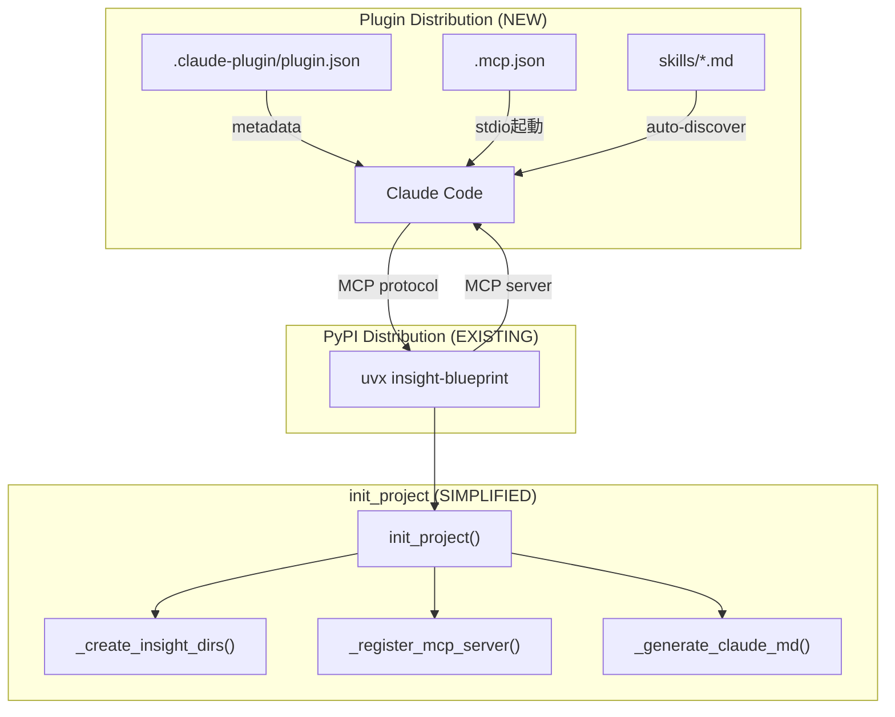

# Design: Plugin Distribution

## Overview

insight-blueprint の配布方式を Claude Code Plugin format に移行する。主な変更は: (1) Plugin manifest + MCP 定義ファイルの新規作成、(2) Skills の `_skills/` → `skills/` 移動、(3) Rules の SKILL.md 統合、(4) `storage/project.py` と `cli.py` から配布関連コード約400行を削除。

本設計は「削除と移動」が中心であり、新規ロジックの実装は最小限。

## Steering Document Alignment

### Technical Standards (tech.md)

- **YAGNI**: 現行のハッシュベースバージョン管理は Plugin のライフサイクル管理で置き換えるため全削除。互換レイヤーは設けない
- **TDD**: Plugin 構造の検証テストを先に書いてから移行を実施
- **Single Source of Truth**: Skills は `skills/` のみ。PyPI wheel への同梱と `.claude/skills/` へのコピーの二重管理を排除

### Project Structure (structure.md)

- `_skills/` → `skills/`（リポジトリルート）への移動により、`src/insight_blueprint/` 配下のパッケージ構造がシンプルになる
- `_rules/` は削除（内容は SKILL.md と CLAUDE.md テンプレートに分散）
- 依存方向は変更なし: `cli.py` → `storage/project.py` の `init_project()` は維持

## Code Reuse Analysis

### Existing Components to Leverage

- **`_register_mcp_server()`** (`storage/project.py:411-459`): 現行の `.mcp.json` upsert ロジックをそのまま維持。Plugin ルートの `.mcp.json` とは別に、ユーザープロジェクトの `.mcp.json` を管理する
- **`_generate_claude_md()`** (`storage/project.py:507-555`): managed section ロジックを維持。テンプレート内容を extension-policy を含むよう更新
- **`_create_insight_dirs()`** (`storage/project.py:43-50`): 変更なし
- **SKILL.md フロントマター形式**: 既存の name/version/description 形式を維持

### Integration Points

- **pyproject.toml**: `[tool.hatch.build.targets.wheel]` の `packages` に `_skills/` は含まれていない（`packages = ["src/insight_blueprint"]` のため `_skills/` は自動的に wheel に含まれている）。`skills/` への移動で wheel からは除外される
- **CI (`ci.yml`)**: `claude plugin validate .` ジョブを追加

## Architecture

Plugin 方式への移行後のアーキテクチャ:



### Two Distribution Paths

| Path | What | Who | How |
|------|------|-----|-----|
| Plugin | Skills + MCP定義 | `claude plugin install` | `.claude-plugin/` + `skills/` + `.mcp.json` |
| PyPI | MCP サーバーバイナリ | `uvx insight-blueprint` | wheel パッケージ（`_skills/` なし） |

Plugin はスキル定義と MCP サーバー起動設定を配布する。MCP サーバー本体は `uvx` が PyPI から自動取得する。

## Components and Interfaces

### Component 1: Plugin Manifest Files (NEW)

- **Purpose**: Claude Code に insight-blueprint を Plugin として認識させる
- **Files**:
  - `.claude-plugin/plugin.json` — メタデータ
  - `.mcp.json` — MCP サーバー起動定義

**`.claude-plugin/plugin.json`**:
```json
{
  "name": "insight-blueprint",
  "version": "0.4.0",
  "description": "Hypothesis-driven data analysis workflow and catalog MCP server",
  "author": {
    "name": "Eto Yama"
  },
  "repository": "https://github.com/etoyama/insight-blueprint",
  "license": "MIT",
  "keywords": ["analysis", "hypothesis", "data-catalog", "mcp"]
}
```

**`.mcp.json`** (Plugin ルート):
```json
{
  "mcpServers": {
    "insight-blueprint": {
      "command": "uvx",
      "args": ["insight-blueprint", "--project", "."],
      "env": {
        "PYTHONUNBUFFERED": "1",
        "MCP_TIMEOUT": "10000"
      }
    }
  }
}
```

**設計判断**: `--mode` 指定なし（デフォルト `full` = stdio + WebUI）。Plugin の `command/args` 形式は stdio トランスポートを使用するため、`--mode headless`（SSE）は非互換。現行の `_register_mcp_server()` と同一の args を使用。

**`--project .` のパス解決**: Claude Code は Plugin の `.mcp.json` で定義された MCP サーバーを、ユーザーのプロジェクトディレクトリを CWD として起動する。これは現行の `_register_mcp_server()` が生成する `.mcp.json` と同じ動作。

### Component 2: Skills Directory (MOVE)

- **Purpose**: Plugin の自動発見で Skills を配布する
- **From**: `src/insight_blueprint/_skills/{name}/SKILL.md`
- **To**: `skills/{name}/SKILL.md` (リポジトリルート)
- **Dependencies**: なし（純粋なファイル移動）

**移動対象 (7スキル)**:

| Skill | サブディレクトリ | 備考 |
|-------|----------------|------|
| analysis-design | SKILL.md のみ | Rules 統合あり (REQ-3) |
| analysis-framing | SKILL.md + references/ + examples/ | サブディレクトリごと移動 |
| analysis-journal | SKILL.md のみ | |
| analysis-reflection | SKILL.md のみ | |
| analysis-revision | SKILL.md のみ | |
| catalog-register | SKILL.md のみ | Rules 統合あり (REQ-3) |
| data-lineage | SKILL.md のみ | Python パッケージレコメンド追加 (REQ-7) |

### Component 3: Rules → SKILL.md Integration (MERGE)

- **Purpose**: Rules 内容を対応する SKILL.md に統合し、Plugin 配布のみで全情報が揃うようにする
- **Dependencies**: Component 2 (Skills の移動後に統合)

**統合マッピング**:

| Rules ファイル | 統合先 | 統合方法 |
|---|---|---|
| `analysis-workflow.md` | `skills/analysis-design/SKILL.md` | `## Workflow Rules` セクションとして末尾に追加 |
| `insight-yaml.md` | `skills/analysis-design/SKILL.md` | `## YAML Format Reference` セクションとして末尾に追加 |
| `catalog-workflow.md` | `skills/catalog-register/SKILL.md` | `## Workflow Rules` セクションとして末尾に追加 |
| `extension-policy.md` | CLAUDE.md テンプレート | `_templates/CLAUDE.md.template` の managed section に含める |

**SKILL.md の構造 (統合後)**:
```markdown
---
name: analysis-design
version: "1.2.0"
description: |
  ...
---

# /analysis-design — Analysis Design Builder

(既存の SKILL.md 内容)

## Workflow Rules

(analysis-workflow.md の内容)

## YAML Format Reference

(insight-yaml.md の内容)
```

**バージョン更新**: Rules 統合に伴い、該当スキルの version を patch bump する（例: 1.1.0 → 1.2.0）。

### Component 4: storage/project.py Simplification (DELETE)

- **Purpose**: Skills/Rules コピー関連コードを削除し、init_project() を簡素化する
- **Dependencies**: Component 2, 3 の完了後

**削除対象関数一覧**:

| 関数 | 行番号 (概算) | 行数 |
|------|-------------|------|
| `_copy_skills_template()` | 317-379 | 63 |
| `_get_skill_version_from_traversable()` | 382-389 | 8 |
| `_hash_skill_directory_from_traversable()` | 392-396 | 5 |
| `_collect_traversable_entries()` | 399-408 | 10 |
| `_copy_skill_tree()` | (存在確認要) | ~20 |
| `_save_skill_state()` | (存在確認要) | ~15 |
| `_load_skill_state()` | (存在確認要) | ~15 |
| `_write_bundled_update()` | (存在確認要) | ~25 |
| `_discover_bundled_skills()` | 77-93 | 17 |
| `_hash_skill_directory()` | (存在確認要) | ~20 |
| `_get_skill_version()` | (存在確認要) | ~10 |
| `_parse_version_from_content()` | (存在確認要) | ~10 |
| `_hash_entries()` | (存在確認要) | ~10 |
| `_discover_bundled_rules()` | 563-579 | 17 |
| `_copy_rules_template()` | 582-+ | ~60 |

**残す関数**:
- `init_project()` — 3行に簡素化
- `_create_insight_dirs()` — 変更なし
- `_register_mcp_server()` — 変更なし
- `_generate_claude_md()` — テンプレート更新のみ
- `_load_template()` — CLAUDE.md テンプレート読み込み用に維持
- `_hash_content()` — CLAUDE.md 変更検出用に維持
- `_load_claude_md_state()` / `_save_claude_md_state()` — 状態管理用に維持
- マーカー定数 (`_CLAUDE_MD_BEGIN`, `_CLAUDE_MD_END`, `_CLAUDE_MD_STATE_KEY`)

**init_project() の変更後**:
```python
def init_project(project_path: Path) -> None:
    lock_path = project_path / ".insight" / ".init.lock"
    lock_path.parent.mkdir(parents=True, exist_ok=True)
    lock = FileLock(lock_path, timeout=30)

    with lock:
        _create_insight_dirs(project_path)
        _register_mcp_server(project_path)
        _generate_claude_md(project_path)
```

**不要になるインポート** (`project.py` 冒頭):
- `shutil` — `_copy_skill_tree` で使用。CLAUDE.md backup には不要（_register_mcp_server で使用するため残す可能性あり）
- `packaging.version` — バージョン比較で使用。削除可能
- `Traversable` — bundled skills 読み込み用。削除可能

### Component 5: cli.py upgrade-templates Removal (DELETE)

- **Purpose**: 廃止されたサブコマンドを削除する
- **Dependencies**: Component 4

**削除対象**: `upgrade_templates` 関数全体（`cli.py:157-272`、約115行）と関連インポート文。

### Component 6: CLAUDE.md Template Update (MODIFY)

- **Purpose**: managed section に extension-policy を含める
- **File**: `src/insight_blueprint/_templates/CLAUDE.md.template`

**追加内容**: extension-policy.md の内容を CLAUDE.md テンプレートに直接記述。managed section マーカー内に配置される。

また、Python パッケージのオプショナルインストール推奨文を追加:

```markdown
## Optional: Python Package

For data-lineage tracking (`tracked_pipe`), install the Python package:
`uv add insight-blueprint`

This is optional but recommended for analysis pipeline transparency.
```

### Component 7: data-lineage SKILL.md Update (MODIFY)

- **Purpose**: 初回利用時の Python パッケージレコメンド
- **File**: `skills/data-lineage/SKILL.md`

**トリガー定義**: 「初回」= `/data-lineage` スキルが呼び出された時（AC-7.1 と整合）。Claude Code 起動時ではない。スキルのワークフロー冒頭で import チェックを行う。

**追加セクション**:
```markdown
## Prerequisites Check

Before using tracked_pipe, verify the Python package is available:

### Step 0: Python Package Check (MUST run before Step 1)

1. Run: `python -c "from insight_blueprint.lineage import tracked_pipe; print('OK')"`
2. If output is "OK": proceed to Step 1
3. If ImportError or command fails:
   - Ask the user: "data-lineage の tracked_pipe を使うには insight-blueprint Python パッケージが必要です。`uv add insight-blueprint` を実行しますか？（分析パイプラインの透明性追跡に推奨）"
   - If user approves: run `uv add insight-blueprint`, then re-check import
   - If user declines: inform user that tracked_pipe features are unavailable, continue with MCP tools only (export/Mermaid diagram generation via MCP is still available)
   - If install fails: show error, suggest manual install with `pip install insight-blueprint`
```

### Component 8: README.md Update (MODIFY)

- **Purpose**: Plugin インストール手順と移行ガイドを追加
- **Sections to add**:
  1. Plugin Installation（推奨方法）
  2. Classic Installation（従来方法）
  3. Optional: Python Package（data-lineage 用）
  4. Migration Guide（既存ユーザー向け `.claude/skills/` クリーンアップ）

### Component 9: Test Updates (MODIFY + DELETE + ADD)

- **Delete**: `test_skill_update.py`, `test_skill_integration.py` の skills/rules コピー関連テスト
- **Modify**: `test_storage.py` の `init_project` テストを簡素化
- **Add**: `test_plugin_structure.py` — Plugin manifest と skills ディレクトリの構造検証

### Component 10: CI Update (MODIFY)

- **File**: `.github/workflows/ci.yml`
- **Add**: `plugin-validate` ジョブ（`claude plugin validate .`、claude CLI 不在時は skip）

## Data Models

本 spec では新規データモデルは追加しない。既存の Pydantic モデルへの変更もない。

変更されるのはファイル構造のみ:

```
# Before
src/insight_blueprint/
├── _skills/          # 7 skill directories
├── _rules/           # 4 .md files
└── _templates/       # CLAUDE.md.template

# After
skills/               # 7 skill directories (repo root)
src/insight_blueprint/
├── (no _skills/)
├── (no _rules/)
└── _templates/       # CLAUDE.md.template (updated)
.claude-plugin/
└── plugin.json       # NEW
.mcp.json             # NEW (plugin root)
```

## Error Handling

### Error Scenarios

1. **`claude plugin validate .` 失敗**
   - **Handling**: CI で検出。plugin.json の name/version/description を修正
   - **User Impact**: リリースがブロックされる

2. **Plugin インストール後に MCP サーバーが起動しない**
   - **Handling**: `.mcp.json` の `command/args` が正しいか検証。`uvx insight-blueprint --project . --help` で動作確認
   - **User Impact**: MCP ツールが使えない。エラーメッセージから原因特定可能

3. **既存 `.claude/skills/` と Plugin `skills/` の重複**
   - **Handling**: Claude Code は Plugin の skills を優先する（要検証）。README の移行ガイドで旧 skills の削除を案内
   - **User Impact**: 古いバージョンの skill が使われる可能性がある

4. **`uv add insight-blueprint` 失敗（REQ-7）**
   - **Handling**: data-lineage スキルの SKILL.md に失敗時の代替手順を記載（`pip install insight-blueprint` を案内）
   - **User Impact**: tracked_pipe が使えない。MCP ツール経由の操作は引き続き可能

5. **plugin.json と pyproject.toml の version 不一致**
   - **Handling**: `test_plugin_structure.py` で version 一致を検証。CI で検出
   - **User Impact**: なし（CI で事前にブロック）

6. **`uvx` が未インストール**
   - **Handling**: `.mcp.json` の command 実行失敗。Claude Code がエラーメッセージを表示
   - **User Impact**: MCP サーバーが起動しない。ユーザーに `uv` のインストールを案内

7. **`--project .` のCWD 不一致（Plugin コンテキスト）**
   - **Handling**: Claude Code は MCP サーバーをユーザーのプロジェクト CWD で起動する（現行 `_register_mcp_server()` と同一動作で実績あり）。万一 `.insight/` が見つからない場合は `init_project()` が自動作成する
   - **User Impact**: 初回起動時に `.insight/` が自動作成される（既存動作と同一）

## Testing Strategy

### Unit Testing

- **`test_plugin_structure.py`** (NEW, **CI required**):
  - `plugin.json` が存在し、必須フィールド（name）を持つ
  - `plugin.json` の version が `pyproject.toml` の version と一致する
  - `.mcp.json` が存在し、mcpServers.insight-blueprint が定義されている
  - `.mcp.json` の args に `--mode` が含まれていない（stdio を保証）
  - `.mcp.json` に secrets（API キー、パスワード等）が含まれていない
  - `skills/` 配下に全7スキルの SKILL.md が存在する
  - 各 SKILL.md がフロントマター（name, description）を持つ
  - `src/insight_blueprint/_skills/` が存在しない
  - `src/insight_blueprint/_rules/` が存在しない

  **注**: このテストが Plugin 構造の一次検証を担う（CI required）。`claude plugin validate .` は補助的な二次検証（CLI 不在時は skip 可）。

- **`test_storage.py`** (MODIFY):
  - `init_project()` が `.insight/` を作成することを検証
  - `init_project()` が `.mcp.json` を更新することを検証
  - `init_project()` が CLAUDE.md managed section を生成することを検証
  - `init_project()` が skills/rules コピーを**しない**ことを検証

### Integration Testing

- **`test_init_project_no_skills_copy`** (NEW):
  - `init_project()` 実行後に `.claude/skills/` が作成されていないことを確認

- **Rules 統合検証**:
  - `skills/analysis-design/SKILL.md` に analysis-workflow と insight-yaml の内容が含まれる
  - `skills/catalog-register/SKILL.md` に catalog-workflow の内容が含まれる

### CI Testing

- **一次検証 (required)**: `test_plugin_structure.py` が既存の `python` ジョブで実行される。plugin.json / .mcp.json / skills/ の構造・version 一致・secrets 不在を pytest で検証。これが Plugin 構造の信頼性ゲート
- **二次検証 (optional)**: `plugin-validate` ジョブ (NEW in ci.yml)。`claude plugin validate .` による公式バリデーション。CLI 不在時は skip:
  ```yaml
  plugin-validate:
    runs-on: ubuntu-latest
    if: github.event_name == 'push' && startsWith(github.ref, 'refs/tags/v')
    steps:
      - uses: actions/checkout@v4
      - name: Validate plugin structure
        run: |
          if command -v claude &> /dev/null; then
            claude plugin validate .
          else
            echo "::warning::claude CLI not available, skipping plugin validation"
          fi
  ```

### Deleted Tests

- `test_skill_update.py` の `_copy_skills_template` 関連テスト
- `test_skill_integration.py` の skills コピー統合テスト
- `test_storage.py` の `_copy_rules_template`, `_discover_bundled_rules` 関連テスト
- `cli.py` の `upgrade_templates` コマンドテスト（存在する場合）
