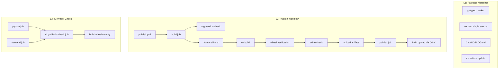

# Design: PyPI Publish Readiness

## Overview

insight-blueprint を PyPI に公開可能にするためのパッケージング整備と CI/CD パイプライン構築。変更対象は Python ソースコード（`__init__.py` のみ）、プロジェクトメタデータ（`pyproject.toml`）、GitHub Actions ワークフロー、およびプロジェクトルートのドキュメント。アプリケーションのビジネスロジックには一切変更を加えない。

## Steering Document Alignment

### Technical Standards (tech.md)

- **Build System**: hatchling (Python wheel) + Vite (frontend bundle) — 既存構成をそのまま活用
- **Package Management**: uv — `uv build` でビルド、`uv sync` で開発インストール
- **Distribution**: tech.md に「PyPI パッケージ（`pip install insight-blueprint`）」と明記済み。本設計はその実現
- **CI**: GitHub Actions — 既存 `ci.yml` を拡張し、新規 `publish.yml` を追加

### Project Structure (structure.md)

- 変更ファイルは全てプロジェクトルートまたは `.github/` 配下。`src/insight_blueprint/` 内の変更は `__init__.py` と `py.typed` の2ファイルのみ
- structure.md の依存方向ルール（`server.py/web.py → core/ → storage/ → models/`）に影響なし

## Code Reuse Analysis

### Existing Components to Leverage

- **hatch artifacts config**: `pyproject.toml` の `[tool.hatch.build.targets.wheel] artifacts` が既に `static/**` を含めるよう設定済み。変更不要
- **Vite build config**: `frontend/vite.config.ts` の `outDir: "../src/insight_blueprint/static"` が既にビルド出力を正しい場所に配置。変更不要
- **CI workflow**: `.github/workflows/ci.yml` の `python` / `frontend` ジョブ構成を `build-check` ジョブの依存元として再利用

### Integration Points

- **pyproject.toml**: version フィールドが唯一のソース。`__init__.py` がこれを参照
- **.gitignore**: `src/insight_blueprint/static/` が既に除外済み。hatch artifacts がこれを wheel に含める仕組みは変更不要

## Architecture

本設計は3つの独立したコンポーネントで構成される。相互依存はない。



## Components and Interfaces

### Component 1: Package Metadata (L1)

- **Purpose:** PyPI 公開に必要なメタデータの整備。py.typed マーカー、version 一元化、CHANGELOG、classifiers
- **Files:**
  - `src/insight_blueprint/py.typed` — 新規作成（空ファイル）
  - `src/insight_blueprint/__init__.py` — version 取得方法の変更
  - `pyproject.toml` — classifiers 追加
  - `CHANGELOG.md` — 新規作成
- **Dependencies:** なし
- **Reuses:** 既存の pyproject.toml 構造

#### `__init__.py` version 設計

```python
"""insight-blueprint: MCP server for analysis design management."""

from importlib.metadata import PackageNotFoundError, version

try:
    __version__ = version("insight-blueprint")
except PackageNotFoundError:
    __version__ = "0.0.0+unknown"
```

**設計判断（Codex レビュー反映）:** `importlib.metadata.version()` は editable install (`uv sync`) でも動作するが、ソースから直接実行された場合（未インストール状態）に `PackageNotFoundError` が発生する。fallback を設けることで、開発中の `python -m insight_blueprint` でもクラッシュしない。fallback 値 `"0.0.0+unknown"` は PEP 440 互換のローカルバージョン識別子。

#### classifiers 追加

```toml
classifiers = [
    # ... existing ...
    "Intended Audience :: Science/Research",
    "Topic :: Scientific/Engineering :: Information Analysis",
]
```

### Component 2: Publish Workflow (L2)

- **Purpose:** tag push で PyPI への自動 publish を実行する GitHub Actions ワークフロー
- **Files:** `.github/workflows/publish.yml` — 新規作成
- **Dependencies:** GitHub Environment `pypi`、PyPI Trusted Publisher 設定（手動、ワークフロー外）
- **Reuses:** 既存 CI の Node.js / uv セットアップパターン

#### ワークフロー構造

```yaml
name: Publish to PyPI
on:
  push:
    tags: ["v*"]

jobs:
  build:
    runs-on: ubuntu-latest
    steps:
      # 1. Checkout
      # 2. Tag-version consistency check
      # 3. Frontend build (Node.js + npm ci + npm run build)
      # 4. Python build (uv build)
      # 5. Wheel verification (static assets existence)
      # 6. twine check (metadata validation)
      # 7. Upload artifact

  publish:
    needs: build
    runs-on: ubuntu-latest
    environment: pypi
    permissions:
      id-token: write
    steps:
      # 1. Download artifact
      # 2. PyPI upload (Trusted Publisher OIDC)
```

#### Tag-Version Consistency Check（Codex レビュー反映）

```bash
TAG=${GITHUB_REF#refs/tags/v}
PKG=$(python -c "
import tomllib
with open('pyproject.toml', 'rb') as f:
    print(tomllib.load(f)['project']['version'])
")
if [ "$TAG" != "$PKG" ]; then
  echo "ERROR: Tag v$TAG does not match pyproject.toml version $PKG"
  exit 1
fi
```

**設計判断:** tag `v0.2.0` と pyproject.toml `version = "0.2.0"` の一致を強制する。不一致は即座に fail。これにより、version 更新忘れ / tag typo を publish 前に検出する。

#### Wheel Verification

```python
import zipfile, sys
from pathlib import Path

whl = next(Path("dist").glob("*.whl"))
with zipfile.ZipFile(whl) as zf:
    names = zf.namelist()

    # Check required static assets
    has_html = any("static/index.html" in n for n in names)
    has_js = any("static/assets/" in n and n.endswith(".js") for n in names)

    if not (has_html and has_js):
        print("ERROR: Frontend assets missing from wheel")
        for n in sorted(names):
            if "static" in n:
                print(f"  found: {n}")
        sys.exit(1)

    static_count = sum(1 for n in names if "static/" in n)
    print(f"OK: {static_count} static files verified in wheel")
```

**設計判断（Codex レビュー反映）:** 存在確認に加えて `twine check dist/*` を別ステップで実行し、メタデータの妥当性（long_description のレンダリング等）も検証する。サイズ閾値は Vite の圧縮・コード分割で変動するため入れない（Codex の警告に従い）。

#### Action Pinning（Codex レビュー反映）

publish.yml は供給チェーン攻撃のリスクが高いため、主要 Action を SHA pin する:

- `actions/checkout` → SHA pin
- `actions/setup-node` → SHA pin
- `astral-sh/setup-uv` → SHA pin
- `actions/upload-artifact` / `download-artifact` → SHA pin
- `pypa/gh-action-pypi-publish` → SHA pin

ci.yml の既存ジョブは major tag (`@v6`) のまま据え置き（変更スコープを限定）。

#### Trusted Publisher 設定（手動、ワークフロー外）

PyPI 側で一度だけ設定する:

```
PyPI → Your projects → insight-blueprint → Publishing
  → Add a new pending publisher
    Owner: etoyama
    Repository: insight-blueprint
    Workflow: publish.yml
    Environment: pypi
```

**注意事項（Codex レビュー反映）:**
- workflow filename は正確に `publish.yml` と一致させること（`release.yml` 等にリネームすると OIDC 失敗）
- environment 名も正確に `pypi` と一致させること
- 初回は PyPI 上でパッケージが存在しない状態から pending publisher を登録する

### Component 3: CI Wheel Check (L3)

- **Purpose:** PR ごとに wheel が正しくビルドできることを検証し、壊れたパッケージングが main にマージされることを防ぐ
- **Files:** `.github/workflows/ci.yml` — `build-check` ジョブ追加
- **Dependencies:** 既存の `python` / `frontend` ジョブ
- **Reuses:** publish.yml の wheel verification ロジック（同一のインライン Python スクリプト）

#### ジョブ構造

```yaml
build-check:
  runs-on: ubuntu-latest
  needs: [python, frontend]
  steps:
    # 1. Checkout
    # 2. Setup Node.js + npm ci + npm run build (frontend)
    # 3. Setup uv + uv build
    # 4. Verify wheel contents (same script as publish.yml)
```

**設計判断（Codex レビュー反映）:** 全 PR で実行する。path filter は導入しない（初期段階で実行時間は 1-2 分程度、問題になってから path filter に移行）。

## Data Models

本設計にデータモデルの変更はない。アプリケーションの models/ 層には一切変更を加えない。

## Error Handling

### Error Scenarios

1. **Tag-version mismatch**
   - **Handling:** build job の tag-version check ステップで即座に fail
   - **User Impact:** maintainer に「Tag vX.Y.Z does not match pyproject.toml version X.Y.Z」エラーメッセージ。push し直しが必要

2. **Frontend assets missing from wheel**
   - **Handling:** wheel verification ステップで fail。見つかった static ファイルの一覧を出力
   - **User Impact:** maintainer に「Frontend assets missing from wheel」エラー。`poe build-frontend` の実行漏れ or Vite 設定の問題

3. **Trusted Publisher OIDC failure**
   - **Handling:** PyPI upload ステップで 403 エラー
   - **User Impact:** maintainer に PyPI 側の Trusted Publisher 設定の確認を促す。workflow filename / environment 名の不一致が最も多い原因

4. **twine check failure**
   - **Handling:** twine check ステップで fail。メタデータの問題箇所を出力
   - **User Impact:** pyproject.toml の description / classifiers / URLs の修正が必要

5. **importlib.metadata.version() fallback**
   - **Handling:** `PackageNotFoundError` を catch し `"0.0.0+unknown"` を返す
   - **User Impact:** 未インストール状態での実行時にバージョンが `0.0.0+unknown` と表示される。正常動作には影響なし

## Testing Strategy

### Unit Testing

- **`__init__.py` version fallback**: `importlib.metadata.version` を mock して `PackageNotFoundError` を raise させ、`__version__` が `"0.0.0+unknown"` になることを検証
- **`__init__.py` version normal**: mock なしで `__version__` が pyproject.toml の version と一致することを検証

### Integration Testing

- **Wheel build verification**: `uv build` で wheel を生成し、zipfile で static assets の存在を確認する pytest テスト
- **py.typed inclusion**: wheel 内に `py.typed` が含まれることを確認

### CI/CD Testing

- **publish.yml**: 直接テストは困難（PyPI upload は本番操作）。tag-version check と wheel verification は CI の build-check ジョブで間接的にカバー
- **ci.yml build-check**: PR を出すことで自動実行される

## Release Procedure (Reference)

ワークフロー利用者（maintainer）向けのリリース手順:

```
1. pyproject.toml の version を更新（例: "0.1.0" → "0.2.0"）
2. CHANGELOG.md に [0.2.0] セクションを追加
3. git add pyproject.toml CHANGELOG.md
4. git commit -m "chore: release v0.2.0"
5. git tag v0.2.0
6. git push && git push --tags
7. → publish.yml が自動発火
   → tag-version check → frontend build → uv build → wheel verify → twine check → PyPI upload
8. PyPI で公開を確認
```
