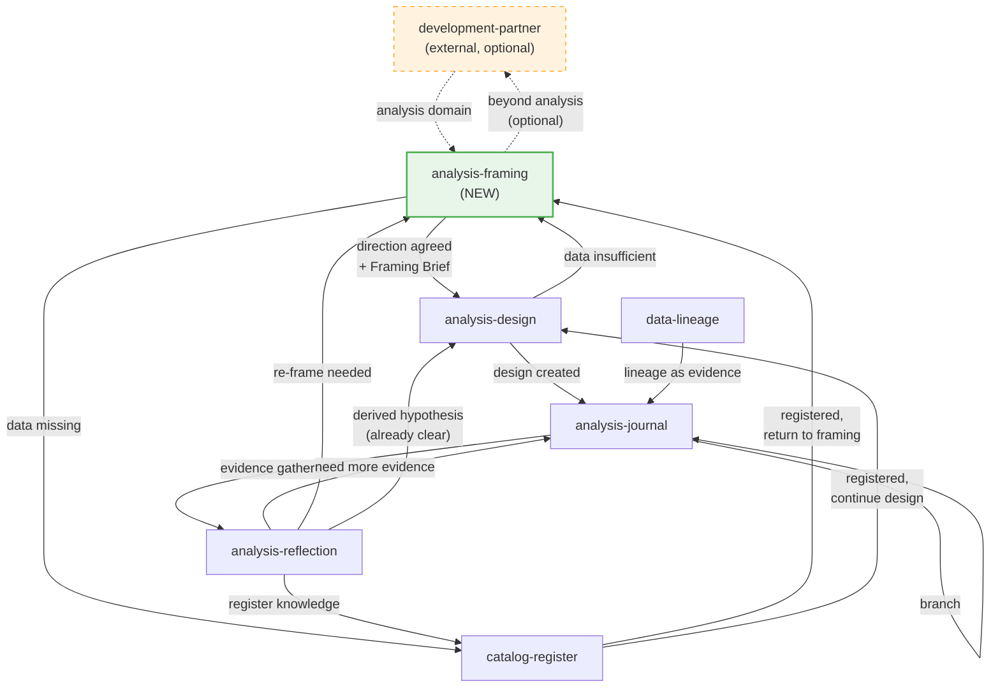

# Design: skill-connectivity-analysis-framing

## Overview

analysis-framing SKILL.md の新規作成と、全6スキルの Chaining セクション整備を行う。成果物は SKILL.md ファイル（Markdown）のみであり、Python コードや MCP ツールの変更は含まない。

成果物一覧:
1. `src/insight_blueprint/_skills/analysis-framing/SKILL.md` — 新規作成
2. `src/insight_blueprint/_skills/analysis-design/SKILL.md` — Step 1.5 + Chaining 追加
3. `src/insight_blueprint/_skills/analysis-journal/SKILL.md` — Chaining 更新
4. `src/insight_blueprint/_skills/analysis-reflection/SKILL.md` — Chaining 更新
5. `src/insight_blueprint/_skills/catalog-register/SKILL.md` — Chaining 追加
6. `src/insight_blueprint/_skills/data-lineage/SKILL.md` — Chaining 追加

## Steering Document Alignment

### Technical Standards (tech.md)

- **Extension Policy**: MCP ツールは 17 個で Fix。新機能はスキルで実現する。本 spec は extension policy に準拠（スキル追加のみ）
- **YAML as Source of Truth**: analysis-framing は `.insight/` 以下の YAML を直接読む。MCP キーワード検索を経由しない
- **Claude Code First**: スキルは Claude Code 上のワークフローガイド。人間は分析テーマを提示し、Claude がスキルに沿って探索・提示する

### Project Structure (structure.md)

- スキルは `src/insight_blueprint/_skills/{skill-name}/SKILL.md` に配置
- `_copy_skills_template()` により `.claude/skills/` にデプロイされる
- バージョン管理: frontmatter の `version` フィールドでアップグレード検知

## Code Reuse Analysis

### Existing Components to Leverage

- **SKILL.md フォーマット**: 全5スキルが共通のフォーマット（YAML frontmatter + Markdown body）を使用。analysis-framing も同じ構造に従う
- **Chaining セクション**: analysis-journal と analysis-reflection に既存の `## Chaining` セクションがある（`| From | To | When |` テーブル形式）。この形式を全6スキルに統一する
- **analysis-journal の Agentic Search パターン**: analysis-journal は既に `.insight/designs/{id}_journal.yaml` を Read ツールで直接読んでいる。analysis-framing はこのパターンを拡張し、複数ディレクトリを Glob + Read で探索する

### Integration Points

- **analysis-design Step 1.5**: analysis-design の既存 Step 1（`list_analysis_designs()`）と Step 2（ユーザーインタビュー）の間に、Framing Brief 検出ステップを挿入する。既存ステップは変更しない
- **スキルデプロイメカニズム**: `storage/project.py` の `_copy_skills_template()` が新スキルディレクトリを検出してデプロイする。コード変更不要（ディレクトリ追加のみ）

## Architecture

### 6-Skill Forwarding Graph



点線 = オプショナル接続（外部スキル）、実線 = バンドルスキル間の接続。

### Forwarding Table (Complete)

| From | To | When | REQ |
|------|----|------|-----|
| development-partner* | → analysis-framing | 分析テーマが出て、ドメイン接地が必要 | REQ-4 |
| analysis-framing | → analysis-design | 仮説の方向性が定まった（Framing Brief 付き） | REQ-1, REQ-3 |
| analysis-framing | → catalog-register | 必要なデータが `.insight/catalog/` にない | REQ-1 |
| analysis-framing | → development-partner* | テーマが分析ドメインを超えて漠然としている | REQ-4 |
| analysis-design | → analysis-journal | デザイン作成後、推論記録を開始 | REQ-2 |
| analysis-design | → analysis-framing | データ不足で仮説の立て方を見直したい | REQ-2 |
| analysis-journal | → analysis-reflection | 証拠が揃った | REQ-2 |
| analysis-journal | → analysis-journal | 分岐（branch workflow で新デザイン作成後） | REQ-2 |
| analysis-reflection | → analysis-journal | 証拠不足、追加調査が必要 | REQ-2 |
| analysis-reflection | → analysis-framing | 新仮説が必要だがデータ・方向の探索が先 | REQ-2 |
| analysis-reflection | → analysis-design | 派生仮説が既に明確 | REQ-2 |
| analysis-reflection | → catalog-register | 結論を知識として登録 | REQ-2 |
| catalog-register | → analysis-framing | 登録完了、フレーミングに戻る | REQ-2 |
| catalog-register | → analysis-design | 登録完了、デザイン作成を続行 | REQ-2 |
| data-lineage | → analysis-journal | リネージ図を証拠として記録 | REQ-2 |

\* = 外部スキル（development-deck）。存在時のみ。

## Components and Interfaces

### Component 1: analysis-framing SKILL.md (新規)

- **Purpose**: ドメインに接地した分析フレーミング。`.insight/` 以下を Agentic Search で探索し、データ地図を提示する
- **SKILL.md 構成**:

```
---
name: analysis-framing
version: "1.0.0"
description: |
  Explores existing data and analyses to help frame a hypothesis.
  Triggers: "framing", "何を分析する", "分析テーマ", "仮説を考えたい",
  "データを探して", "既存分析を確認", "analysis framing".
disable-model-invocation: true
argument-hint: "[theme]"
---

# /analysis-framing — Analysis Framing Explorer

## When to Use
## When NOT to Use
## Workflow
  Step 1: Receive Theme
  Step 2: Domain Exploration (Agentic Search)
    2a: Design Exploration (.insight/designs/)
    2b: Catalog Exploration (.insight/catalog/)
    2c: Knowledge Exploration (.insight/rules/)
    2d: Cross-search (Grep for synonyms)
  Step 3: Present Data Map
  Step 4: Direction Dialogue
  Step 5: Output Framing Brief
## Chaining
## Language Rules
```

- **Workflow 詳細**:

**Step 1: Receive Theme**
- ユーザーのテーマを受け取る。`$ARGUMENTS` があればテーマとして使用
- テーマが漠然としすぎる場合: 利用可能データからの候補方向を 2-3 提示して絞り込む（AC-1.4）
- development-partner からのフォワーディングの場合: 会話コンテキストのフレーミング結果を引き継ぐ

**Step 2: Domain Exploration**

```markdown
### Step 2: Domain Exploration

テーマに関連する情報を `.insight/` 以下から Agentic Search で収集する。
MCP ツールは使用しない。

**実行方法**: Agent tool（subagent_type: "Explore"）に探索を委譲する。
`.insight/` の YAML ファイル群をメインコンテキストに直接展開すると
トークン消費が急増し、後続の対話（Step 3-5）の品質が低下する。
subagent にテーマと以下の探索指示を渡し、Step 3 の Data Map 形式で
構造化されたサマリーのみをメインコンテキストに返す。

#### 2a: Design Exploration
1. Glob `.insight/designs/*_hypothesis.yaml` で全デザインファイルを列挙
2. 各ファイルを Read し、テーマとの関連性を判断
   - 関連あり: title, hypothesis_statement, status, methodology, 結論を記録
   - ジャーナルがあれば（`*_journal.yaml`）key findings を確認
3. 関連デザインの parent/child 関係を把握

#### 2b: Catalog Exploration
1. Glob `.insight/catalog/*.yaml` で全カタログエントリを列挙
2. 各エントリを Read し、テーマに使えるデータソースを特定
   - ソース名、カラム定義、期間、粒度を確認
   - tags フィールドも参照

#### 2c: Knowledge Exploration
1. Glob `.insight/rules/*.yaml` でドメイン知識エントリを列挙
2. 各エントリを Read し、テーマに関連する知見・注意事項を特定
   - category (caution / finding / context) を確認
   - 注意事項は特に重要（データの制約・落とし穴）

#### 2d: Cross-search
テーマから連想されるキーワード（同義語・上位概念・下位概念）で
Grep を `.insight/` 全体にかけ、2a-2c で見落としたファイルを補完する。

#### subagent の返却
探索結果を Step 3 の Data Map フォーマットで構造化して返す。
ファイル内容の全文ではなく、テーマとの関連性を判断した上で
意味的にグループ化されたサマリーを返すこと。
```

**探索スコープの制御** (Codex review: High — 探索上限未定義のリスク対応):

`.insight/` 以下のファイル数が多い場合にトークン消費が破綻しないよう、以下のガイドラインに従う:

1. **Glob first, Read selectively**: まず Glob でファイル一覧を取得し、ファイル名・パスから関連性の高いものを選別してから Read する。全ファイルを無条件に Read しない
2. **ディレクトリごとの Read 上限**: 各ディレクトリ（designs/, catalog/, rules/）から Read するファイルは最大 20 件を目安とする。超える場合はファイル名の関連性とタイムスタンプ（新しいものを優先）で絞り込む
3. **Read の段階化**: 初回は YAML の先頭（title, hypothesis_statement, source_id, name 等の識別フィールド）だけを Read し、関連性が高いと判断したファイルのみ全文を Read する
4. **テーマが広すぎる場合**: 20 件を超える関連ファイルが見つかった場合、ユーザーにテーマの絞り込みを促す（AC-1.4 に該当）

**Step 3: Present Data Map**

```markdown
### Step 3: Present Data Map

探索結果を構造化して提示する:

── Data Map: {theme} ──

利用可能データ:
  - {source_name} ({source_id})
    カラム: {key_columns}  期間: {period}  粒度: {granularity}
  - ...

既存分析:
  - {design_id}: {title} [{status}]
    手法: {methodology}  結論: {conclusion_summary}
  - ...

関連知識:
  - [{category}] {content_summary}
    出典: {source_design_id or manual}
  - ...

ギャップ:
  - {gap_description}
  - ...
```

**Step 4: Direction Dialogue**

ユーザーと対話して仮説の方向性を絞る。以下の観点で議論:
- 既存分析の結論を踏まえた新しい切り口
- 利用可能データで検証可能な仮説の方向
- 不足データの補完方法（catalog-register への誘導）

仮説文（hypothesis_statement）自体は書かない。「この方向で analysis-design に進む」までが analysis-framing の責務。

**Step 5: Output Framing Brief**

```markdown
### Step 5: Output Framing Brief

方向性が定まったら、以下の構造化テキストを出力する。
analysis-design がこれを会話コンテキストから拾う。

## Framing Brief

### テーマ
{theme_one_liner}

### 利用可能データ
- {source_name} ({source_id}): {key_columns}, {period}, {granularity}
- ...

### 既存分析
- {design_id}: {title} [{status}] — {conclusion_summary}
- ...

### ギャップ
- {gap_description}
- ...

### 推奨方向
- 仮説の方向性: {direction_description}
- theme_id: {suggested_theme_id}
- parent_id: {suggested_parent_id or "なし"}
- analysis_intent: {exploratory | confirmatory | mixed}
- 推奨手法: {methodology_suggestion}
```

**Chaining セクション**

```markdown
## Chaining

| From | To | When |
|------|-----|------|
| /development-partner* | → /analysis-framing | 分析テーマが出て、ドメイン接地が必要: "データと既存分析を探索するなら /analysis-framing" |
| /analysis-design | → /analysis-framing | データ不足で仮説の方向を再検討: "データを探し直すなら /analysis-framing" |
| /analysis-reflection | → /analysis-framing | 新仮説が必要だがデータ・方向の探索が先: "新しい角度を探すなら /analysis-framing" |
| /catalog-register | → /analysis-framing | データ登録完了、フレーミングに戻る: "フレーミングに戻るなら /analysis-framing" |
| /analysis-framing | → /analysis-design | 仮説の方向性が定まった（Framing Brief 付き）: "仮説を設計するなら /analysis-design" |
| /analysis-framing | → /catalog-register | 必要なデータが未登録: "データを登録するなら /catalog-register" |
| /analysis-framing | → /development-partner* | テーマが分析ドメインを超えて漠然: "問題を整理するなら /development-partner" |

\* = 外部スキル（development-deck）。存在時のみ表示する。存在しない場合この行は Chaining セクションに含めない。
```

### Component 2: analysis-design SKILL.md (修正)

- **Purpose**: Step 1.5 の追加 + Chaining セクションの追加
- **変更箇所**:

**Step 1.5: Framing Brief Detection (新規挿入)**

Step 1 (Check Current State) と Step 2 (Gather Hypothesis Details) の間に挿入:

```markdown
### Step 1.5: Check for Framing Brief

会話コンテキストに `## Framing Brief` が存在するか確認する。

**Framing Brief の検出:**
会話コンテキストから Framing Brief を探す。有効判定条件:
1. `## Framing Brief` 見出しが存在
2. `### テーマ` と `### 推奨方向` の必須サブセクションが存在
3. `### 推奨方向` 内に `theme_id:` が含まれる
4. 複数 Brief がある場合は最新（最後）のものを使用

**有効な Framing Brief がある場合:**
1. Brief の各セクションから analysis-design のフィールドに draft 値をマッピングする:

   | Framing Brief セクション | analysis-design フィールド | マッピング |
   |---|---|---|
   | テーマ | `title` | テーマの1行要約を title の候補として提示 |
   | 利用可能データ | `explanatory`, `metrics` | データソース・カラムから explanatory/metrics の候補を生成 |
   | 既存分析 | `parent_id` | 関連デザイン ID を parent_id の候補として提示 |
   | ギャップ | `hypothesis_background` | ギャップ情報を仮説の背景・動機の下書きに活用 |
   | 推奨方向.仮説の方向性 | `title`, `hypothesis_background` | 方向性から title 候補を生成し、背景の下書きに活用 |
   | 推奨方向.theme_id | `theme_id` | デフォルト値として設定 |
   | 推奨方向.parent_id | `parent_id` | デフォルト値として設定 |
   | 推奨方向.analysis_intent | `analysis_intent` | デフォルト値として設定 |
   | 推奨方向.推奨手法 | `methodology` | `{method: "推奨手法の値", reason: "Framing Brief の推奨"}` としてデフォルト設定 |
2. ユーザーに確認: "Framing Brief の内容でよいか、修正したい点があるか"
3. Step 2 ではゼロからインタビューせず、draft 値を提示して確認しながら進める

**Framing Brief がない、または不完全な場合:**
- 何もしない。Step 2 の現行インタビューフローに進む（後方互換）
- 不完全な場合はユーザーに通知: "Framing Brief が不完全なため通常フローで進めます"
```

**Chaining セクション (新規追加)**

analysis-design の Language Rules セクションの直前に追加:

```markdown
## Chaining

| From | To | When |
|------|-----|------|
| /analysis-framing | → /analysis-design | Framing Brief 付きでフォワーディング |
| /analysis-design | → /analysis-journal | デザイン作成後: "推論過程を記録するなら /analysis-journal {id}" |
| /analysis-design | → /analysis-framing | データ不足で仮説の方向を再検討: "データを探し直すなら /analysis-framing" |
| /catalog-register | → /analysis-design | データ登録完了後にデザイン作成を続行 |
| /analysis-reflection | → /analysis-design | 派生仮説が明確な場合 |
```

- **バージョン**: `1.0.0` → `1.1.0`

### Component 3: analysis-journal SKILL.md (修正)

- **Purpose**: Chaining セクションの更新（data-lineage からの inbound 追加）
- **変更箇所**: 既存 Chaining テーブルに1行追加

```markdown
## Chaining

| From | To | When |
|------|-----|------|
| /analysis-design | → /analysis-journal | After design creation: "推論過程を記録するなら /analysis-journal {id}" |
| /analysis-journal | → /analysis-reflection | Evidence gathered: "振り返りと結論は /analysis-reflection {id}" |
| /analysis-journal | → /analysis-journal | After branch: "分岐先のジャーナル: /analysis-journal {new_id}" |
| /analysis-reflection | → /analysis-journal | Need more evidence: "追加調査は /analysis-journal {id}" |
| /data-lineage | → /analysis-journal | Lineage diagram generated: "リネージ結果を証拠として記録するなら /analysis-journal {id}" |
```

- **バージョン**: `1.0.0` → `1.1.0`

### Component 4: analysis-reflection SKILL.md (修正)

- **Purpose**: Chaining セクションの更新（analysis-framing への outbound 追加）
- **変更箇所**: 既存テーブルの「New derived hypothesis」を分岐

```markdown
## Chaining

| From | To | When |
|------|-----|------|
| /analysis-journal | → /analysis-reflection | Evidence gathered |
| /analysis-reflection | → /analysis-journal | Need more evidence or branching |
| /analysis-reflection | → /catalog-register | Conclusion worth registering as knowledge |
| /analysis-reflection | → /analysis-framing | New hypothesis needed, explore data/direction first: "新しい角度を探すなら /analysis-framing" |
| /analysis-reflection | → /analysis-design | Derived hypothesis already clear: "派生仮説を作るなら /analysis-design" |
```

- **バージョン**: `1.0.0` → `1.1.0`

### Component 5: catalog-register SKILL.md (修正)

- **Purpose**: Chaining セクションの新規追加
- **変更箇所**: Language Rules セクションの直前に追加

```markdown
## Chaining

| From | To | When |
|------|-----|------|
| /analysis-framing | → /catalog-register | Data missing: "必要なデータを登録するなら /catalog-register" |
| /analysis-reflection | → /catalog-register | Register conclusion as knowledge |
| /catalog-register | → /analysis-framing | Registration complete, return to framing: "フレーミングに戻るなら /analysis-framing" |
| /catalog-register | → /analysis-design | Registration complete, continue design: "デザイン作成を続けるなら /analysis-design" |
```

- **バージョン**: `1.0.0` → `1.1.0`

### Component 6: data-lineage SKILL.md (修正)

- **Purpose**: Chaining セクションの新規追加
- **変更箇所**: Language Rules セクションの直前に追加

```markdown
## Chaining

| From | To | When |
|------|-----|------|
| /data-lineage | → /analysis-journal | Lineage diagram generated: "リネージ結果を証拠として記録するなら /analysis-journal {id}" |
```

- **バージョン**: `1.0.0` → `1.1.0`

## Data Models

### Framing Brief Format

analysis-framing が出力し、analysis-design が会話コンテキストから検出する構造化テキスト。

```markdown
## Framing Brief

### テーマ
{分析テーマの1行要約}

### 利用可能データ
- {source_name} ({source_id}): {key_columns}, {period}, {granularity}

### 既存分析
- {design_id}: {title} [{status}] — {conclusion_summary}

### ギャップ
- {gap_description}

### 推奨方向
- 仮説の方向性: {direction_description}
- theme_id: {UPPERCASE_ID}
- parent_id: {existing_design_id | "なし"}
- analysis_intent: {exploratory | confirmatory | mixed}
- 推奨手法: {methodology_suggestion}
```

**検出ルール** (Codex review: High — 誤検出・混線リスク対応):

analysis-design の Step 1.5 は以下の条件を**すべて**満たす場合のみ Framing Brief を有効と判断する:

1. 会話コンテキスト内に `## Framing Brief` 見出しが存在する
2. その配下に `### テーマ` と `### 推奨方向` の2つの必須サブセクションが存在する
3. `### 推奨方向` セクション内に `theme_id:` が含まれる

**フォールバック**: 上記条件を満たさない場合（見出しはあるがサブセクションが欠けている等）は、Framing Brief を無効として扱い、通常の Step 2 インタビューフローに進む。ユーザーに「Framing Brief が不完全なため通常フローで進めます」と通知する。

**複数 Brief が存在する場合**: 会話コンテキスト内に複数の `## Framing Brief` が存在する場合は、最後（最新）のものを使用する。

### .insight/ Directory Structure (参照のみ、変更なし)

```
.insight/
├── designs/
│   ├── {theme_id}-H{nn}_hypothesis.yaml   # AnalysisDesign
│   └── {theme_id}-H{nn}_journal.yaml      # Insight Journal (skill-managed)
├── catalog/
│   └── {source_id}.yaml                   # DataSource
├── rules/
│   └── knowledge_{id}.yaml                # DomainKnowledgeEntry
├── reviews/
│   └── {design_id}_reviews.yaml           # ReviewComment
└── lineage/
    └── {design_id}.mmd                    # Mermaid diagram
```

analysis-framing は `designs/`, `catalog/`, `rules/` の3ディレクトリを探索対象とする。`reviews/` と `lineage/` は対象外。

## Error Handling

### Error Scenarios

1. **`.insight/` ディレクトリが存在しない**
   - **Handling**: "プロジェクトが初期化されていない。`insight-blueprint init` を実行してください" と案内
   - **User Impact**: スキルは即座に終了

2. **探索対象ディレクトリが空（データなし）**
   - **Handling**: 空のディレクトリごとに状況を報告。catalog が空なら `/catalog-register` を提案（AC-1.5）
   - **User Impact**: データ地図は空または部分的に提示される

3. **テーマが漠然としすぎて関連ファイルを絞れない**
   - **Handling**: 利用可能な全データソースの概要一覧を提示し、ユーザーに 2-3 の候補方向を提案（AC-1.4）
   - **User Impact**: 対話的に方向を絞り込む

4. **YAML ファイルが壊れている（パースエラー）**
   - **Handling**: 壊れたファイルをスキップし、警告を出して残りのファイルで探索を続行
   - **User Impact**: データ地図が不完全になるが、探索は継続する

5. **Framing Brief が会話コンテキストに見つからない（analysis-design Step 1.5）**
   - **Handling**: 何もしない。現行の Step 2 インタビューフローに fallback（AC-3.3）
   - **User Impact**: 影響なし（後方互換）

## Testing Strategy

本 spec の成果物は SKILL.md ファイル（Markdown）のみであり、Python コードの変更を含まない。そのため、テストは以下の方法で検証する。

### Structural Validation

- 全6スキルの SKILL.md が最低限セクション（frontmatter, When to Use, When NOT to Use, Workflow, Chaining, Language Rules）を持つことを確認
- 全 Chaining テーブルが `| From | To | When |` フォーマットであることを確認
- 全スキルの version が更新されていることを確認（analysis-framing: 1.0.0, 既存5スキル: 1.1.0）

### Forwarding Graph Consistency

- Forwarding Table の全エントリについて、From 側と To 側の SKILL.md 双方に対応するエントリが存在することを確認（双方向整合性）
- サイクルが正しく定義されていることを確認（analysis-reflection → analysis-framing → analysis-design → ... のループ）

### Framing Brief Protocol

- analysis-framing の Step 5 出力フォーマットと analysis-design の Step 1.5 検出ルールが整合することを確認
- Framing Brief なしで analysis-design を起動した場合の後方互換性を確認

### Deployment Verification

- `src/insight_blueprint/_skills/analysis-framing/` ディレクトリが存在し、SKILL.md が配置されていることを確認
- 既存の `_copy_skills_template()` が新ディレクトリを検出してデプロイすることを確認（既存テストの実行）
