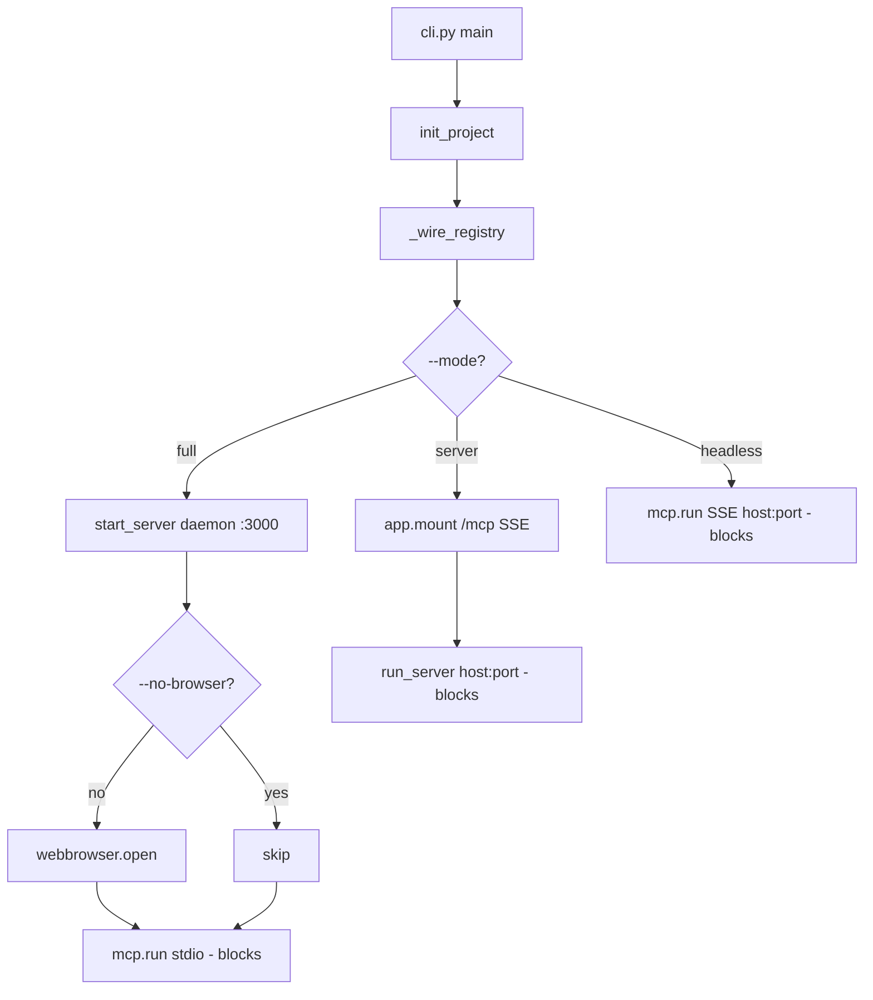
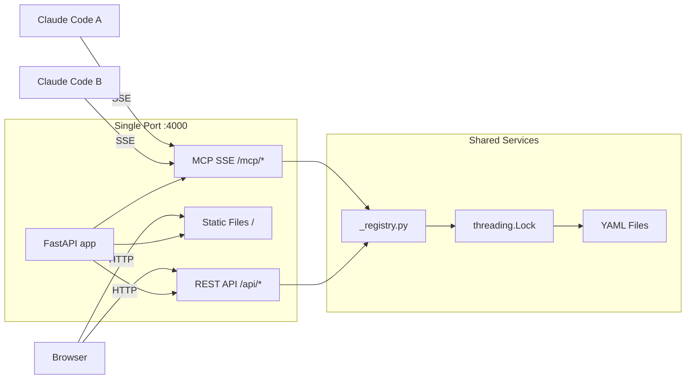

# Design: Team Server Separation

## Overview

insight-blueprint の CLI に `--mode full|server|headless` フラグを追加し、チームサーバーモード（SSE + WebUI 単一ポート）とヘッドレスモード（SSE のみ）を提供する。既存の full モード（stdio + daemon WebUI）は完全互換を維持する。YAML 書き込みの排他制御として `threading.Lock` を追加する。

## Steering Document Alignment

### Technical Standards (tech.md)

- **FastMCP >= 2.0**: `mcp.http_app(transport="sse")` で SSE ASGI アプリを取得。既存の `mcp.run()` (stdio) との共存
- **FastAPI >= 0.115**: `app.mount("/mcp", mcp_sse_app)` で SSE エンドポイントを統合
- **Click >= 8.1**: `click.Choice` で `--mode` の値バリデーション
- **Atomic writes**: 既存の `tempfile + os.replace()` を `threading.Lock` で保護
- **Service Locator**: `_registry.py` パターンを維持。配線ロジックを `_wire_registry()` に抽出
- **TDD**: Red-Green-Refactor サイクルで実装

### Project Structure (structure.md)

- 変更は `cli.py`, `server.py`, `web.py`, `yaml_store.py` の4ファイルに集中
- 依存方向 `server.py / web.py → core/ → storage/ → models/` を維持
- `cli.py` が唯一の composition root であることを維持
- テスト: `test_cli.py`（新規）, `test_server.py`（拡張）, `test_web.py`（拡張）, `test_yaml_store.py`（拡張）

## Code Reuse Analysis

### Existing Components to Leverage

- **`web.py:start_server()`**: daemon thread 起動ロジック。full モード専用（変更なし）
- **`web.py:ThreadedUvicorn`**: signal handler 無効化済み。**full モードの daemon thread 専用**。server モードでは使用しない（後述）
- **`web.py:app` (FastAPI)**: 既存 REST API + static files マウントをそのまま利用。SSE をマウント追加するのみ
- **`server.py:mcp` (FastMCP)**: `mcp.http_app(transport="sse")` で SSE ASGI アプリを取得
- **`yaml_store.py:write_yaml()`**: 既存の atomic write ロジックに Lock を被せるだけ
- **`_registry.py`**: Service Locator パターンを変更なしで利用

### Integration Points

- **FastMCP SSE ↔ FastAPI**: `app.mount("/mcp", mcp.http_app(transport="sse"))` でパスベース統合。**マウント順序が重要**: `/mcp` は `/` (static files) より前にマウントする必要がある（Starlette はルート定義順で評価するため、`/` の catch-all が先だと `/mcp` に到達不能）
- **CLI ↔ Server**: `cli.py` の mode 分岐で起動フローを制御。server.py/web.py にモード概念を漏洩させない
- **SSE パス構成**: `mcp.http_app(transport="sse")` は `/sse` と `/messages/` を公開する。`/mcp` にマウントすると、Claude Code からの接続先は `http://host:port/mcp/sse`、メッセージ送信先は `http://host:port/mcp/messages/` になる

## Architecture

### モード別起動フロー

### 単一ポートアーキテクチャ (server モード)

## Components and Interfaces

### Component 1: CLI Mode Dispatch (`cli.py`)

- **Purpose**: `--mode` フラグに基づいて起動フローを分岐する
- **Interfaces**:
  - `main(project, mode, host, port, no_browser)` — Click group コマンド
  - `_wire_registry(project_path: Path) -> None` — サービス配線（main から抽出）
  - `_start_full_mode(project_path, no_browser)` — full モード起動
  - `_start_server_mode(host, port)` — server モード起動
  - `_start_headless_mode(host, port)` — headless モード起動
- **Dependencies**: `server.mcp`, `web.app`, `web.run_server`, `web.start_server`
- **Reuses**: 既存の `_resolve_project()`, `init_project()`

### Component 2: SSE App Provider (`server.py`)

- **Purpose**: FastMCP の SSE ASGI アプリを提供するヘルパー
- **Interfaces**:
  - `mcp` — 既存の FastMCP インスタンス（変更なし）
  - `get_mcp_sse_app(path: str = "/mcp") -> StarletteWithLifespan` — SSE ASGI アプリ取得
- **Dependencies**: `fastmcp.FastMCP`
- **Reuses**: 既存の `mcp` インスタンス

### Component 3: Server Mode Runner (`web.py`)

- **Purpose**: server モード用の blocking uvicorn 起動関数を提供する
- **Interfaces**:
  - `mount_mcp_sse(mcp_sse_app) -> None` — MCP SSE ASGI アプリを FastAPI にマウント。**`/` (static) より前にマウントする**（マウント順序制約）
  - `run_server(host: str, port: int) -> None` — メインスレッドで `uvicorn.run(app)` を実行（blocks）。signal handler 有効（Ctrl+C で graceful shutdown）
  - `start_server(host, port) -> int` — 既存の daemon thread 起動（変更なし）
- **Dependencies**: `uvicorn`, `FastAPI app`
- **Reuses**: ポートプローブロジック
- **注意**: `run_server()` は `ThreadedUvicorn`（signal handler 無効）を使わず、`uvicorn.run()` を直接呼ぶ。server モードではメインスレッドで実行されるため、Ctrl+C による graceful shutdown が必要

### Component 4: Write Lock (`yaml_store.py`)

- **Purpose**: YAML 書き込みの排他制御
- **Interfaces**:
  - `write_yaml(path, data) -> None` — 既存関数に Lock を追加（シグネチャ変更なし）
- **Dependencies**: `threading.Lock`
- **Reuses**: 既存の atomic write ロジック（tempfile + os.replace）
- **Lock の限界（既知の制約）**: Lock は `write_yaml()` の呼び出し単位で保護する。Service 層の read-modify-write（`read_yaml()` → 変更 → `write_yaml()`）は atomic ではない。2つのクライアントが同時に同一ファイルを更新した場合、最後の書き込みが勝つ（lost update）。これは REQ-4 AC-4.1 で許容済み。ファイル破損のみを防止する

## Data Models

### 新規モデル: なし

データモデルの変更はない。CLI 引数は Click のパラメータとして定義し、Pydantic モデルは不要。

### 既存モデルへの影響: なし

`AnalysisDesign`, `DataSource`, `ReviewBatch` 等の既存モデルは変更しない。

## Error Handling

### Error Scenario 1: ポート競合

- **Handling**: `socket.bind()` で競合を検出し、OS 割り当てポート (port=0) にフォールバック。実際のポートを stderr に出力
- **User Impact**: `Warning: port 4000 in use, using port 4123` のようなメッセージ。サーバーは正常起動

### Error Scenario 2: `--mode full` で `--host`/`--port` を指定

- **Handling**: `click.echo()` で警告を stderr に出力し、値を無視して full モードで起動
- **User Impact**: `Warning: --host/--port are ignored in full mode` メッセージ

### Error Scenario 3: SSE 接続が切断

- **Handling**: FastMCP のデフォルトの SSE 切断処理に委任。サーバー側はクリーンアップのみ
- **User Impact**: Claude Code 側でリトライ。サーバーは他クライアントに影響なし

### Error Scenario 4: MCP SSE sub-app lifespan 未起動

- **Handling**: server モード起動後に `/mcp/sse` エンドポイントへの疎通を確認する。応答がなければエラーログを出力して終了する
- **User Impact**: `Error: MCP SSE endpoint not responding at /mcp/sse` メッセージ。フォールバック手段として `--mode headless` での起動を提案する

### Error Scenario 5: `--headless` 非推奨警告

- **Handling**: `click.echo("Warning: --headless is deprecated, use --no-browser", err=True)` で stderr に出力
- **User Impact**: 既存の動作は変わらない。警告メッセージのみ

## Testing Strategy

### Unit Testing

- **`test_cli.py`（新規）**: Click の `CliRunner` で各モード・フラグの組み合わせをテスト
  - `--mode full` のデフォルト動作
  - `--mode server --host 0.0.0.0 --port 4000`
  - `--mode headless --port 4000`
  - `--headless` の deprecation warning
  - `--no-browser` フラグ
  - `--mode full --host 0.0.0.0` の警告
  - `--mode` の不正値
- **`test_yaml_store.py`（拡張）**: `threading.Lock` の並行テスト
  - 2スレッドからの同時 `write_yaml()` でファイル破損しないこと
  - Lock が uncontested 時のパフォーマンスオーバーヘッド

### Integration Testing

- **`test_server.py`（拡張）**: SSE トランスポート経由の MCP ツール動作確認
  - `mcp.http_app(transport="sse")` が有効な ASGI アプリを返すこと
  - SSE 経由で `create_analysis_design` が動作すること
- **`test_web.py`（拡張）**: server モードでの REST API + SSE 共存確認
  - FastAPI に SSE マウント後も既存エンドポイントが正常動作すること
  - `/mcp/sse` エンドポイントが応答すること（マウント順序の検証）
  - `/api/designs` と `/mcp/sse` が同一ポートで共存すること

### End-to-End Testing

- server モードでの起動 → Claude Code 設定 → MCP ツール呼び出し → WebUI 確認のフロー（手動テスト。Playwright は WebUI のみ対象であり、SSE プロトコルのテストは含まない）
