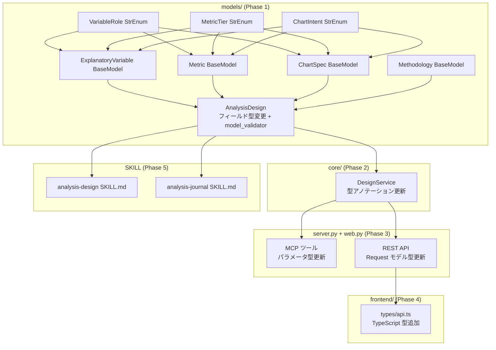

# Design Document

## Overview

AnalysisDesign モデルの `explanatory`、`metrics`、`chart` フィールドを Pydantic BaseModel + StrEnum で型付けし、`methodology` フィールドを新規追加する。既存の untyped dict 構造から typed model への移行を、Pydantic v2 の coercion と model_validator で後方互換を維持しながら実現する。

変更は models/ レイヤーを起点に、依存方向（models → storage → core → server/web）に沿って伝播する。

## Steering Document Alignment

### Technical Standards (tech.md)

- **StrEnum for all enums**: 既存の DesignStatus, AnalysisIntent, KnowledgeCategory と同一パターンで VariableRole, MetricTier, ChartIntent を定義
- **Pydantic v2 BaseModel**: 既存の AnalysisDesign, DataSource, ReviewComment と同一パターンで ExplanatoryVariable, Metric, ChartSpec, Methodology を定義
- **YAML as Source of Truth**: `model_dump(mode="json")` → YAML 書き出し、YAML 読み込み → `Model(**data)` の既存フローを維持
- **Atomic writes**: yaml_store.py の既存機構をそのまま使用（変更なし）
- **TDD**: Red-Green-Refactor サイクルで実装。テストコードが仕様

### Project Structure (structure.md)

- 新規モデルは `models/design.py` に追加（1ファイル = 1ドメイン領域）
- DesignService (`core/designs.py`) の型アノテーション更新
- MCP ツール (`server.py`) と REST API (`web.py`) のパラメータ型更新
- frontend `types/api.ts` の型定義追加
- 依存方向 `server.py / web.py → core/ → storage/ → models/` を厳守

## Code Reuse Analysis

### Existing Components to Leverage

- **`models/design.py`**: AnalysisDesign, DesignStatus, AnalysisIntent — 同ファイルに新モデルを追加。StrEnum の定義パターンを踏襲
- **`storage/yaml_store.py`**: read_yaml / write_yaml — 変更なし。Pydantic の `model_dump(mode="json")` が dict を返すため、YAML 層は透過的
- **`core/designs.py`**: DesignService — create_design / update_design のパラメータ型アノテーションを更新。ロジック変更は最小限
- **`models/common.py`**: now_jst — 既存ユーティリティ。変更なし

### Integration Points

- **`server.py` (MCP)**: create_analysis_design / update_analysis_design のパラメータ型を `dict` / `list[dict]` から typed model 対応に更新。Pydantic の coercion により、dict 入力はそのまま受け付ける
- **`web.py` (REST)**: CreateDesignRequest / UpdateDesignRequest のフィールド型を更新
- **`frontend/src/types/api.ts`**: Design interface のフィールド型を typed 定義に更新
- **SQLite FTS5 (`storage/sqlite_store.py`)**: 変更なし。FTS5 はカタログ/ナレッジの検索用であり、design モデルのフィールド変更の影響を受けない

## Architecture

### 変更の影響フロー



### 後方互換の設計

Pydantic v2 の3つの機構で後方互換を実現する:

1. **Coercion（自動変換）**: `list[ExplanatoryVariable]` フィールドに `list[dict]` が渡されると、Pydantic v2 が自動的に `ExplanatoryVariable(**d)` を適用する。デフォルト値付きフィールドは dict に含まれていなくても補完される
2. **model_validator（明示的変換）**: `metrics` の `dict → list[Metric]` 変換のみ、構造変更（単一 dict → リスト）があるため model_validator で対応
3. **before validator（推論）**: `ChartSpec.intent` は必須フィールドだが、既存データに `intent` がない場合は `type` フィールドから推論する

## Components and Interfaces

### Component 1: StrEnum 定義（3つ）

- **Purpose**: 変数の因果的役割、指標の優先度、チャートの分析意図を型安全に表現する
- **Location**: `src/insight_blueprint/models/design.py`
- **Reuses**: DesignStatus, AnalysisIntent の既存 StrEnum パターン

```python
class VariableRole(StrEnum):
    treatment = "treatment"
    confounder = "confounder"
    covariate = "covariate"
    instrumental = "instrumental"
    mediator = "mediator"

class MetricTier(StrEnum):
    primary = "primary"
    secondary = "secondary"
    guardrail = "guardrail"

class ChartIntent(StrEnum):
    distribution = "distribution"
    correlation = "correlation"
    trend = "trend"
    comparison = "comparison"
```

### Component 2: ExplanatoryVariable BaseModel

- **Purpose**: 説明変数のスキーマ定義。因果的役割を明示する
- **Location**: `src/insight_blueprint/models/design.py`
- **Interfaces**: Pydantic BaseModel（コンストラクタ、model_dump、model_validate）

```python
class ExplanatoryVariable(BaseModel):
    name: str
    description: str = ""
    role: VariableRole = VariableRole.covariate
    data_source: str = ""
    time_points: str = ""
```

- `role` のデフォルトは `covariate`（既存データに role フィールドがない場合の後方互換）
- `data_source` は str のまま維持（構造化は将来課題、YAGNI）

### Component 3: Metric BaseModel

- **Purpose**: 検証指標のスキーマ定義。primary/secondary/guardrail の優先度を明示する
- **Location**: `src/insight_blueprint/models/design.py`

```python
class Metric(BaseModel):
    target: str
    tier: MetricTier = MetricTier.primary
    data_source: dict = Field(default_factory=dict)
    grouping: list = Field(default_factory=list)
    filter: str = ""
    aggregation: str = ""
    comparison: str = ""
```

- `tier` のデフォルトは `primary`（既存データとの後方互換）
- `data_source` は dict のまま維持（カタログの DataSource 参照形式が多様なため）

### Component 4: ChartSpec BaseModel

- **Purpose**: 可視化のスキーマ定義。分析意図（intent）と出力形式（type）を分離する
- **Location**: `src/insight_blueprint/models/design.py`

```python
class ChartSpec(BaseModel):
    intent: ChartIntent
    type: str = ""
    description: str = ""
    x: str = ""
    y: str = ""

    @model_validator(mode="before")
    @classmethod
    def _infer_intent_from_type(cls, data: Any) -> Any:
        """Backward compat: infer intent from type when intent is missing."""
        if isinstance(data, dict) and "intent" not in data:
            chart_type = data.get("type", "")
            type_to_intent = {
                "scatter": "correlation",
                "heatmap": "correlation",
                "bar": "comparison",
                "table": "comparison",
                "histogram": "distribution",
                "box": "distribution",
                "line": "trend",
                "area": "trend",
            }
            data["intent"] = type_to_intent.get(chart_type, "distribution")
        return data
```

- `intent` は必須フィールド（Codex レビュー採用: 正規形では明示的に指定すべき）
- 既存データの後方互換は `_infer_intent_from_type` validator で `type` から推論
- 推論テーブル: scatter/heatmap→correlation, bar/table→comparison, histogram/box→distribution, line/area→trend
- 未知の type はデフォルト `distribution`

### Component 5: Methodology BaseModel

- **Purpose**: 分析手法・パッケージの記録。analysis-journal の decide イベントからの昇格先
- **Location**: `src/insight_blueprint/models/design.py`

```python
class Methodology(BaseModel):
    method: str = Field(min_length=1)
    package: str = ""
    reason: str = ""
```

- `method` は必須（min_length=1 で空文字列を拒否）
- `package` と `reason` は任意

### Component 6: AnalysisDesign フィールド変更 + model_validator

- **Purpose**: 既存モデルのフィールド型を typed model に移行し、後方互換の migration を実装する
- **Location**: `src/insight_blueprint/models/design.py`

```python
class AnalysisDesign(BaseModel):
    # ... 既存フィールド（id, theme_id, title, etc.）変更なし ...

    # 型変更フィールド
    metrics: list[Metric] = Field(default_factory=list)
    explanatory: list[ExplanatoryVariable] = Field(default_factory=list)
    chart: list[ChartSpec] = Field(default_factory=list)

    # 新規フィールド
    methodology: Methodology | None = None

    @model_validator(mode="before")
    @classmethod
    def _migrate_metrics(cls, data: Any) -> Any:
        """Convert legacy metrics formats to list[Metric]."""
        if isinstance(data, dict) and "metrics" in data:
            m = data["metrics"]
            if m is None:
                data["metrics"] = []
            elif isinstance(m, dict):
                if not m:  # empty dict {}
                    data["metrics"] = []
                elif "target" in m:  # single metric dict
                    data["metrics"] = [m]
                # else: unexpected dict structure → let Pydantic validate
        return data
```

**_migrate_metrics のエッジケース処理**（Codex レビュー反映）:

| 入力形式 | 変換結果 | 説明 |
|----------|----------|------|
| `None` | `[]` | フィールド未指定 |
| `{}` | `[]` | 空の dict（既存データの初期値） |
| `{"target": "...", ...}` | `[{"target": "...", ...}]` | レガシー単一 metric dict |
| `[{"target": "..."}, ...]` | そのまま | 新形式（list） |
| その他の dict | そのまま（Pydantic ValidationError） | 不正な構造はバリデーションに委ねる |

### Component 7: DesignService 型アノテーション更新

- **Purpose**: create_design / update_design のパラメータ型を typed model に合わせる
- **Location**: `src/insight_blueprint/core/designs.py`
- **Reuses**: 既存の DesignService ロジック。変更は型アノテーションのみ

```python
def create_design(
    self,
    title: str,
    hypothesis_statement: str,
    hypothesis_background: str,
    parent_id: str | None = None,
    theme_id: str = "DEFAULT",
    metrics: list[dict] | None = None,          # dict → list[dict] に変更
    explanatory: list[dict] | None = None,       # 変更なし
    chart: list[dict] | None = None,             # 変更なし
    next_action: dict | None = None,
    referenced_knowledge: dict[str, list[str]] | None = None,
    analysis_intent: str | AnalysisIntent = AnalysisIntent.confirmatory,
    methodology: dict | None = None,             # 新規追加
) -> AnalysisDesign:
```

- パラメータは `dict` / `list[dict]` のまま受け付ける（MCP / REST からの入力は dict 形式）
- AnalysisDesign コンストラクタに渡す時点で Pydantic の coercion が型変換を行う
- `methodology` パラメータを追加

### Component 8: MCP ツール / REST API パラメータ更新

- **Purpose**: server.py と web.py のインターフェース型を更新する
- **Location**: `src/insight_blueprint/server.py`, `src/insight_blueprint/web.py`

**server.py の変更**:

```python
@mcp.tool()
async def create_analysis_design(
    ...
    metrics: list[dict] | None = None,      # dict → list[dict]
    ...
    methodology: dict | None = None,         # 新規追加
) -> dict:

@mcp.tool()
async def update_analysis_design(
    ...
    metrics: list[dict] | None = None,      # dict → list[dict]
    ...
    methodology: dict | None = None,         # 新規追加
) -> dict:
```

**web.py の変更**:

```python
class CreateDesignRequest(BaseModel):
    ...
    metrics: list[dict] | None = None       # dict → list[dict]
    ...
    methodology: dict | None = None          # 新規追加

class UpdateDesignRequest(BaseModel):
    ...
    metrics: list[dict] | None = None       # dict → list[dict]
    ...
    methodology: dict | None = None          # 新規追加
```

- MCP ツールと REST API のパラメータ型は `dict` / `list[dict]` のまま（JSON 入力を受け付けるため）
- 型変換は AnalysisDesign モデル側の Pydantic coercion に委ねる
- `methodology` パラメータを追加

### Component 9: Frontend TypeScript 型定義

- **Purpose**: Python モデルと同期した TypeScript 型を提供する
- **Location**: `frontend/src/types/api.ts`

```typescript
// New enum union types
export type VariableRole =
  | "treatment"
  | "confounder"
  | "covariate"
  | "instrumental"
  | "mediator";

export type MetricTier = "primary" | "secondary" | "guardrail";

export type ChartIntent =
  | "distribution"
  | "correlation"
  | "trend"
  | "comparison";

// New model interfaces
export interface ExplanatoryVariable {
  name: string;
  description: string;
  role: VariableRole;
  data_source: string;
  time_points: string;
}

export interface Metric {
  target: string;
  tier: MetricTier;
  data_source: Record<string, unknown>;
  grouping: unknown[];
  filter: string;
  aggregation: string;
  comparison: string;
}

export interface ChartSpec {
  intent: ChartIntent;
  type: string;
  description: string;
  x: string;
  y: string;
}

export interface Methodology {
  method: string;
  package: string;
  reason: string;
}

// Updated Design interface
export interface Design {
  // ... existing fields ...
  metrics: Metric[];                         // was Record<string, unknown>
  explanatory: ExplanatoryVariable[];        // was Record<string, unknown>[]
  chart: ChartSpec[];                        // was Record<string, unknown>[]
  methodology: Methodology | null;           // new field
  // ... rest unchanged ...
}
```

## Data Models

### 新規モデル一覧

| モデル名 | フィールド | デフォルト値 | 備考 |
|----------|-----------|------------|------|
| VariableRole | (StrEnum) | — | 5値: treatment, confounder, covariate, instrumental, mediator |
| MetricTier | (StrEnum) | — | 3値: primary, secondary, guardrail |
| ChartIntent | (StrEnum) | — | 4値: distribution, correlation, trend, comparison |
| ExplanatoryVariable | name, description, role, data_source, time_points | role=covariate, 他="" | Pydantic coercion で dict → model 自動変換 |
| Metric | target, tier, data_source, grouping, filter, aggregation, comparison | tier=primary, 他=空 | model_validator で legacy dict → list 変換 |
| ChartSpec | intent, type, description, x, y | type="", 他="" | before validator で type → intent 推論 |
| Methodology | method, package, reason | package="", reason="" | method は必須 (min_length=1) |

### AnalysisDesign フィールド変更

| フィールド | 変更前 | 変更後 | 移行方法 |
|-----------|--------|--------|----------|
| explanatory | `list[dict]` | `list[ExplanatoryVariable]` | Pydantic coercion（自動） |
| metrics | `dict` | `list[Metric]` | model_validator (`_migrate_metrics`) |
| chart | `list[dict]` | `list[ChartSpec]` | Pydantic coercion + before validator (`_infer_intent_from_type`) |
| methodology | (なし) | `Methodology \| None` | 新規フィールド、デフォルト None |

## Error Handling

### Error Scenarios

1. **無効な VariableRole 値**
   - **Handling**: Pydantic ValidationError（StrEnum のバリデーション）
   - **User Impact**: MCP ツール → `{"error": "..."}` dict。REST API → 422 Unprocessable Entity

2. **無効な MetricTier / ChartIntent 値**
   - **Handling**: 同上（Pydantic ValidationError）
   - **User Impact**: 同上

3. **Methodology.method が空文字列**
   - **Handling**: Pydantic ValidationError（`Field(min_length=1)` による検証）
   - **User Impact**: 同上

4. **ChartSpec に intent も type もない dict**
   - **Handling**: `_infer_intent_from_type` validator がデフォルト `distribution` を適用。エラーにはならない
   - **User Impact**: 影響なし（暗黙のデフォルト適用）

5. **metrics に不正な構造の dict（target キーなし）**
   - **Handling**: `_migrate_metrics` validator は変換せずそのまま Pydantic に渡す → ValidationError
   - **User Impact**: MCP ツール → `{"error": "..."}` dict

6. **既存 YAML ファイルの読み込み失敗**
   - **Handling**: DesignService.get_design / list_designs で Pydantic ValidationError が発生する場合、該当ファイルをスキップしてログ出力（既存動作を維持）
   - **User Impact**: 該当デザインが一覧に表示されない。YAML を手動修正するか、update_design で上書き

## Testing Strategy

### Unit Testing

- **models/design.py のテスト** (`tests/test_design_models.py` 新規作成):
  - 各 StrEnum の値の検証（有効値・無効値）
  - 各 BaseModel のコンストラクタテスト（必須フィールド・デフォルト値）
  - ExplanatoryVariable: dict → model coercion テスト
  - Metric: dict → model coercion テスト、tier デフォルト値テスト
  - ChartSpec: intent 推論テスト（全 type → intent マッピング）、intent 明示指定テスト
  - Methodology: method 必須テスト、空文字列拒否テスト
  - AnalysisDesign._migrate_metrics: 全エッジケース（None, {}, 単一dict, list, 不正dict）
  - AnalysisDesign の YAML ラウンドトリップテスト（model_dump → AnalysisDesign(**data)）

### Integration Testing

- **DesignService のテスト** (`tests/test_designs.py` 既存ファイル更新):
  - create_design で typed model フィールドを指定して作成・読み込み確認
  - update_design で metrics / explanatory / chart / methodology を更新
  - レガシー形式の YAML ファイルを読み込んで正常に AnalysisDesign に変換されること
  - list_designs で typed model フィールドが正しくシリアライズされること

- **MCP ツールのテスト** (`tests/test_server.py` 既存ファイル更新):
  - create_analysis_design / update_analysis_design で typed フィールドを dict 形式で指定

- **REST API のテスト** (`tests/test_web.py` 既存ファイル更新):
  - POST /api/designs, PUT /api/designs/{id} で typed フィールドを JSON で指定

### End-to-End Testing

- **Playwright テスト**: 既存テストが通ることの確認のみ。WebUI のコンポーネント変更はスコープ外（extension-policy: WebUI Fixed Scope）
