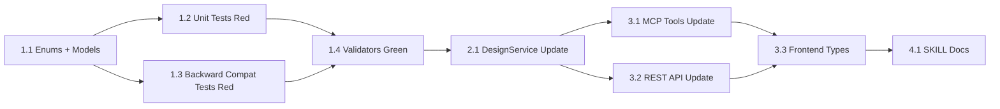

# Tasks Document

## Task Dependency Graph

---

- [x] 1.1 Add StrEnums and BaseModels to models/design.py
  - File: src/insight_blueprint/models/design.py
  - Purpose: Define VariableRole, MetricTier, ChartIntent enums and ExplanatoryVariable, Metric, ChartSpec, Methodology models. Update AnalysisDesign field types.
  - Leverage: Existing StrEnum pattern (DesignStatus, AnalysisIntent), existing BaseModel pattern (AnalysisDesign)
  - Requirements: REQ-1 (FR-1.1, FR-1.2, FR-1.3, FR-1.4), REQ-2 (FR-2.1, FR-2.2, FR-2.3, FR-2.5), REQ-3 (FR-3.1, FR-3.2, FR-3.3), REQ-4 (FR-4.1, FR-4.2, FR-4.3)
  - Dependencies: None
  - _Prompt: |
      Implement the task for spec verification-design, first run spec-workflow-guide to get the workflow guide then implement the task:

      Role: Python Developer specializing in Pydantic v2 data models

      Task: Add 3 StrEnums and 4 BaseModels to models/design.py, then update AnalysisDesign field types. Follow the exact schema defined in design.md Component 1-6. Do NOT add model_validator or before_validator yet (that is task 1.3).

      Changes to make:
      1. Add VariableRole(StrEnum) with 5 values: treatment, confounder, covariate, instrumental, mediator
      2. Add MetricTier(StrEnum) with 3 values: primary, secondary, guardrail
      3. Add ChartIntent(StrEnum) with 4 values: distribution, correlation, trend, comparison
      4. Add ExplanatoryVariable(BaseModel) with fields: name(str), description(str=""), role(VariableRole=covariate), data_source(str=""), time_points(str="")
      5. Add Metric(BaseModel) with fields: target(str), tier(MetricTier=primary), data_source(dict), grouping(list), filter(str=""), aggregation(str=""), comparison(str="")
      6. Add ChartSpec(BaseModel) with fields: intent(ChartIntent), type(str=""), description(str=""), x(str=""), y(str="")
      7. Add Methodology(BaseModel) with fields: method(str, min_length=1), package(str=""), reason(str="")
      8. Update AnalysisDesign: explanatory -> list[ExplanatoryVariable], metrics -> list[Metric], chart -> list[ChartSpec], add methodology: Methodology | None = None

      Restrictions: Do NOT add model_validator or before_validator to AnalysisDesign (task 1.3). Do NOT modify any other files. Add necessary imports (Any from typing if needed for validators later). Keep existing field order in AnalysisDesign.

      Mark task as in-progress in tasks.md before starting. Log implementation after completion. Mark as complete when done.

      Success: All new enums and models are defined. AnalysisDesign field types are updated. File passes ruff check and ruff format.

- [x] 1.2 Write unit tests for new models (Red phase)
  - File: tests/test_design_models.py (new)
  - Purpose: Write all unit tests from test-design.md Unit section. Tests should initially fail (Red phase of TDD).
  - Leverage: Existing test patterns in tests/test_designs.py, _minimal_design_data helper from test-design.md
  - Requirements: REQ-1 (AC-1.1~1.3), REQ-2 (AC-2.1~2.4), REQ-3 (AC-3.1~3.4), REQ-4 (AC-4.1~4.3)
  - Dependencies: 1.1
  - _Prompt: |
      Implement the task for spec verification-design, first run spec-workflow-guide to get the workflow guide then implement the task:

      Role: QA Engineer specializing in pytest and TDD

      Task: Create tests/test_design_models.py with all unit tests defined in test-design.md. This is the Red phase — tests are expected to fail because validators are not yet implemented (task 1.3).

      Tests to implement (from test-design.md):
      - Unit-E01~E03: StrEnum member verification
      - Unit-01~03: ExplanatoryVariable (role default, invalid role, dump)
      - Unit-E04: Parametrized all valid roles
      - Unit-04~07: Metric (single dict migration, list, empty dict, tier default)
      - Unit-E05~E07: Metric edge cases (None, invalid tier, no target)
      - Unit-08~11: ChartSpec (intent inference scatter/table/unknown, dump)
      - Unit-E08: Parametrized all 8 type->intent mappings
      - Unit-E09~E10: ChartSpec explicit intent, no intent+no type
      - Unit-12~14: Methodology (default None, from dict, empty method)
      - Unit-E11: Methodology defaults
      - Unit-M01~M04: Migration robustness (idempotent, invalid element, update preserves, canonical form)
      - Unit-RT01~RT02: YAML round-trip (typed + legacy)

      Include _minimal_design_data helper function.

      Restrictions: Only create tests/test_design_models.py. Do not modify implementation code. Tests for model_validator and before_validator will fail — that is expected.

      Mark task as in-progress in tasks.md before starting. Log implementation after completion. Mark as complete when done.

      Success: All 30 unit tests are written. Tests that only depend on enum/model definitions pass. Tests that depend on validators (migration, inference) fail as expected (Red).

- [x] 1.3 Write backward compatibility tests (Red phase)
  - File: tests/test_design_backward_compat.py (new)
  - Purpose: Write backward compatibility tests from test-design.md BC section. Validates legacy YAML format handling. Tests should fail initially (Red phase — validators not yet implemented).
  - Leverage: test-design.md BC-01~BC-04, existing test patterns
  - Requirements: REQ-1 (AC-1.1, AC-1.4), REQ-2 (AC-2.1, AC-2.5), REQ-3 (AC-3.1~3.3)
  - Dependencies: 1.1
  - _Prompt: |
      Implement the task for spec verification-design, first run spec-workflow-guide to get the workflow guide then implement the task:

      Role: QA Engineer specializing in backward compatibility testing

      Task: Create tests/test_design_backward_compat.py with 4 tests from test-design.md BC section. This is the Red phase — BC-01 and BC-02 will fail because validators are not yet implemented (task 1.4).

      Tests to implement:
      - BC-01: Legacy YAML with no typed fields loads correctly (all defaults applied)
      - BC-02: DesignService update with legacy metrics format works
      - BC-03: MCP tool with invalid enum value returns error dict — mark with @pytest.mark.skip("depends on task 3.1")
      - BC-04: REST API with invalid enum value returns 400/422 — mark with @pytest.mark.skip("depends on task 3.2")

      Restrictions: Only create tests/test_design_backward_compat.py. Do not modify implementation code.

      Mark task as in-progress in tasks.md before starting. Log implementation after completion. Mark as complete when done.

      Success: All 4 tests are written. BC-01/BC-02 fail as expected (Red — validators not yet implemented). BC-03/BC-04 are skipped.

- [x] 1.4 Implement validators on AnalysisDesign (Green phase)
  - File: src/insight_blueprint/models/design.py
  - Purpose: Add _migrate_metrics model_validator and _infer_intent_from_type before_validator to make failing tests pass (Green phase).
  - Leverage: design.md Component 4 (ChartSpec validator) and Component 6 (AnalysisDesign _migrate_metrics)
  - Requirements: REQ-2 (FR-2.4), REQ-3 (FR-3.4)
  - Dependencies: 1.1, 1.2, 1.3
  - _Prompt: |
      Implement the task for spec verification-design, first run spec-workflow-guide to get the workflow guide then implement the task:

      Role: Python Developer specializing in Pydantic v2 validators

      Task: Add two validators to make the Red tests from tasks 1.2 and 1.3 pass (Green phase).

      1. Add @model_validator(mode="before") _infer_intent_from_type to ChartSpec:
         - If data is dict and "intent" not in data, infer from "type" field
         - Mapping: scatter/heatmap to correlation, bar/table to comparison, histogram/box to distribution, line/area to trend
         - Unknown type or missing type defaults to distribution
         - If intent is already present, do not override

      2. Add @model_validator(mode="before") _migrate_metrics to AnalysisDesign:
         - None converts to empty list
         - Empty dict converts to empty list
         - Single metric dict (has "target" key) converts to one-element list
         - List input passes through (let Pydantic validate each element)
         - Other dict (no "target" key) passes through (let Pydantic raise ValidationError)

      Add necessary import: from typing import Any

      Restrictions: Only modify models/design.py. Do not modify tests. Run tests to verify all pass.

      Mark task as in-progress in tasks.md before starting. Log implementation after completion. Mark as complete when done.

      Success: All 30 unit tests in test_design_models.py pass. All 4 backward compat tests pass (BC-01/BC-02 now Green, BC-03/BC-04 still skipped). Existing 624 tests still pass. ruff check and ruff format pass.

- [x] 2.1 Update DesignService type annotations and add methodology parameter
  - File: src/insight_blueprint/core/designs.py
  - Purpose: Update create_design/update_design parameter types and add methodology support.
  - Leverage: design.md Component 7, existing DesignService patterns
  - Requirements: REQ-1 (FR-1.3), REQ-2 (FR-2.3), REQ-4 (FR-4.2)
  - Dependencies: 1.4
  - _Prompt: |
      Implement the task for spec verification-design, first run spec-workflow-guide to get the workflow guide then implement the task:

      Role: Python Backend Developer

      Task: Update DesignService in core/designs.py:

      1. Update create_design parameters:
         - metrics: dict | None = None -> list[dict] | None = None
         - Add methodology: dict | None = None parameter
         - Pass methodology to AnalysisDesign constructor

      2. Update update_design:
         - No special handling needed for typed fields (Pydantic coercion handles it)
         - methodology update flows through model_copy naturally

      3. Update imports: add new model types from models.design if needed for type annotations

      4. Add integration tests to tests/test_designs.py:
         - Integ-01: create with untyped explanatory -> default role
         - Integ-02: create with typed explanatory -> persists role
         - Integ-05: create with legacy dict metrics -> migrated to list
         - Integ-07: create with typed chart -> persists intent
         - Integ-08: create without methodology -> None
         - Integ-09: update with methodology -> persisted

      Restrictions: Do not change core logic. Only update type annotations and add methodology parameter. Keep backward compat for callers that pass dict/list[dict].

      Mark task as in-progress in tasks.md before starting. Log implementation after completion. Mark as complete when done.

      Success: All 6 new integration tests pass. All existing tests in test_designs.py pass. ruff check passes.

- [x] 3.1 Update MCP tools in server.py
  - File: src/insight_blueprint/server.py
  - Purpose: Update create_analysis_design/update_analysis_design parameter types and add methodology parameter.
  - Leverage: design.md Component 8, existing MCP tool patterns
  - Requirements: REQ-1 (AC-1.4), REQ-2 (AC-2.5), REQ-4 (AC-4.4)
  - Dependencies: 2.1
  - _Prompt: |
      Implement the task for spec verification-design, first run spec-workflow-guide to get the workflow guide then implement the task:

      Role: Python Backend Developer specializing in MCP tools

      Task: Update MCP tools in server.py:

      1. create_analysis_design:
         - Change metrics parameter: dict | None = None -> list[dict] | None = None
         - Add methodology: dict | None = None parameter
         - Pass methodology to service.create_design()

      2. update_analysis_design:
         - Change metrics parameter: dict | None = None -> list[dict] | None = None
         - Add methodology: dict | None = None parameter
         - Add "methodology": methodology to the updates dict

      3. Add MCP tests to tests/test_server.py:
         - Integ-03: create with typed explanatory (role field) — AC-1.4 create path
         - Integ-04: update with typed explanatory (role field) — AC-1.4 update path
         - Integ-06: create with metrics list — AC-2.5
         - Integ-11: update with methodology — AC-4.4 MCP path

      4. Un-skip BC-03 in test_design_backward_compat.py (invalid enum error response)

      Restrictions: Do not change response format. Keep dict/list[dict] parameter types (not typed models) for MCP tool interface.

      Mark task as in-progress in tasks.md before starting. Log implementation after completion. Mark as complete when done.

      Success: 4 new MCP tests pass. BC-03 passes. All existing test_server.py tests pass.

- [x] 3.2 Update REST API in web.py
  - File: src/insight_blueprint/web.py
  - Purpose: Update CreateDesignRequest/UpdateDesignRequest field types and add methodology field.
  - Leverage: design.md Component 8, existing Request model patterns
  - Requirements: REQ-5 (AC-5.2)
  - Dependencies: 2.1
  - _Prompt: |
      Implement the task for spec verification-design, first run spec-workflow-guide to get the workflow guide then implement the task:

      Role: Python Backend Developer specializing in FastAPI

      Task: Update REST API models and handlers in web.py:

      1. CreateDesignRequest:
         - Change metrics: dict | None = None -> list[dict] | None = None
         - Add methodology: dict | None = None

      2. UpdateDesignRequest:
         - Change metrics: dict | None = None -> list[dict] | None = None
         - Add methodology: dict | None = None

      3. Update create_design handler: pass body.methodology to service.create_design()
      4. Update update_design handler: add "methodology": body.methodology to updates dict

      5. Add REST API test to tests/test_web.py:
         - Integ-10: GET /api/designs/DESIGN_ID returns typed fields (role, tier, intent, methodology)

      6. Un-skip BC-04 in test_design_backward_compat.py (invalid enum 422 response)

      Restrictions: Keep dict/list[dict] types in Request models (JSON input). Do not change response format.

      Mark task as in-progress in tasks.md before starting. Log implementation after completion. Mark as complete when done.

      Success: Integ-10 passes. BC-04 passes. All existing test_web.py tests pass.

- [x] 3.3 Update frontend TypeScript types
  - File: frontend/src/types/api.ts
  - Purpose: Add TypeScript types for new models and update Design interface.
  - Leverage: design.md Component 9, existing type patterns in api.ts
  - Requirements: REQ-5 (FR-5.1, FR-5.2, FR-5.3, AC-5.1)
  - Dependencies: 3.1, 3.2
  - _Prompt: |
      Implement the task for spec verification-design, first run spec-workflow-guide to get the workflow guide then implement the task:

      Role: TypeScript Developer

      Task: Update frontend/src/types/api.ts with typed definitions:

      1. Add union types:
         - VariableRole: "treatment" | "confounder" | "covariate" | "instrumental" | "mediator"
         - MetricTier: "primary" | "secondary" | "guardrail"
         - ChartIntent: "distribution" | "correlation" | "trend" | "comparison"

      2. Add interfaces (see design.md Component 9 for exact field definitions):
         - ExplanatoryVariable (name, description, role, data_source, time_points)
         - Metric (target, tier, data_source, grouping, filter, aggregation, comparison)
         - ChartSpec (intent, type, description, x, y)
         - Methodology (method, package, reason)

      3. Update Design interface:
         - metrics: `Metric[]` (was untyped record)
         - explanatory: `ExplanatoryVariable[]` (was untyped record array)
         - chart: `ChartSpec[]` (was untyped record array)
         - Add methodology: `Methodology | null`

      4. Fix any TypeScript compilation errors caused by the type changes in other frontend files.

      5. Run npm run build in frontend/ to verify no compilation errors (E2E-01).

      Restrictions: Do not change UI components. Only update type definitions and fix compilation errors.

      Mark task as in-progress in tasks.md before starting. Log implementation after completion. Mark as complete when done.

      Success: npm run build succeeds with no TypeScript errors. Existing Playwright tests pass.

- [x] 4.1 Update SKILL documentation
  - File: src/insight_blueprint/_skills/analysis-design/SKILL.md, src/insight_blueprint/_skills/analysis-journal/SKILL.md
  - Purpose: Update field examples to include typed model fields and add methodology guidance.
  - Leverage: design.md Component descriptions, existing SKILL.md format
  - Requirements: REQ-6 (FR-6.1, FR-6.2, FR-6.3, AC-6.1, AC-6.2)
  - Dependencies: 3.3
  - _Prompt: |
      Implement the task for spec verification-design, first run spec-workflow-guide to get the workflow guide then implement the task:

      Role: Technical Writer for AI skill documentation

      Task: Update SKILL documentation:

      1. analysis-design/SKILL.md:
         - Update explanatory field example to include role field (e.g. role: "treatment")
         - Update metrics field example to list format with tier (e.g. tier: "primary")
         - Update chart field example to include intent (e.g. intent: "correlation")
         - Add methodology field example (e.g. method: "OLS", package: "statsmodels")
         - Add VariableRole, MetricTier, ChartIntent enum values reference

      2. analysis-journal/SKILL.md:
         - In the decide event section, add note about promoting method/package to design.methodology:
           "decide イベントで記録した method/package は、analysis-design の methodology フィールドに昇格できる。update_analysis_design の methodology パラメータで method, package, reason を渡す。"

      Restrictions: Only update documentation. Do not change code. Preserve existing SKILL.md structure and format.

      Mark task as in-progress in tasks.md before starting. Log implementation after completion. Mark as complete when done.

      Success: SKILL.md files contain updated field examples with role, tier, intent, methodology. decide→methodology promotion guidance is documented.
