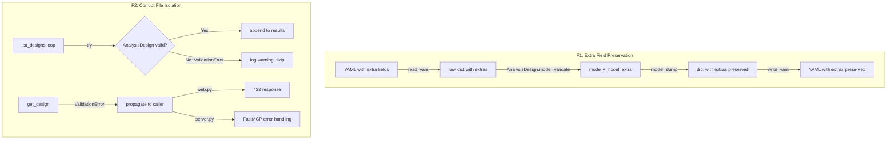

# Design: YAML Direct Edit Resilience

## Overview

AnalysisDesign の YAML 直接編集時のデータ保全性（F1）と耐障害性（F2）を実現する。変更は model 層と service 層に閉じ、MCP/REST のインターフェース層への影響を最小化する。

## Steering Document Alignment

### Technical Standards (tech.md)

- **Pydantic >= 2.10**: `ConfigDict(extra="allow")` は Pydantic v2 の標準機能。`model_dump()` が extra フィールドを自動で含む
- **ruamel.yaml**: `preserve_quotes = True` で YAML のフォーマットを維持する既存設計と一貫。extra フィールド保全もデータ保護の延長
- **レイヤードアーキテクチャ**: F1 は model 層、F2 は service 層 + API 層で解決。依存方向 `server.py / web.py → core/ → storage/ → models/` を維持
- **TDD**: テストを先に書く。extra フィールドの round-trip テスト、corrupt file skip テストを実装前に定義

### Project Structure (structure.md)

- 変更対象ファイルは既存ファイルのみ。新規ファイル作成なし
- テストは既存テストファイルに追加（`test_design_models.py`, `test_designs.py`, `test_web.py`）

## Code Reuse Analysis

### Existing Components to Leverage

- **`models/design.py`**: 5つの BaseModel サブクラスに `ConfigDict` を追加するだけ。既存の `model_validator`, フィールド定義、StrEnum は変更なし
- **`storage/yaml_store.py`**: `read_yaml()` は ruamel.yaml で読み込んだ生の dict を返す。extra フィールドを含む完全なデータを既に読めている。変更不要
- **`core/designs.py`**: `list_designs()` のループ構造を活用し、try/except を追加するだけ。`update_design()` は `model_validate(merged)` → `model_dump(mode="json")` → `write_yaml()` の既存フローで extra が自動保全される
- **`web.py` exception handlers**: 既存パターン（`ValueError → 400`, `Exception → 500`）に `ValidationError → 422` を追加

### Integration Points

- **MCP 層 (`server.py`)**: 変更なし。`get_analysis_design` は try/except がないが、FastMCP フレームワークが未処理例外をクライアントにエラーとして返す。ValidationError が自然に伝播する
- **REST 層 (`web.py`)**: `ValidationError` 専用の exception handler を追加。既存の `general_exception_handler` (500) の前にマッチさせる
- **SQLite FTS5 (`sqlite_store.py`)**: 影響なし。extra フィールドは FTS インデックスに含まれない（FTS は `hypothesis_statement` 等の既知フィールドのみインデックス）

## Architecture

F1 と F2 は独立した変更であり、相互依存はない。



### Modular Design Principles

- **Single File Responsibility**: model 層は「データの形を定義する」責務のみ。corrupt ファイルの処理判断（skip vs error）は service 層の責務
- **Component Isolation**: F1 の変更（model 層）と F2 の変更（service 層 + API 層）は独立。別タスクで並行実装可能
- **Dependency Direction**: model 層 → service 層 → API 層の依存方向を維持。API 層が `pydantic.ValidationError` を import するのは例外的だが、Pydantic は既に API 層の依存に含まれている

## Components and Interfaces

### Component 1: Extra Field Preservation (model 層)

- **Purpose**: Pydantic モデルがスキーマ外フィールドを保持し、`model_dump()` で出力する
- **Interfaces**: 既存の `AnalysisDesign`, `Metric`, `ExplanatoryVariable`, `ChartSpec`, `Methodology` の公開インターフェースは変更なし。`model_extra` 属性が新たにアクセス可能になる
- **Dependencies**: Pydantic v2 `ConfigDict`
- **Reuses**: 既存の全モデル定義、全 validator、全フィールド定義

**実装詳細**:

```python
# models/design.py — 全5モデルに追加
from pydantic import BaseModel, ConfigDict

class ExplanatoryVariable(BaseModel):
    model_config = ConfigDict(extra="allow")
    name: str
    description: str = ""
    role: VariableRole = VariableRole.covariate
    data_source: str = ""
    time_points: str = ""

class Metric(BaseModel):
    model_config = ConfigDict(extra="allow")
    target: str
    tier: MetricTier = MetricTier.primary
    # ... 既存フィールド ...

class ChartSpec(BaseModel):
    model_config = ConfigDict(extra="allow")
    intent: ChartIntent
    # ... 既存フィールド + 既存 validator ...

class Methodology(BaseModel):
    model_config = ConfigDict(extra="allow")
    method: str = Field(min_length=1)
    package: str = ""
    reason: str = ""

class AnalysisDesign(BaseModel):
    model_config = ConfigDict(extra="allow")
    id: str
    # ... 既存フィールド + 既存 validator ...
```

**`extra="allow"` と既存 validator の共存** (Codex レビュー済み):

- `model_validator(mode="before")` はモデル構築前に raw dict を受け取る。extra フィールドは dict 内に存在するが、validator はスキーマフィールドのみを操作するため干渉しない
- `_migrate_metrics` (L138-152): `data["metrics"]` のみを変更し、同じ `data` dict を返す。新しい dict を作り直していないため、extra フィールドは保持される → **安全**
- `_infer_intent_from_type` (L89-106): `data["intent"]` を追加するだけで、同じ `data` dict を返す。extra フィールドは保持される → **安全**
- **注意**: 将来 before validator を追加する際、dict を作り直す (`return {"key": data["key"]}` 等) と extra が消える。既存 dict を変更して返すパターンを維持すること

**round-trip の保証**:

`update_design()` の既存フロー:

```python
# core/designs.py L106-109 (既存コード、変更なし)
merged = {**design.model_dump(mode="json"), **fields, "updated_at": now_jst()}
updated = AnalysisDesign.model_validate(merged)
write_yaml(file_path, updated.model_dump(mode="json"))
```

1. `design.model_dump(mode="json")` → extra フィールドを含む dict（`extra="allow"` により）
2. `{**model_dump, **fields}` → extra フィールドが `fields` に上書きされない限り保持
3. `model_validate(merged)` → extra フィールドが `model_extra` に格納
4. `updated.model_dump(mode="json")` → extra フィールドを含む dict を出力
5. `write_yaml()` → extra フィールドを含む YAML を書き出し

→ サービス層の変更ゼロで round-trip が成立。

**shallow merge の安全性** (Codex レビュー済み):

`update_design()` の merge は top-level shallow merge (`{**model_dump, **fields}`)。これは意図通り:

- `fields` に `metrics` がない場合 → `model_dump` の metrics（extra 含む）がそのまま使われる → **extra 保持**
- `fields` に `metrics=[...]` がある場合 → metrics リスト全体が置換される → **意図通り**（ユーザーが明示的に新しいリストを渡している）

deep merge は不要。per-metric level の部分更新は API 設計としてサポートしていない。

**YAML フィールド順序について** (Codex レビュー済み):

`model_dump()` は Pydantic のモデル定義順 + extra フィールドの dict 順で出力する。元の YAML のフィールド順序やコメントは保持されない。これは既存の動作と同じであり、本 spec では対応しない。ruamel.yaml round-trip オブジェクトの直接更新は実装コストが高く、YAGNI。

### Component 2: Corrupt File Isolation (service 層)

- **Purpose**: 1ファイルの ValidationError が他のファイルの処理に影響しないようにする
- **Interfaces**: `list_designs()` の戻り値型は変更なし (`list[AnalysisDesign]`)。`get_design()` の戻り値型も変更なし
- **Dependencies**: `logging` 標準ライブラリ、`pydantic.ValidationError`
- **Reuses**: 既存の `list_designs()` ループ構造

**`list_designs()` の変更**:

```python
# core/designs.py
import logging
from pydantic import ValidationError

logger = logging.getLogger(__name__)

def list_designs(self, status: DesignStatus | None = None) -> list[AnalysisDesign]:
    if not self._designs_dir.exists():
        return []
    files = sorted(self._designs_dir.glob("*_hypothesis.yaml"))
    designs = []
    for file_path in files:
        data = read_yaml(file_path)
        if not data:
            continue
        try:
            design = AnalysisDesign(**data)
        except (ValidationError, Exception) as exc:
            logger.warning(
                "Skipping corrupt design file %s: %s",
                file_path.name,
                exc,
            )
            continue
        if status is None or design.status == status:
            designs.append(design)
    return designs
```

**`get_design()` の変更**: なし。`AnalysisDesign(**data)` が `ValidationError` を raise した場合、そのまま呼び出し元に伝播する。呼び出し元が「not found」と「corrupt」を区別できる:

- `data` が空 → `return None`（not found）
- `AnalysisDesign(**data)` が raise → `ValidationError`（corrupt）

### Component 3: REST API Error Handler (API 層)

- **Purpose**: `ValidationError` を 422 レスポンスとして返す
- **Interfaces**: 新規 exception handler の追加
- **Dependencies**: `pydantic.ValidationError`, FastAPI `JSONResponse`
- **Reuses**: 既存の exception handler パターン (`ValueError → 400`)

**実装詳細**:

```python
# web.py — 既存の exception handler の後に追加
from pydantic import ValidationError

@app.exception_handler(ValidationError)
async def validation_error_handler(
    request: Request, exc: ValidationError
) -> JSONResponse:
    """Convert Pydantic ValidationError to 422 for corrupt design files."""
    return JSONResponse(
        status_code=422,
        content={"error": f"Invalid design data: {exc.error_count()} validation error(s)"},
    )
```

**handler の優先順位**: FastAPI は具体的な例外型を先にマッチさせる。`ValidationError` は `Exception` のサブクラスだが、`validation_error_handler` が `general_exception_handler` より先にマッチする。

## Design Decisions

### DD-1: `list_designs()` の skipped 情報を返さない

Codex は `DesignListResult(designs=[...], skipped=[...])` のような構造体で skipped 情報を返すことを推奨した。しかし以下の理由で採用しない:

- `list_designs()` の戻り値型 `list[AnalysisDesign]` を変更すると、呼び出し元（server.py L169, web.py L167）全てに影響する後方非互換変更になる
- warning ログで十分。運用上、corrupt ファイルの存在はログ監視で検知できる
- 将来的に必要になった場合、別メソッド `list_designs_with_errors()` を追加すれば非互換なく拡張可能

### DD-2: `get_design()` で ValidationError をそのまま伝播する

`get_design()` は現在 `None`（not found）のみを返す。corrupt ファイルの場合に `None` を返すと「存在しない」と「壊れている」が区別できない。ValidationError をそのまま伝播させることで:

- 呼び出し元が `None` check と `except ValidationError` で明確に分岐できる
- REST API は 404（not found）と 422（corrupt）を適切に返し分けられる
- MCP 層は FastMCP のエラーハンドリングで自然にエラーメッセージが返る

## Data Models

### AnalysisDesign (変更後)

```
既存フィールド（変更なし）:
- id: str
- theme_id: str = "DEFAULT"
- title: str
- hypothesis_statement: str
- hypothesis_background: str
- status: DesignStatus = "in_review"
- analysis_intent: AnalysisIntent = "confirmatory"
- parent_id: str | None = None
- metrics: list[Metric] = []
- explanatory: list[ExplanatoryVariable] = []
- chart: list[ChartSpec] = []
- source_ids: list[str] = []
- next_action: dict | None = None
- referenced_knowledge: dict[str, list[str]] = {}
- methodology: Methodology | None = None
- created_at: datetime
- updated_at: datetime

追加:
- model_config = ConfigDict(extra="allow")
- model_extra: dict[str, Any]  # Pydantic 自動生成。スキーマ外フィールドを格納
```

### サブモデル (Metric, ExplanatoryVariable, ChartSpec, Methodology)

各モデルに `model_config = ConfigDict(extra="allow")` を追加。フィールド定義は変更なし。

## Error Handling

### Error Scenario 1: Extra field in YAML (F1)

- **Description**: 分析者が YAML にスキーマ外フィールドを追加
- **Handling**: `extra="allow"` により `model_extra` に格納。`model_dump()` で出力に含まれる
- **User Impact**: フィールドが消えない。MCP tool 経由の更新後も保持される

### Error Scenario 2: Corrupt file in list (F2-list)

- **Description**: `list_designs()` で1ファイルが ValidationError
- **Handling**: per-file try/except で skip。warning ログを出力。残りのファイルは正常に処理
- **User Impact**: corrupt ファイルが一覧から消えるが、他の設計は正常に表示される

### Error Scenario 3: Corrupt file in get (F2-get)

- **Description**: `get_design(id)` で指定ファイルが ValidationError
- **Handling**: ValidationError がそのまま伝播。REST API は 422 を返す。MCP は FastMCP のエラーハンドリングで対応
- **User Impact**: 「このファイルのデータが不正です」というエラーメッセージを受け取る

### Error Scenario 4: Typo in field name (F1 side effect)

- **Description**: 分析者が `tiar: primary` と typo（正しくは `tier`）
- **Handling**: `tiar` は extra field として保持。`tier` はデフォルト値 `primary` が使われる
- **User Impact**: typo が検出されない。ただし MCP tool / REST API 経由の入力は別バリデーションモデルで防御済み。直接編集のみのリスク
- **Mitigation**: Out of Scope の validate コマンド（F3）で将来的に対応

## Testing Strategy

### Unit Testing

- **extra フィールド round-trip** (`test_design_models.py`):
  - AnalysisDesign のトップレベル extra フィールドが `model_dump()` に含まれること
  - Metric の extra フィールドがネストされた状態で保持されること
  - ExplanatoryVariable, ChartSpec, Methodology それぞれの extra フィールド
  - `update_design()` 後も extra フィールドが保持されること
  - 既存の `model_validator` (`_migrate_metrics`, `_infer_intent_from_type`) が extra フィールド存在下で正常動作すること

- **corrupt file isolation** (`test_designs.py`):
  - 正常3ファイル + corrupt 1ファイルで `list_designs()` が3件返すこと
  - corrupt file skip 時に warning ログが出力されること
  - 必須フィールド欠損、不正 enum 値、型エラーの各パターン
  - `get_design()` で corrupt ファイルが `ValidationError` を raise すること
  - status フィルタ + corrupt ファイルの組み合わせ

### Integration Testing

- **REST API** (`test_web.py`):
  - `GET /api/designs/{id}` で corrupt design → 422 レスポンス
  - `GET /api/designs` で corrupt ファイル混在 → 正常ファイルのみ返却
  - 422 レスポンスボディに `error` フィールドが含まれること

### Backward Compatibility Testing

- 既存の 681 テストが全て通ること（CI で確認）
- 既存の `model_validator` テスト（`test_design_backward_compat.py`）が通ること
