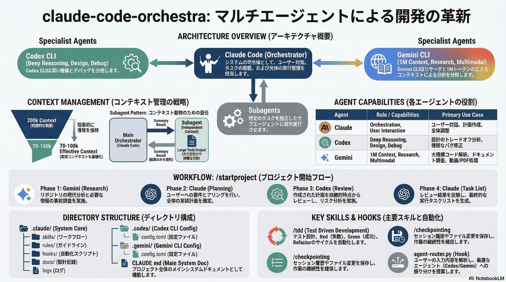

# claude-code-orchestra



Multi-Agent AI Development Environment

```
spec-workflow-mcp (Requirements → Design → Tasks)
        ↕  MCP Protocol
Claude Code (Orchestrator) ─┬─ Codex CLI (Deep Reasoning)
                            ├─ Gemini CLI (Research)
                            └─ Subagents (Parallel Tasks)
```

## Quick Start

既存プロジェクトのルートで実行:

```bash
git clone --depth 1 https://github.com/DeL-TaiseiOzaki/claude-code-orchestra.git .starter && cp -r .starter/.claude .starter/.codex .starter/.gemini .starter/CLAUDE.md . && rm -rf .starter && claude
```

### spec-workflow-mcp セットアップ（オプション）

スペック駆動開発を使う場合、MCP サーバーを追加:

```bash
claude mcp add spec-workflow npx @pimzino/spec-workflow-mcp@latest -- $(pwd)
```

ダッシュボードで要件・設計・タスクを管理:

```bash
npx -y @pimzino/spec-workflow-mcp@latest --dashboard
# → http://localhost:5000
```

## Prerequisites

### Claude Code

```bash
npm install -g @anthropic-ai/claude-code
claude login
```

### Codex CLI

```bash
npm install -g @openai/codex
codex login
```

### Gemini CLI

```bash
npm install -g @google/gemini-cli
gemini login
```

## Architecture

```
┌─────────────────────────────────────────────────────────────┐
│         spec-workflow-mcp (MCP Server)                      │
│         → Requirements / Design / Tasks 管理                │
│         → ダッシュボード (http://localhost:5000)             │
│                      ↕ MCP Protocol                         │
│                                                             │
│           Claude Code (Orchestrator)                        │
│           → コンテキスト節約が最優先                         │
│           → ユーザー対話・調整・実行を担当                   │
│                      ↓                                      │
│  ┌───────────────────────────────────────────────────────┐  │
│  │              Subagent (general-purpose)               │  │
│  │              → 独立したコンテキストを持つ               │  │
│  │              → Codex/Gemini を呼び出し可能             │  │
│  │              → 結果を要約してメインに返す              │  │
│  │                                                       │  │
│  │   ┌──────────────┐        ┌──────────────┐           │  │
│  │   │  Codex CLI   │        │  Gemini CLI  │           │  │
│  │   │  設計・推論  │        │  リサーチ    │           │  │
│  │   │  デバッグ    │        │  マルチモーダル│          │  │
│  │   └──────────────┘        └──────────────┘           │  │
│  └───────────────────────────────────────────────────────┘  │
└─────────────────────────────────────────────────────────────┘
```

### コンテキスト管理（重要）

メインオーケストレーターのコンテキストを節約するため、大きな出力が予想されるタスクはサブエージェント経由で実行します。

| 状況 | 推奨方法 |
|------|----------|
| 大きな出力が予想される | サブエージェント経由 |
| 短い質問・短い回答 | 直接呼び出しOK |
| Codex/Gemini相談 | サブエージェント経由 |
| 詳細な分析が必要 | サブエージェント経由 → ファイル保存 |
| スペック作成・更新 | spec-workflow MCP ツール経由 |

## Workflow Selection

実装の複雑さに応じてワークフローを選択:

| 基準 | `/startproject` (Agile) | `/spec-start` (Spec-Driven) |
|------|------------------------|----------------------------|
| **時間** | < 1日 | 1日以上 |
| **ファイル数** | < 5 | 5+ |
| **影響範囲** | 単機能 | システム横断 |
| **Approval** | 不要 | 必要 |
| **用途** | バグ修正、UI調整、ユーティリティ | 新機能、API設計、認証システム |

**Migration:** `/startproject` で始めた作業が複雑化した場合、`/migrate-to-spec` で正式なスペックに変換できます。

## Directory Structure

```
.
├── CLAUDE.md                    # メインシステムドキュメント
├── README.md
├── pyproject.toml               # Python プロジェクト設定
├── uv.lock                      # 依存関係ロックファイル
│
├── .claude/
│   ├── agents/
│   │   ├── general-purpose.md   # 汎用サブエージェント
│   │   ├── codex-debugger.md    # エラー分析エージェント
│   │   └── gemini-explore.md    # コードベース探索エージェント
│   │
│   ├── skills/                  # 再利用可能なワークフロー
│   │   ├── startproject/        # プロジェクト開始
│   │   ├── spec-start/          # スペック駆動開発 ★
│   │   │   └── SKILL.md
│   │   ├── migrate-to-spec/     # スペックへの移行 ★
│   │   │   ├── SKILL.md
│   │   │   ├── scripts/extract_docs.py
│   │   │   └── references/migration-patterns.md
│   │   ├── plan/                # 実装計画作成
│   │   ├── tdd/                 # テスト駆動開発
│   │   ├── checkpointing/       # セッション永続化
│   │   ├── codex-system/        # Codex CLI連携
│   │   ├── gemini-system/       # Gemini CLI連携
│   │   └── ...
│   │
│   ├── hooks/                   # 自動化フック
│   │   ├── agent-router.py      # エージェントルーティング
│   │   ├── lint-on-save.py      # 保存時自動lint
│   │   ├── spec-task-complete.py # スペックタスク完了通知 ★
│   │   └── ...
│   │
│   ├── rules/                   # 開発ガイドライン
│   │   ├── coding-principles.md
│   │   ├── testing.md
│   │   ├── spec-workflow-rules.md # スペックワークフロー規則 ★
│   │   └── ...
│   │
│   ├── docs/
│   │   ├── DESIGN.md            # 設計決定記録
│   │   ├── research/            # Gemini調査結果
│   │   └── libraries/           # ライブラリ制約
│   │
│   └── logs/
│       └── cli-tools.jsonl      # Codex/Gemini入出力ログ
│
├── .codex/                      # Codex CLI設定
│   ├── AGENTS.md
│   └── config.toml
│
└── .gemini/                     # Gemini CLI設定
    ├── GEMINI.md
    └── settings.json
```

## Skills

### `/startproject` — プロジェクト開始（Agile）

マルチエージェント協調でプロジェクトを開始します。軽量な実装向け。

```
/startproject ユーザー認証機能
```

**ワークフロー:**
1. **Gemini** → リポジトリ分析・事前調査
2. **Claude** → 要件ヒアリング・計画作成
3. **Codex** → 計画レビュー・リスク分析
4. **Claude** → タスクリスト作成

### `/spec-start` — スペック駆動開発

spec-workflow-mcp + マルチエージェント協調で正式なスペックを作成します。大規模機能・承認が必要な実装向け。

```
/spec-start ユーザー認証機能
```

**ワークフロー:**
1. **Gemini** → 技術リサーチ・類似実装調査
2. **Claude** → 要件ヒアリング・ユーザーストーリー収集
3. **spec-workflow MCP** → Requirements ドキュメント作成
4. **Codex** → 技術リスク分析・設計レビュー
5. **spec-workflow MCP** → Design ドキュメント・Tasks 作成
6. ダッシュボード (http://localhost:5000) で承認

### `/migrate-to-spec` — スペックへの移行

`/startproject` で始めた作業を正式な spec-workflow スペックに変換します。

```
/migrate-to-spec
```

**用途:**
- 単純な作業が予想以上に複雑化した場合
- 承認フローやタスク追跡が必要になった場合
- チーム間の連携が必要になった場合

### `/plan` — 実装計画

要件を具体的なステップに分解します。

```
/plan APIエンドポイントの追加
```

**出力:**
- 実装ステップ（ファイル・変更内容・検証方法）
- 依存関係・リスク
- 検証基準

### `/tdd` — テスト駆動開発

Red-Green-Refactorサイクルで実装します。

```
/tdd ユーザー登録機能
```

**ワークフロー:**
1. テストケース設計
2. 失敗するテスト作成（Red）
3. 最小限の実装（Green）
4. リファクタリング（Refactor）

### `/checkpointing` — セッション永続化

セッションの状態を保存します。

```bash
/checkpointing              # 基本: 履歴ログ
/checkpointing --full       # 完全: git履歴・ファイル変更含む
/checkpointing --analyze    # 分析: 再利用可能なスキルパターン発見
```

### `/codex-system` — Codex CLI連携

設計判断・デバッグ・トレードオフ分析に使用します。

**トリガー例:**
- 「どう設計すべき？」「どう実装する？」
- 「なぜ動かない？」「エラーが出る」
- 「どちらがいい？」「比較して」

### `/gemini-system` — Gemini CLI連携

リサーチ・大規模分析・マルチモーダル処理に使用します。

**トリガー例:**
- 「調べて」「リサーチして」
- 「このPDF/動画を見て」
- 「コードベース全体を理解して」

### `/simplify` — コードリファクタリング

コードを簡潔化・可読性向上させます。

### `/design-tracker` — 設計決定追跡

アーキテクチャ・実装決定を自動記録します。

## Development

### Tech Stack

| ツール | 用途 |
|--------|------|
| **uv** | パッケージ管理（pip禁止） |
| **ruff** | リント・フォーマット |
| **ty** | 型チェック |
| **pytest** | テスト |
| **poethepoet** | タスクランナー |

### Commands

```bash
# 依存関係
uv add <package>           # パッケージ追加
uv add --dev <package>     # 開発依存追加
uv sync                    # 依存関係同期

# 品質チェック
poe lint                   # ruff check + format
poe typecheck              # ty
poe test                   # pytest
poe all                    # 全チェック実行

# 直接実行
uv run pytest -v
uv run ruff check .
```

## Hooks

自動化フックにより、適切なタイミングでエージェント連携を提案します。

| フック | トリガー | 動作 |
|--------|----------|------|
| `agent-router.py` | ユーザー入力 | Codex/Geminiへのルーティング提案 |
| `lint-on-save.py` | ファイル保存 | 自動lint実行 |
| `check-codex-before-write.py` | ファイル書き込み前 | Codex相談提案 |
| `log-cli-tools.py` | Codex/Gemini実行 | 入出力ログ記録 |
| `spec-task-complete.py` | Bash (テスト実行後) | spec-workflow タスク完了通知 |

## Language Rules

- **コード・思考・推論**: 英語
- **ユーザーへの応答**: 日本語
- **技術ドキュメント**: 英語
- **README等**: 日本語可
